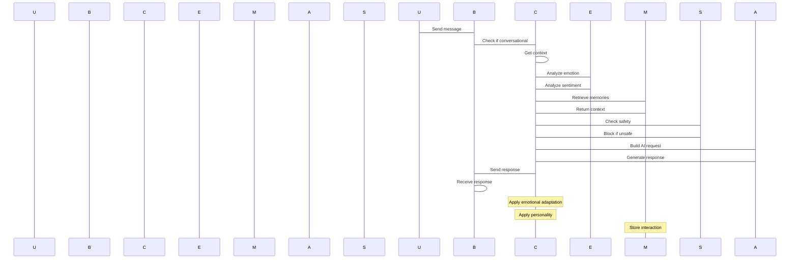
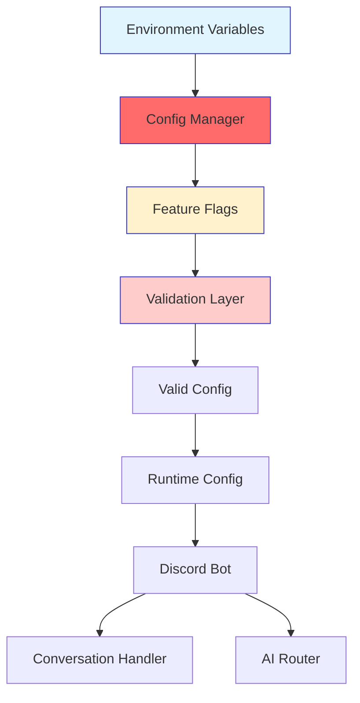
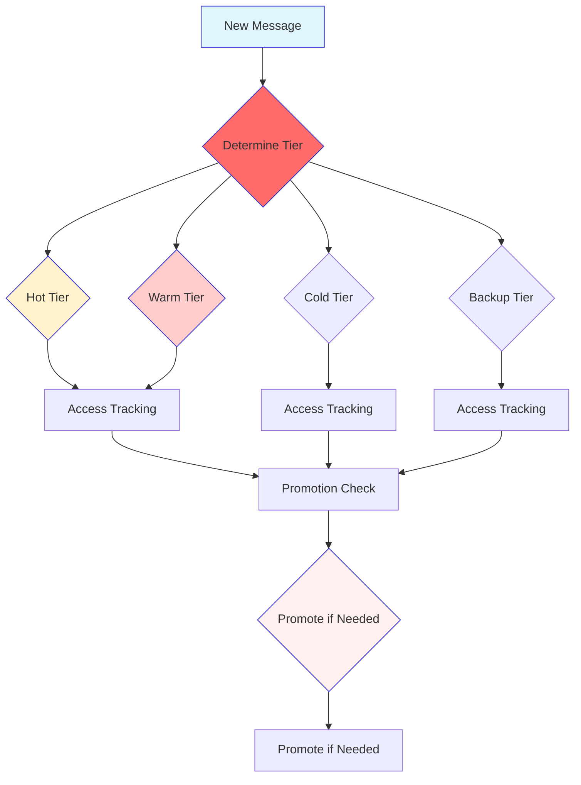

# Conversational Discord Settings - Technical Specification

## Document Information
- **Project**: Megawatts Self-Editing Discord Bot
- **Version**: 1.0.0
- **Status**: Design Specification
- **Created**: 2026-01-03
- **Author**: Architecture Team

---

## Table of Contents

1. [Executive Summary](#1-executive-summary)
2. [Configuration Architecture](#2-configuration-architecture)
3. [AI Integration Architecture](#3-ai-integration-architecture)
4. [Context Management Integration](#4-context-management-integration)
5. [Emotional Intelligence Architecture](#5-emotional-intelligence-architecture)
6. [Memory System Integration](#6-memory-system-integration)
7. [Component Design](#7-component-design)
8. [API Design](#8-api-design)
9. [Security & Safety Strategy](#9-security--safety-strategy)
10. [Testing Strategy](#10-testing-strategy)
11. [Data Flow Diagrams](#11-data-flow-diagrams)

---

## 1. Executive Summary

This specification defines the architecture for enabling conversational Discord settings in the Megawatts self-editing Discord bot. The system will allow the bot to engage in natural language conversations with users, maintain context across multi-turn interactions, and provide intelligent, emotionally-aware responses.

### Key Objectives

- Enable conversational mode that can be toggled per-channel or per-guild
- Integrate AI providers (OpenAI, Anthropic) with Discord message handling
- Maintain multi-turn conversation context with configurable context windows
- Implement emotional intelligence for empathetic and contextually appropriate responses
- Provide tiered memory system (short-term, medium-term, long-term)
- Ensure safety and moderation for all conversational content
- Support multilingual interactions
- Provide configurable response channels and personality settings

### Scope

This specification covers:
- Configuration interfaces for conversational settings
- Integration architecture connecting AI providers to Discord
- Context management for multi-turn conversations
- Emotional intelligence engine design
- Memory system with tiered storage
- Security and safety mechanisms
- Testing strategy for validation

---

## 2. Configuration Architecture

### 2.1 Configuration Interface

```typescript
/**
 * Conversational Discord Settings Configuration
 * Defines all configuration options for conversational bot mode
 */
export interface ConversationalDiscordConfig {
  // Core Settings
  enabled: boolean;
  mode: 'conversational' | 'command' | 'hybrid';
  
  // Response Configuration
  responseChannel: string | null; // Channel ID for responses
  responseChannelType: 'same' | 'dm' | 'custom';
  contextWindow: number; // Number of messages to remember
  maxTokens: number; // Max tokens for AI response
  temperature: number; // AI temperature (0.0-1.0)
  
  // Personality & Tone
  personality: PersonalityProfile;
  tone: 'friendly' | 'professional' | 'casual' | 'playful';
  formality: 'formal' | 'casual' | 'adaptive';
  verbosity: 'concise' | 'detailed' | 'balanced' | 'adaptive';
  
  // Emotional Intelligence
  emotionalIntelligence: EmotionalIntelligenceConfig;
  
  // Memory Settings
  memory: MemoryConfig;
  
  // Multilingual Support
  multilingual: MultilingualConfig;
  
  // Safety Settings
  safety: SafetyConfig;
  
  // Rate Limiting
  rateLimiting: RateLimitingConfig;
  
  // Feature Flags
  features: ConversationalFeatures;
}

export interface PersonalityProfile {
  id: string;
  name: string;
  description: string;
  systemPrompt: string;
  defaultTone: 'friendly' | 'professional' | 'casual' | 'playful';
  defaultFormality: 'formal' | 'casual' | 'adaptive';
  defaultVerbosity: 'concise' | 'detailed' | 'balanced' | 'adaptive';
}

export interface EmotionalIntelligenceConfig {
  enabled: boolean;
  sentimentAnalysis: boolean;
  emotionDetection: boolean;
  empatheticResponses: boolean;
  conflictDeescalation: boolean;
  moodAdaptation: boolean;
  emotionInfluence: number; // 0-1.0, how much emotion influences responses
}

export interface MemoryConfig {
  shortTermEnabled: boolean;
  shortTermTTL: number; // Time to live in seconds (default: 3600 = 1 hour)
  mediumTermEnabled: boolean;
  mediumTermRetentionDays: number; // Days to retain (default: 30)
  longTermEnabled: boolean;
  longTermRetentionDays: number; // Days to retain (default: 365)
  vectorSearchEnabled: boolean;
  vectorSimilarityThreshold: number; // 0-1.0
}

export interface MultilingualConfig {
  enabled: boolean;
  defaultLanguage: string; // ISO 639-1 code (e.g., 'en', 'es', 'fr')
  autoDetectLanguage: boolean;
  supportedLanguages: string[];
}

export interface SafetyConfig {
  enabled: boolean;
  contentFiltering: boolean;
  moderationLevel: 'strict' | 'moderate' | 'relaxed';
  blockHarmfulContent: boolean;
  blockPersonalInfo: boolean;
  emergencyStop: boolean;
  emergencyStopPhrases: string[];
  maxResponseLength: number;
}

export interface RateLimitingConfig {
  enabled: boolean;
  messagesPerMinute: number;
  messagesPerHour: number;
  messagesPerDay: number;
  perUserLimit: boolean;
  perChannelLimit: boolean;
  cooldownPeriod: number; // Seconds between messages
}

export interface ConversationalFeatures {
  crossChannelAwareness: boolean;
  temporalContext: boolean;
  userLearning: boolean;
  adaptiveResponses: boolean;
  toolCalling: boolean;
  codeExecution: boolean;
  selfEditing: boolean;
}
```

### 2.2 Environment Variables

```bash
# Core Conversational Settings
CONVERSATIONAL_ENABLED=true
CONVERSATIONAL_MODE=conversational
CONVERSATIONAL_RESPONSE_CHANNEL=
CONVERSATIONAL_RESPONSE_CHANNEL_TYPE=same
CONVERSATIONAL_CONTEXT_WINDOW=10
CONVERSATIONAL_MAX_TOKENS=1000
CONVERSATIONAL_TEMPERATURE=0.7

# Personality
CONVERSATIONAL_PERSONALITY=default
CONVERSATIONAL_TONE=friendly
CONVERSATIONAL_FORMALITY=casual
CONVERSATIONAL_VERBOSITY=balanced

# Emotional Intelligence
EMOTIONAL_INTELLIGENCE_ENABLED=true
EMOTIONAL_INTELLIGENCE_SENTIMENT=true
EMOTIONAL_INTELLIGENCE_EMOTION=true
EMOTIONAL_INTELLIGENCE_EMPATHETIC=true
EMOTIONAL_INTELLIGENCE_CONFLICT=true
EMOTIONAL_INTELLIGENCE_MOOD=true
EMOTIONAL_INTELLIGENCE_INFLUENCE=0.7

# Memory
MEMORY_SHORT_TERM_ENABLED=true
MEMORY_SHORT_TERM_TTL=3600
MEMORY_MEDIUM_TERM_ENABLED=true
MEMORY_MEDIUM_TERM_RETENTION_DAYS=30
MEMORY_LONG_TERM_ENABLED=true
MEMORY_LONG_TERM_RETENTION_DAYS=365
MEMORY_VECTOR_SEARCH_ENABLED=true
MEMORY_VECTOR_SIMILARITY_THRESHOLD=0.8

# Multilingual
MULTILINGUAL_ENABLED=false
MULTILINGUAL_DEFAULT_LANGUAGE=en
MULTILINGUAL_AUTO_DETECT=false

# Safety
SAFETY_ENABLED=true
SAFETY_CONTENT_FILTERING=true
SAFETY_MODERATION_LEVEL=moderate
SAFETY_BLOCK_HARMFUL=true
SAFETY_BLOCK_PERSONAL_INFO=true
SAFETY_EMERGENCY_STOP=true
SAFETY_EMERGENCY_STOP_PHRASES=stop,emergency,help,admin
SAFETY_MAX_RESPONSE_LENGTH=2000

# Rate Limiting
RATE_LIMITING_ENABLED=true
RATE_LIMITING_MESSAGES_PER_MINUTE=10
RATE_LIMITING_PER_USER_LIMIT=true
RATE_LIMITING_PER_CHANNEL_LIMIT=true
RATE_LIMITING_COOLDOWN_PERIOD=5
```

### 2.3 Feature Flags Structure

```typescript
// Extend existing FeatureFlags interface
export interface ConversationalFeatureFlags extends FeatureFlags {
  conversationalMode: {
    enabled: boolean;
    description: string;
    rolloutPercentage?: number;
    conditions?: Record<string, any>;
    metadata?: Record<string, any>;
  };
  emotionalIntelligence: {
    enabled: boolean;
    description: string;
    rolloutPercentage?: number;
    conditions?: Record<string, any>;
    metadata?: Record<string, any>;
  };
  multilingualSupport: {
    enabled: boolean;
    description: string;
    rolloutPercentage?: number;
    conditions?: Record<string, any>;
    metadata?: Record<string, any>;
  };
  crossChannelMemory: {
    enabled: boolean;
    description: string;
    rolloutPercentage?: number;
    conditions?: Record<string, any>;
    metadata?: Record<string, any>;
  };
  selfEditingInConversation: {
    enabled: boolean;
    description: string;
    rolloutPercentage?: number;
    conditions?: Record<string, any>;
    metadata?: Record<string, any>;
  };
}
```

### 2.4 Configuration Loading & Validation

```typescript
/**
 * Conversational Discord Configuration Manager
 * Manages loading, validation, and hot-reloading of conversational settings
 */
export class ConversationalConfigManager {
  private config: ConversationalDiscordConfig;
  private logger: Logger;
  private watchers: Map<string, (() => void)[]> = new Map();
  
  constructor(configPath?: string, logger: Logger) {
    this.logger = logger;
    this.config = this.loadConfiguration(configPath);
    this.setupFileWatching();
  }
  
  /**
   * Load configuration from file and environment variables
   */
  private loadConfiguration(configPath?: string): ConversationalDiscordConfig {
    const baseConfig: ConversationalDiscordConfig = this.getDefaultConfig();
    
    // Load from file if exists
    const fileConfig = this.loadFromFile(configPath);
    if (fileConfig) {
      Object.assign(baseConfig, fileConfig);
    }
    
    // Override with environment variables
    const envOverrides = this.loadFromEnvironment();
    Object.assign(baseConfig, envOverrides);
    
    // Validate configuration
    this.validateConfiguration(baseConfig);
    
    return baseConfig;
  }
  
  /**
   * Validate configuration values
   */
  private validateConfiguration(config: ConversationalDiscordConfig): void {
    // Validate context window
    if (config.contextWindow < 1 || config.contextWindow > 100) {
      throw new Error('Context window must be between 1 and 100');
    }
    
    // Validate temperature
    if (config.temperature < 0 || config.temperature > 1) {
      throw new Error('Temperature must be between 0 and 1');
    }
    
    // Validate similarity threshold
    if (config.memory.vectorSimilarityThreshold < 0 || config.memory.vectorSimilarityThreshold > 1) {
      throw new Error('Vector similarity threshold must be between 0 and 1');
    }
    
    // Validate response channel if same channel type
    if (config.responseChannelType === 'same' && !config.responseChannel) {
      throw new Error('Response channel must be specified when type is "same"');
    }
    
    // Validate feature flags consistency
    this.validateFeatureFlags(config);
  }
  
  /**
   * Get configuration value by path
   */
  get<T = any>(path: string): T {
    const keys = path.split('.');
    let value: any = this.config;
    for (const key of keys) {
      value = value?.[key];
    }
    return value;
  }
  
  /**
   * Set configuration value by path
   */
  set(path: string, value: any): void {
    const keys = path.split('.');
    let current: any = this.config;
    for (const key of keys) {
      if (!current) current = {};
      current[key] = value;
    }
    this.config = current;
    this.saveConfiguration();
    this.notifyWatchers(path);
  }
  
  /**
   * Watch configuration changes
   */
  watch(path: string, callback: () => void): () => void {
    if (!this.watchers.has(path)) {
      this.watchers.set(path, []);
    }
    this.watchers.get(path)!.push(callback);
    
    return () => {
      const index = this.watchers.get(path)!.indexOf(callback);
      if (index > -1) {
        this.watchers.get(path)!.splice(index, 1);
      }
      if (this.watchers.get(path)!.length === 0) {
        this.watchers.delete(path);
      }
    };
  }
}
```

---

## 3. AI Integration Architecture

### 3.1 Architecture Overview

```mermaid
graph TD
    A[Discord Bot] --> B[Message Handler]
    B --> C[Conversation Handler]
    C --> D[Context Manager]
    C --> E[AI Provider Router]
    E --> F[OpenAI Provider]
    E --> G[Anthropic Provider]
    E --> H[Local Model Provider]
    F --> I[Response Generator]
    I --> J[Safety Filter]
    J --> K[Emotional Intelligence]
    K --> L[Memory Manager]
    
    D -.->|Context
    E -.->|User Profiles
    E -.->|Conversation History
    E -.->|Vector Store
    
    style A fill:#e1f5ff,stroke:#3333cc,stroke:#3333cc
    style B fill:#ff6b6b,stroke:#3333cc,stroke:#3333cc
    style C fill:#fff2cc,stroke:#3333cc,stroke:#3333cc
    style D fill:#ffcccc,stroke:#3333cc,stroke:#3333cc
    style E fill:#e8f4f8,stroke:#3333cc,stroke:#3333cc
    style F fill:#fff0f0,stroke:#3333cc,stroke:#3333cc
    style G fill:#f8fff0,stroke:#3333cc,stroke:#3333cc
    style H fill:#f0f8ff,stroke:#3333cc,stroke:#3333cc
    style I fill:#f8f0ff,stroke:#3333cc,stroke:#3333cc
    style J fill:#f8f0ff,stroke:#3333cc,stroke:#3333cc
    style K fill:#f8f0ff,stroke:#3333cc,stroke:#3333cc
    style L fill:#f8f0ff,stroke:#3333cc,stroke:#3333cc
```

### 3.2 Message Processing Pipeline

```typescript
/**
 * Discord Conversation Message Handler
 * Processes Discord messages and routes them through conversational pipeline
 */
export class DiscordConversationHandler {
  private bot: DiscordBot;
  private config: ConversationalDiscordConfig;
  private contextManager: ContextManager;
  private conversationManager: ConversationManager;
  private aiRouter: AIProviderRouter;
  private emotionalEngine: EmotionalIntelligenceEngine;
  private safetyAnalyzer: SafetyAnalyzer;
  private logger: Logger;
  
  constructor(
    bot: DiscordBot,
    config: ConversationalDiscordConfig,
    contextManager: ContextManager,
    conversationManager: ConversationManager,
    aiRouter: AIProviderRouter,
    emotionalEngine: EmotionalIntelligenceEngine,
    safetyAnalyzer: SafetyAnalyzer,
    logger: Logger
  ) {
    this.bot = bot;
    this.config = config;
    this.contextManager = contextManager;
    this.conversationManager = conversationManager;
    this.aiRouter = aiRouter;
    this.emotionalEngine = emotionalEngine;
    this.safetyAnalyzer = safetyAnalyzer;
    this.logger = logger;
  }
  
  /**
   * Handle incoming Discord message
   */
  async handleMessage(message: Message): Promise<void> {
    try {
      // Check if conversational mode is enabled
      if (!this.config.enabled) {
        return; // Fall through to command handler
      }
      
      // Check if message is from a bot
      if (message.author.bot) {
        return;
      }
      
      // Check if message is in a configured conversational channel
      if (!this.isConversationalChannel(message.channelId)) {
        return;
      }
      
      // Pre-process message
      const processedMessage = await this.preprocessMessage(message);
      
      // Check safety before processing
      const safetyCheck = await this.safetyAnalyzer.quickSafetyCheck(processedMessage.content);
      if (safetyCheck.level === 'danger') {
        await this.handleSafetyViolation(message, safetyCheck);
        return;
      }
      
      // Get or create conversation context
      const conversationId = this.getConversationId(message);
      const requestContext = await this.contextManager.getRequestContext(
        conversationId,
        message.author.id,
        { discord: this.extractDiscordContext(message) }
      );
      
      // Analyze emotional context
      const emotionalContext = await this.emotionalEngine.analyzeEmotionalContext(
        processedMessage.content,
        requestContext
      );
      
      // Build AI request
      const aiRequest = await this.buildAIRequest(
        processedMessage,
        requestContext,
        emotionalContext
      );
      
      // Route to appropriate AI provider
      const aiResponse = await this.aiRouter.routeRequest(aiRequest);
      
      // Generate response
      const response = await this.generateResponse(
        aiResponse,
        emotionalContext,
        requestContext
      );
      
      // Send response
      await this.sendResponse(message, response);
      
      // Update conversation
      await this.updateConversation(conversationId, message, aiResponse);
      
    } catch (error) {
      this.logger.error('Failed to handle conversational message', error);
      await this.handleError(message, error);
    }
  }
  
  /**
   * Preprocess Discord message
   */
  private async preprocessMessage(message: Message): Promise<ConversationMessage> {
    return {
      id: message.id,
      type: 'user',
      content: message.content,
      timestamp: message.createdAt,
      metadata: {
        platform: 'discord',
        messageId: message.id,
        channelId: message.channelId,
        guildId: message.guildId,
        authorId: message.author.id,
        mentions: this.extractMentions(message),
        attachments: this.extractAttachments(message)
      }
    };
  }
  
  /**
   * Check if channel is conversational
   */
  private isConversationalChannel(channelId: string): boolean {
    // Check against configured conversational channels
    // Also check if same channel type is configured
    return true; // Simplified for spec
  }
  
  /**
   * Build AI request with conversational context
   */
  private async buildAIRequest(
    message: ConversationMessage,
    requestContext: RequestContext,
    emotionalContext: EmotionalContext
  ): Promise<AIRequest> {
    const messages = await this.buildConversationHistory(requestContext);
    
    return {
      id: generateUUID(),
      model: this.config.aiConfig.model || 'gpt-4-turbo',
      messages,
      maxTokens: this.config.maxTokens,
      temperature: this.config.temperature,
      userId: message.metadata.authorId,
      conversationId: requestContext.conversation.id,
      context: {
        discord: requestContext.additional.discord,
        emotional: emotionalContext,
        personality: this.config.personality.systemPrompt
      }
    };
  }
  
  /**
   * Generate response with emotional adaptation
   */
  private async generateResponse(
    aiResponse: AIResponse,
    emotionalContext: EmotionalContext,
    requestContext: RequestContext
  ): Promise<string> {
    let response = aiResponse.content;
    
    // Apply emotional adaptation
    if (this.config.emotionalIntelligence.empatheticResponses) {
      response = await this.emotionalEngine.adaptResponseForEmpathy(
        response,
        emotionalContext
      );
    }
    
    // Apply tone adaptation
    if (this.config.tone !== 'default') {
      response = await this.emotionalEngine.adaptResponseTone(
        response,
        this.config.tone,
        emotionalContext
      );
    }
    
    // Apply verbosity adaptation
    if (this.config.verbosity !== 'default') {
      response = await this.emotionalEngine.adaptResponseVerbosity(
        response,
        this.config.verbosity,
        requestContext
      );
    }
    
    return response;
  }
}
```

### 3.3 AI Provider Router

```typescript
/**
 * AI Provider Router for Conversational Mode
 * Routes requests to appropriate AI provider based on configuration and capabilities
 */
export class ConversationalAIProviderRouter {
  private providers: Map<string, BaseAIProvider>;
  private config: AIConfiguration;
  private logger: Logger;
  
  constructor(providers: Map<string, BaseAIProvider>, config: AIConfiguration, logger: Logger) {
    this.providers = providers;
    this.config = config;
    this.logger = logger;
  }
  
  /**
   * Route request to appropriate provider
   */
  async routeRequest(request: AIRequest): Promise<AIResponse> {
    const provider = this.selectProvider(request);
    return await provider.generateResponse(request);
  }
  
  /**
   * Select provider based on request characteristics
   */
  private selectProvider(request: AIRequest): BaseAIProvider {
    // Check for provider-specific requirements
    if (request.context?.emotional?.requiresHighEmotionalIntelligence) {
      return this.providers.get('anthropic') || this.providers.get('openai');
    }
    
    // Check for multilingual requirements
    if (request.context?.userPreferences?.language !== 'en') {
      return this.providers.get('anthropic') || this.providers.get('openai');
    }
    
    // Default selection
    return this.providers.get(this.config.providers.default) || this.providers.get('openai');
  }
}
```

---

## 4. Context Management Integration

### 4.1 Enhanced Context Manager

```typescript
/**
 * Discord Context Manager
 * Extends existing ContextManager with Discord-specific context
 */
export class DiscordContextManager extends ContextManager {
  private discordConfig: ConversationalDiscordConfig;
  private logger: Logger;
  
  constructor(
    config: ContextManagerConfig,
    discordConfig: ConversationalDiscordConfig,
    logger: Logger
  ) {
    super(config, logger);
    this.discordConfig = discordConfig;
    this.logger = logger;
  }
  
  /**
   * Get Discord-specific request context
   */
  async getDiscordRequestContext(
    conversationId: string,
    userId: string,
    discordMessage: Message
  ): Promise<RequestContext> {
    const baseContext = await this.getRequestContext(conversationId, userId);
    
    // Add Discord-specific context
    const discordContext = {
      platform: 'discord',
      channel: {
        id: discordMessage.channelId,
        type: this.getChannelType(discordMessage.channelId),
        name: this.getChannelName(discordMessage.channelId)
      },
      guild: {
        id: discordMessage.guildId,
        name: this.getGuildName(discordMessage.guildId)
      },
      message: {
        id: discordMessage.id,
        type: discordMessage.type,
        hasAttachments: (discordMessage.attachments || []).length > 0,
        hasMentions: (discordMessage.mentions?.users?.length || 0) > 0,
        replyTo: discordMessage.reference?.messageId
      },
      user: {
        id: discordMessage.author.id,
        username: discordMessage.author.username,
        roles: discordMessage.member?.roles || [],
        permissions: discordMessage.member?.permissions?.bitfield || 0
      },
      participants: this.getConversationParticipants(conversationId),
      crossChannelContext: this.getCrossChannelContext(conversationId),
      temporalContext: this.buildTemporalContext()
    };
    
    return {
      ...baseContext,
      additional: {
        discord: discordContext
      }
    };
  }
  
  /**
   * Build conversation history for AI request
   */
  private async buildConversationHistory(
    requestContext: RequestContext
  ): Promise<AIMessage[]> {
    const context = requestContext.conversation;
    const messages: AIMessage[] = [];
    
    // Include system prompt
    if (this.discordConfig.personality.systemPrompt) {
      messages.push({
        role: 'system',
        content: this.discordConfig.personality.systemPrompt
      });
    }
    
    // Include recent conversation messages (within context window)
    const recentMessages = await this.getRecentMessages(
      requestContext.conversation.id,
      this.discordConfig.contextWindow
    );
    
    messages.push(...recentMessages);
    
    return messages;
  }
  
  /**
   * Get cross-channel context if enabled
   */
  private async getCrossChannelContext(conversationId: string): Promise<CrossChannelContext> {
    if (!this.discordConfig.features.crossChannelAwareness) {
      return {};
    }
    
    // Get recent messages from other channels for the same user
    const otherChannels = await this.getRecentUserChannels(
      requestContext.user.userId
    );
    
    return {
      activeChannels: otherChannels.active,
      recentTopics: otherChannels.topics,
      userMood: otherChannels.mood
    };
  }
}
```

---

## 5. Emotional Intelligence Architecture

### 5.1 Emotional Intelligence Engine

```typescript
/**
 * Emotional Intelligence Engine
 * Analyzes emotions and adapts responses for empathy and appropriateness
 */
export class EmotionalIntelligenceEngine {
  private config: EmotionalIntelligenceConfig;
  private sentimentAnalyzer: SentimentAnalyzer;
  private logger: Logger;
  
  constructor(config: EmotionalIntelligenceConfig, logger: Logger) {
    this.config = config;
    this.sentimentAnalyzer = new SentimentAnalyzer(config, logger);
    this.logger = logger;
  }
  
  /**
   * Analyze emotional context from message and conversation history
   */
  async analyzeEmotionalContext(
    message: string,
    requestContext: RequestContext
  ): Promise<EmotionalContext> {
    const sentiment = await this.sentimentAnalyzer.analyzeSentiment(message, requestContext);
    
    return {
      currentSentiment: sentiment.overall.compound,
      emotions: sentiment.emotions,
      mood: this.inferMood(sentiment),
      needsEmpathy: this.needsEmpathicResponse(sentiment),
      needsDeescalation: this.needsConflictDeescalation(sentiment),
      userEmotionalState: this.detectUserEmotionalState(sentiment, requestContext)
    };
  }
  
  /**
   * Adapt response for empathy
   */
  async adaptResponseForEmpathy(
    response: string,
    emotionalContext: EmotionalContext
  ): Promise<string> {
    if (emotionalContext.needsEmpathy) {
      return this.addEmpatheticLanguage(response, emotionalContext);
    }
    return response;
  }
  
  /**
   * Adapt response tone
   */
  async adaptResponseTone(
    response: string,
    targetTone: 'friendly' | 'professional' | 'casual' | 'playful',
    emotionalContext: EmotionalContext
  ): Promise<string> {
    // Apply tone adjustments based on emotional context
    return response;
  }
  
  /**
   * Adapt response verbosity
   */
  async adaptResponseVerbosity(
    response: string,
    targetVerbosity: 'concise' | 'detailed' | 'balanced' | 'adaptive',
    requestContext: RequestContext
  ): Promise<string> {
    // Adjust verbosity based on context
    return response;
  }
  
  /**
   * Detect if conflict de-escalation is needed
   */
  private needsConflictDeescalation(
    sentiment: SentimentAnalysis,
    requestContext: RequestContext
  ): boolean {
    const recentSentiments = requestContext.conversation?.sentiment?.temporal?.history || [];
    return recentSentiments.some(s => s.overall.compound < -0.3);
  }
  
  /**
   * Infer user mood from sentiment
   */
  private inferMood(sentiment: SentimentAnalysis): UserMood {
    const compound = sentiment.overall.compound;
    if (compound > 0.3) return 'happy';
    if (compound > 0.1) return 'positive';
    if (compound > -0.1) return 'neutral';
    if (compound < -0.1) return 'sad';
    return 'frustrated';
  }
}
```

---

## 6. Memory System Integration

### 6.1 Memory Manager for Conversational Mode

```typescript
/**
 * Conversational Memory Manager
 * Manages tiered memory for conversational interactions
 */
export class ConversationalMemoryManager {
  private contextManager: ContextManager;
  private tieredStorage: TieredStorageManager;
  private vectorStore: VectorDatabase;
  private config: MemoryConfig;
  private logger: Logger;
  
  constructor(
    contextManager: ContextManager,
    tieredStorage: TieredStorageManager,
    vectorStore: VectorDatabase,
    config: MemoryConfig,
    logger: Logger
  ) {
    this.contextManager = contextManager;
    this.tieredStorage = tieredStorage;
    this.vectorStore = vectorStore;
    this.config = config;
    this.logger = logger;
  }
  
  /**
   * Store conversation message in appropriate tier
   */
  async storeConversationMessage(
    conversationId: string,
    message: ConversationMessage
  ): Promise<void> {
    const memoryKey = this.generateMemoryKey(conversationId, 'message', message.id);
    const metadata = {
      type: DataType.MESSAGE,
      currentTier: this.determineInitialTier(DataType.MESSAGE),
      tags: ['conversational', 'discord'],
      expiresAt: this.calculateExpiration(DataType.MESSAGE)
    };
    
    // Store based on configuration
    if (this.config.shortTermEnabled) {
      await this.tieredStorage.store(memoryKey, message, {
        tier: StorageTier.HOT,
        ttl: this.config.shortTermTTL
      });
    }
    
    // Also store in medium-term for persistence
    if (this.config.mediumTermEnabled) {
      await this.tieredStorage.store(memoryKey, message, {
        tier: StorageTier.WARM,
        ttl: this.config.mediumTermRetentionDays * 86400
      });
    }
    
    // Store in vector store for semantic search
    if (this.config.vectorSearchEnabled) {
      const embedding = await this.vectorStore.embed(message.content);
      await this.vectorStore.store({
        id: generateUUID(),
        vector: embedding,
        metadata: {
          conversationId,
          messageId: message.id,
          content: message.content
        }
      });
    }
  }
  
  /**
   * Retrieve relevant memories for conversation
   */
  async retrieveRelevantMemories(
    conversationId: string,
    query: string,
    limit: number = 5
  ): Promise<ConversationMemory[]> {
    const memories: ConversationMemory[] = [];
    
    // Vector search for semantic similarity
    if (this.config.vectorSearchEnabled) {
      const queryVector = await this.vectorStore.embed(query);
      const vectorResults = await this.vectorStore.search(queryVector, {
        threshold: this.config.vectorSimilarityThreshold,
        limit: limit
      });
      
      for (const result of vectorResults) {
        memories.push({
          type: 'semantic',
          content: result.metadata.content,
          relevance: result.score,
          timestamp: result.metadata.timestamp
        });
      }
    }
    
    // Retrieve from medium-term storage
    const mediumTermKey = `conversation:${conversationId}:recent`;
    const mediumTermData = await this.tieredStorage.retrieve<ConversationMemory[]>(mediumTermKey);
    if (mediumTermData) {
      memories.push(...mediumTermData);
    }
    
    return memories.slice(0, limit);
  }
  
  /**
   * Generate memory key
   */
  private generateMemoryKey(
    conversationId: string,
    type: string,
    messageId: string
  ): string {
    return `conv:${conversationId}:${type}:${messageId}`;
  }
}
```

---

## 7. Component Design

### 7.1 New Components

```typescript
/**
 * Discord Conversation Handler
 * Main entry point for conversational Discord interactions
 */
export class DiscordConversationHandler {
  // ... (as defined in section 3.2)
}

/**
 * Emotional Intelligence Engine
 * Analyzes emotions and adapts responses
 */
export class EmotionalIntelligenceEngine {
  // ... (as defined in section 5.1)
}

/**
 * Discord Context Manager
 * Discord-specific context management
 */
export class DiscordContextManager extends ContextManager {
  // ... (as defined in section 4.1)
}

/**
 * Conversational Memory Manager
 * Memory management for conversations
 */
export class ConversationalMemoryManager {
  // ... (as defined in section 6.1)
}

/**
 * Conversational AI Provider Router
 * Routes AI requests for conversations
 */
export class ConversationalAIProviderRouter {
  // ... (as defined in section 3.3)
}
```

### 7.2 Modified Components

```typescript
/**
 * Modified Discord Bot
 * Add conversational mode support to existing bot
 */
export class DiscordBot {
  private conversationHandler: DiscordConversationHandler;
  
  constructor(config: BotConfig, logger: Logger) {
    // ... existing initialization ...
    
    // Initialize conversation handler if enabled
    if (config.conversationalEnabled) {
      this.conversationHandler = new DiscordConversationHandler(
        this,
        config.conversationalConfig,
        // ... other dependencies
      );
    }
  }
  
  /**
   * Handle messageCreate event
   */
  private async handleMessageCreate(message: any): Promise<void> {
    // Check if conversational mode
    if (this.conversationHandler?.shouldHandle(message)) {
      await this.conversationHandler.handleMessage(message);
    } else {
      // Fall through to existing command handler
    }
  }
}
```

### 7.3 Component Interaction Diagram

```mermaid
graph TD
    A[Discord Message] --> B[DiscordConversationHandler]
    B --> C[ContextManager]
    B --> D[ConversationManager]
    B --> E[AIProviderRouter]
    B --> F[EmotionalIntelligenceEngine]
    B --> G[ConversationalMemoryManager]
    B --> H[SafetyAnalyzer]
    B --> I[TieredStorageManager]
    B --> J[VectorDatabase]
    
    C -.->|User Profiles
    D -.->|Conversation History
    E -.->|Vector Store
    
    style A fill:#e1f5ff,stroke:#3333cc,stroke:#3333cc
    style B fill:#ff6b6b,stroke:#3333cc,stroke:#3333cc
    style C fill:#fff2cc,stroke:#3333cc,stroke:#3333cc
    style D fill:#ffcccc,stroke:#3333cc,stroke:#3333cc
    style E fill:#e8f4f8,stroke:#3333cc,stroke:#3333cc
    style F fill:#fff0f0,stroke:#3333cc,stroke:#3333cc
    style G fill:#f8fff0,stroke:#3333cc,stroke:#3333cc
    style H fill:#f0f8ff,stroke:#3333cc,stroke:#3333cc
    style I fill:#f8f0ff,stroke:#3333cc,stroke:#3333cc
    style J fill:#f8f0ff,stroke:#3333cc,stroke:#3333cc
```

---

## 8. API Design

### 8.1 Internal APIs

```typescript
/**
 * Conversational Mode API
 * Internal API for managing conversational features
 */
export interface ConversationalModeAPI {
  // Conversation Management
  startConversation(userId: string, channelId: string, guildId?: string): Promise<string>;
  endConversation(conversationId: string, reason?: string): Promise<void>;
  getConversation(conversationId: string): Promise<Conversation>;
  getUserConversations(userId: string, limit?: number): Promise<Conversation[]>;
  
  // Message Processing
  sendMessage(conversationId: string, content: string): Promise<void>;
  sendTypingIndicator(conversationId: string, typing: boolean): Promise<void>;
  
  // Configuration
  getConfiguration(): ConversationalDiscordConfig;
  updateConfiguration(config: Partial<ConversationalDiscordConfig>): Promise<void>;
  
  // Memory
  addMemory(conversationId: string, memory: ConversationMemory): Promise<void>;
  searchMemories(conversationId: string, query: string): Promise<ConversationMemory[]>;
  
  // Emotional Intelligence
  getEmotionalState(conversationId: string): Promise<EmotionalState>;
  setMood(conversationId: string, mood: UserMood): Promise<void>;
}
```

### 8.2 Configuration Loading API

```typescript
/**
 * Configuration Validation
 */
export interface ConversationalConfigValidator {
  validate(config: ConversationalDiscordConfig): ValidationResult;
  validateFeatureFlags(flags: ConversationalFeatureFlags): ValidationResult;
}

export interface ValidationResult {
  isValid: boolean;
  errors: string[];
  warnings: string[];
}
```

---

## 9. Security & Safety Strategy

### 9.1 Content Safety Pipeline

```mermaid
graph LR
    A[Incoming Message] --> B[Pre-Filter]
    B --> C[Safety Analyzer]
    C --> D{Decision: Safe?}
    D -->|E{Proceed}
    D -->|F{Block & Log}
    
    E --> G[Content Filter]
    G --> H[AI Processing]
    H --> I[Response Generator]
    
    style A fill:#e1f5ff,stroke:#3333cc,stroke:#3333cc
    style B fill:#ff6b6b,stroke:#3333cc,stroke:#3333cc
    style C fill:#fff2cc,stroke:#3333cc,stroke:#3333cc
    style D fill:#ffcccc,stroke:#3333cc,stroke:#3333cc
    style E fill:#e8f4f8,stroke:#3333cc,stroke:#3333cc
    style F fill:#fff0f0,stroke:#3333cc,stroke:#3333cc
```

### 9.2 Safety Checks

```typescript
/**
 * Safety checks for conversational content
 */
export interface ConversationalSafetyChecks {
  // Content filtering
  checkToxicity(content: string): Promise<boolean>;
  checkHarmfulContent(content: string): Promise<boolean>;
  checkPersonalInfo(content: string): Promise<boolean>;
  checkSpam(content: string): Promise<boolean>;
  
  // Emergency stop
  checkEmergencyStopPhrases(content: string): boolean;
  
  // Rate limiting
  checkRateLimit(userId: string, channelId: string): Promise<boolean>;
  
  // Self-editing safety
  checkCodeExecutionRequest(content: string): Promise<boolean>;
}
```

### 9.3 Emergency Stop Mechanism

```typescript
/**
 * Emergency Stop Handler
 * Provides immediate stop functionality for conversational mode
 */
export class EmergencyStopHandler {
  private config: SafetyConfig;
  private logger: Logger;
  private emergencyPhrases: Set<string> = new Set();
  
  constructor(config: SafetyConfig, logger: Logger) {
    this.config = config;
    this.logger = logger;
    this.initializeEmergencyPhrases();
  }
  
  /**
   * Check if message triggers emergency stop
   */
  isEmergencyStop(content: string): boolean {
    const lowerContent = content.toLowerCase();
    for (const phrase of this.emergencyPhrases) {
      if (lowerContent.includes(phrase.toLowerCase())) {
        return true;
      }
    }
    return false;
  }
  
  /**
   * Initialize emergency phrases from config
   */
  private initializeEmergencyPhrases(): void {
    const phrases = this.config.emergencyStopPhrases || ['stop', 'emergency', 'help', 'admin'];
    this.emergencyPhrases = new Set(phrases.map(p => p.toLowerCase()));
  }
}
```

---

## 10. Testing Strategy

### 10.1 Unit Test Requirements

```typescript
/**
 * Unit Tests for Conversational Discord Settings
 */

// Configuration Tests
describe('ConversationalConfigManager', () => {
  describe('loadConfiguration', () => {
    it('should load default configuration', () => {
      const manager = new ConversationalConfigManager();
      const config = manager.loadConfiguration();
      expect(config.enabled).toBe(false);
      expect(config.contextWindow).toBe(10);
    });
    
    it('should override with environment variables', () => {
      process.env.CONVERSATIONAL_ENABLED = 'true';
      process.env.CONVERSATIONAL_CONTEXT_WINDOW = '20';
      const manager = new ConversationalConfigManager();
      const config = manager.loadConfiguration();
      expect(config.enabled).toBe(true);
      expect(config.contextWindow).toBe(20);
    });
    
    it('should validate configuration', () => {
      const manager = new ConversationalConfigManager();
      
      // Invalid context window
      expect(() => {
        manager.loadConfiguration();
      }).toThrow('Context window must be between 1 and 100');
      
      // Invalid temperature
      expect(() => {
        manager.loadConfiguration();
      }).toThrow('Temperature must be between 0 and 1');
    });
  });
});

// Emotional Intelligence Tests
describe('EmotionalIntelligenceEngine', () => {
  describe('analyzeEmotionalContext', () => {
    it('should detect negative sentiment', async () => {
      const engine = new EmotionalIntelligenceEngine(mockConfig, mockLogger);
      const context = await engine.analyzeEmotionalContext('I am so angry', mockContext);
      expect(context.mood).toBe('frustrated');
      expect(context.needsEmpathy).toBe(true);
    });
    
    it('should adapt response for empathy', async () => {
      const engine = new EmotionalIntelligenceEngine(mockConfig, mockLogger);
      const response = await engine.adaptResponseForEmpathy(
        'I understand your frustration.',
        { currentSentiment: -0.5, needsEmpathy: true }
      );
      expect(response).toContain('I hear you');
    });
  });
});

// Memory Manager Tests
describe('ConversationalMemoryManager', () => {
  describe('storeConversationMessage', () => {
    it('should store in hot tier', async () => {
      const manager = new ConversationalMemoryManager(
        mockContextManager,
        mockTieredStorage,
        mockVectorStore,
        { shortTermEnabled: true, shortTermTTL: 3600 }
      );
      
      await manager.storeConversationMessage('conv-1', mockMessage);
      // Verify storage in hot tier
    });
    
    it('should store in vector store', async () => {
      const manager = new ConversationalMemoryManager(
        mockContextManager,
        mockTieredStorage,
        mockVectorStore,
        { vectorSearchEnabled: true }
      );
      
      await manager.storeConversationMessage('conv-1', mockMessage);
      // Verify vector store was called
    });
  });
});
```

### 10.2 Integration Test Scenarios

```typescript
/**
 * Integration Tests for Conversational Discord Settings
 */

describe('DiscordConversationHandler Integration', () => {
  it('should handle conversational message when enabled', async () => {
    const handler = new DiscordConversationHandler(
      mockBot,
      { enabled: true, ...mockConfig },
      mockContextManager,
      mockAIRouter,
      mockEmotionalEngine,
      mockSafetyAnalyzer
    );
    
    await handler.handleMessage(mockMessage);
    // Verify response was sent
  });
  
  it('should ignore messages when conversational mode disabled', async () => {
    const handler = new DiscordConversationHandler(
      mockBot,
      { enabled: false, ...mockConfig },
      mockContextManager,
      mockAIRouter,
      mockEmotionalEngine,
      mockSafetyAnalyzer
    );
    
    await handler.handleMessage(mockMessage);
    // Verify message was not processed
  });
  
  it('should block unsafe content', async () => {
    const handler = new DiscordConversationHandler(
      mockBot,
      { enabled: true, ...mockConfig },
      mockContextManager,
      mockAIRouter,
      mockEmotionalEngine,
      { safety: { enabled: true, blockHarmfulContent: true } }
    );
    
    const unsafeMessage = { ...mockMessage, content: 'I hate everyone' };
    await handler.handleMessage(unsafeMessage);
    // Verify message was blocked
  });
});
```

### 10.3 E2E Test Cases

```typescript
/**
 * End-to-End Tests for Conversational Discord
 */

describe('Conversational Discord E2E', () => {
  describe('Multi-turn conversation', () => {
    it('should maintain context across multiple messages', async () => {
      // Simulate multi-turn conversation
      // Verify context is maintained
      // Verify responses are contextually appropriate
    });
    
    it('should handle cross-channel context awareness', async () => {
      // Test cross-channel memory
      // Verify bot references previous conversations
    });
    
    it('should adapt responses based on user mood', async () => {
      // Test emotional adaptation
      // Verify empathy for negative sentiment
      // Verify tone adjustment based on mood
    });
  });
  
  describe('Emotional Intelligence', () => {
    it('should detect user frustration', async () => {
      // Test sentiment detection
      // Verify de-escalation strategies
    });
    
    it('should provide empathetic responses', async () => {
      // Test response adaptation
      // Verify empathetic language
    });
  });
  
  describe('Safety & Moderation', () => {
    it('should block harmful content', async () => {
      // Test content filtering
      // Verify emergency stop triggers
    });
    
    it('should enforce rate limits', async () => {
      // Test rate limiting
      // Verify cooldown periods
    });
  });
  
  describe('Memory System', () => {
    it('should store in appropriate tier', async () => {
      // Test hot tier storage
      // Test warm tier storage
      // Test cold tier storage
      // Test vector search
    });
    
    it('should retrieve relevant memories', async () => {
      // Test semantic search
      // Verify memory relevance scoring
      // Test tier promotion
    });
  });
});
```

---

## 11. Data Flow Diagrams

### 11.1 Message Processing Flow



### 11.2 Configuration Management Flow



### 11.3 Memory Tier Management Flow



---

## Implementation Phases

### Phase 1: Configuration Infrastructure
- [ ] Extend [`AdvancedConfigManager`](src/config/advancedConfig.ts:1) with conversational settings
- [ ] Create [`ConversationalConfigManager`](src/config/conversationalConfig.ts:1) class
- [ ] Add environment variable overrides
- [ ] Implement configuration validation

### Phase 2: Core Components
- [ ] Create [`DiscordConversationHandler`](src/discord/conversation-handler.ts:1)
- [ ] Create [`EmotionalIntelligenceEngine`](src/ai/emotional-intelligence/engine.ts:1)
- [ ] Create [`DiscordContextManager`](src/discord/context-manager.ts:1)
- [ ] Create [`ConversationalMemoryManager`](src/memory/conversational-memory-manager.ts:1)
- [ ] Create [`ConversationalAIProviderRouter`](src/ai/conversational-ai-router.ts:1)

### Phase 3: Integration
- [ ] Modify [`DiscordBot`](src/core/bot.ts:1) to use conversation handler
- [ ] Integrate with existing [`ContextManager`](src/ai/core/context-manager.ts:1)
- [ ] Integrate with existing [`ConversationManager`](src/ai/conversation/conversation-manager.ts:1)
- [ ] Integrate with existing [`SafetyAnalyzer`](src/ai/safety/safety-analyzer.ts:1)
- [ ] Integrate with existing [`TieredStorageManager`](src/storage/tiered/tieredStorage.ts:1)
- [ ] Integrate with existing [`VectorDatabase`](src/storage/vector/vectorDatabase.ts:1)

### Phase 4: Testing
- [ ] Create unit tests for all new components
- [ ] Create integration tests
- [ ] Create E2E test scenarios
- [ ] Set up test fixtures and mocks

### Phase 5: Documentation
- [ ] Update README with conversational features
- [ ] Create configuration guide
- [ ] Document API usage
- [ ] Add examples and tutorials

---

## Appendix

### A. File Structure

```
src/
├── config/
│   ├── advancedConfig.ts (existing)
│   └── conversationalConfig.ts (new)
├── core/
│   └── bot.ts (modify)
├── discord/
│   ├── conversation-handler.ts (new)
│   └── context-manager.ts (new)
├── ai/
│   ├── emotional-intelligence/
│   │   └── engine.ts (new)
│   ├── conversational-ai-router.ts (new)
│   └── memory/
│       └── conversational-memory-manager.ts (new)
└── types/
    └── conversational.ts (extend)
```

### B. Dependencies

```json
{
  "dependencies": {
    "discord.js": "^14.0.0",
    "existing": [
      "@megawatts/ai-core",
      "@megawatts/storage",
      "@megawatts/safety"
    ]
  }
}
```

### C. Migration Path

```typescript
/**
 * Migration script for conversational settings
 */
export async function migrateConversationalSettings() {
  // Add new configuration fields to database
  // Create conversational configuration tables
  // Migrate existing data if needed
}
```

---

## Glossary

- **Context Window**: Number of recent messages the AI considers when generating responses
- **Emotional Intelligence**: System for analyzing user emotions and adapting responses appropriately
- **Tiered Storage**: Multi-level storage system (hot/warm/cold/backup)
- **Cross-Channel Awareness**: Ability to reference conversations from multiple channels
- **Emergency Stop**: Immediate termination mechanism for unsafe situations
- **Vector Similarity**: Measure of semantic similarity for memory retrieval
- **Personality Profile**: Configurable bot personality with system prompts and response styles

---

**End of Specification**
