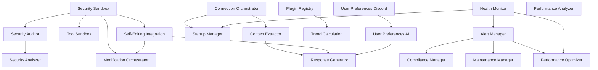

# Mock Implementation Replacement Plan

## Executive Summary

This document provides a comprehensive implementation plan for replacing 50+ mock implementations found in the codebase. The mocks are organized into three priority levels based on security criticality and system functionality.

**Total Mocks Identified:** 50+ across 18 files
**Implementation Batches:** 3 (Security/Core, Compliance/Monitoring, AI/Features)

---

## Priority Classification

### HIGH PRIORITY (Security & Core Functionality)
These mocks directly impact system security, stability, and core operations. They should be implemented first.

| # | Component | File | Mock Count | Complexity |
|---|-----------|------|-------------|------------|
| 1 | Security Sandbox | [`src/self-editing/safety/security-sandbox.ts`](../src/self-editing/safety/security-sandbox.ts) | 1 | Complex |
| 2 | Connection Orchestrator | [`src/core/connection/orchestrator.ts`](../src/core/connection/orchestrator.ts) | 1 | Medium |
| 3 | Security Auditor | [`src/maintenance/security-auditor.ts`](../src/maintenance/security-auditor.ts) | 1 | Complex |
| 4 | Alert Manager | [`src/monitoring/alertManager.ts`](../src/monitoring/alertManager.ts) | 1 | Medium |

### MEDIUM PRIORITY (Compliance & Monitoring)
These mocks affect compliance, monitoring, and maintenance operations. Important but not critical for basic functionality.

| # | Component | File | Mock Count | Complexity |
|---|-----------|------|-------------|------------|
| 5 | Compliance Manager | [`src/maintenance/compliance-manager.ts`](../src/maintenance/compliance-manager.ts) | 10 | Medium |
| 6 | Maintenance Manager | [`src/maintenance/maintenance-manager.ts`](../src/maintenance/maintenance-manager.ts) | 2 | Medium |
| 7 | Health Monitor | [`src/self-editing/monitoring/health-monitor.ts`](../src/self-editing/monitoring/health-monitor.ts) | 1 | Medium |
| 8 | Plugin Registry | [`src/self-editing/plugins/plugin-registry.ts`](../src/self-editing/plugins/plugin-registry.ts) | 3 | Medium |

### LOW PRIORITY (AI & Features)
These mocks affect AI features, user preferences, and non-critical functionality.

| # | Component | File | Mock Count | Complexity |
|---|-----------|------|-------------|------------|
| 9 | Response Generator | [`src/ai/response/response-generator.ts`](../src/ai/response/response-generator.ts) | 4 | Medium |
| 10 | User Preferences | [`src/discord/conversation/DiscordConversationHandler.ts`](../src/discord/conversation/DiscordConversationHandler.ts) | 1 | Simple |
| 11 | User Preferences (AI) | [`src/ai/conversation/conversation-manager.ts`](../src/ai/conversation/conversation-manager.ts) | 1 | Simple |
| 12 | Trend Calculation | [`src/marketplace/plugin-discovery.ts`](../src/marketplace/plugin-discovery.ts) | 1 | Medium |
| 13 | Tool Sandbox | [`src/ai/tools/tool-sandbox.ts`](../src/ai/tools/tool-sandbox.ts) | 2 | Medium |
| 14 | Context Extractor | [`src/core/processing/contextExtractor.ts`](../src/core/processing/contextExtractor.ts) | 1 | Medium |
| 15 | Self-Editing Integration | [`src/ai/integration/self-editing-integration.ts`](../src/ai/integration/self-editing-integration.ts) | 2 | Medium |
| 16 | Modification Orchestrator | [`src/self-editing/core/modification-orchestrator.ts`](../src/self-editing/core/modification-orchestrator.ts) | 9 | Complex |
| 17 | Performance Optimizer | [`src/self-editing/learning/performance-optimizer.ts`](../src/self-editing/learning/performance-optimizer.ts) | 1 | Medium |
| 18 | Performance Analyzer | [`src/self-editing/analysis/performance-analyzer.ts`](../src/self-editing/analysis/performance-analyzer.ts) | 4 | Medium |
| 19 | Security Analyzer | [`src/self-editing/analysis/security-analyzer.ts`](../src/self-editing/analysis/security-analyzer.ts) | 1 | Complex |
| 20 | Startup Manager | [`src/core/lifecycle/startupManager.ts`](../src/core/lifecycle/startupManager.ts) | 1 | Simple |

---

## Detailed Implementation Specifications

### HIGH PRIORITY IMPLEMENTATIONS

#### 1. Security Sandbox (`mockExecution()`)

**Current Mock Location:** [`src/self-editing/safety/security-sandbox.ts`](../src/self-editing/safety/security-sandbox.ts:145)

**What Real Implementation is Needed:**
- Isolated code execution environment for self-editing operations
- Resource limits (CPU, memory, execution time)
- Secure communication between sandbox and host
- Output capture and error handling

**Recommended Libraries:**
- `isolated-vm` or `vm2` for Node.js isolation
- `node:worker_threads` for parallel execution
- `@sentry/node` for error tracking

**Dependencies Required:**
- Node.js Worker Threads API
- File system access for temporary code storage
- Event emitter for sandbox events

**Database Schema Changes:**
```sql
CREATE TABLE sandbox_executions (
  id UUID PRIMARY KEY DEFAULT gen_random_uuid(),
  code_hash VARCHAR(64) NOT NULL,
  execution_time_ms INTEGER NOT NULL,
  memory_used_mb FLOAT,
  cpu_percent FLOAT,
  status VARCHAR(20) NOT NULL,
  output TEXT,
  error TEXT,
  created_at TIMESTAMP DEFAULT NOW()
);
```

**Configuration Requirements:**
```typescript
interface SandboxConfig {
  maxExecutionTime: number;      // milliseconds
  maxMemoryMB: number;
  maxCpuPercent: number;
  allowedModules: string[];
  blockedModules: string[];
  tempDirectory: string;
}
```

**Complexity:** Complex
**Dependencies Between Implementations:** None (can be implemented independently)
**Risks and Considerations:**
- Sandbox escape vulnerabilities
- Resource exhaustion attacks
- Need to carefully validate all code before execution
- Consider using containerization (Docker) for stronger isolation

**Implementation Order:** First in Batch 1

---

#### 2. Connection Orchestrator (`createClient()`)

**Current Mock Location:** [`src/core/connection/orchestrator.ts`](../src/core/connection/orchestrator.ts:83)

**What Real Implementation is Needed:**
- Actual Discord.js client creation with proper configuration
- Gateway intents configuration
- Partials configuration for optimization
- Shard management for large bots

**Recommended Libraries:**
- `discord.js` (already in dependencies)
- `@discordjs/voice` for voice support (if needed)

**Dependencies Required:**
- Discord bot token from environment variables
- Gateway intents configuration
- Shard configuration (if needed)

**Configuration Requirements:**
```typescript
interface DiscordClientConfig {
  token: string;
  intents: GatewayIntentBits;
  partials: PartialType[];
  shards: number | 'auto';
  presence: PresenceData;
  makeCache: CacheOptions;
}
```

**Complexity:** Medium
**Dependencies Between Implementations:** None (can be implemented independently)
**Risks and Considerations:**
- Token security - must never be logged or exposed
- Intent configuration affects what events the bot receives
- Sharding complexity for large bots
- Rate limiting considerations

**Implementation Order:** Second in Batch 1

---

#### 3. Security Auditor (`runPenetrationTest()`)

**Current Mock Location:** [`src/maintenance/security-auditor.ts`](../src/maintenance/security-auditor.ts:2257)

**What Real Implementation is Needed:**
- Integration with penetration testing tools
- Automated vulnerability scanning
- Security report generation
- CVE database integration

**Recommended Libraries:**
- `npm audit` for dependency scanning
- `snyk` API for vulnerability detection
- `@nodesecurity/nsp` for security scanning
- OWASP ZAP API integration (optional)

**Dependencies Required:**
- External penetration testing service API keys
- CVE database access
- Vulnerability scanning tools

**Database Schema Changes:**
```sql
CREATE TABLE penetration_tests (
  id UUID PRIMARY KEY DEFAULT gen_random_uuid(),
  schedule_id VARCHAR(50) NOT NULL,
  status VARCHAR(20) NOT NULL,
  score INTEGER,
  findings JSONB,
  started_at TIMESTAMP,
  completed_at TIMESTAMP,
  created_at TIMESTAMP DEFAULT NOW()
);

CREATE TABLE security_findings (
  id UUID PRIMARY KEY DEFAULT gen_random_uuid(),
  test_id UUID REFERENCES penetration_tests(id),
  type VARCHAR(50) NOT NULL,
  severity VARCHAR(20) NOT NULL,
  title VARCHAR(255) NOT NULL,
  description TEXT,
  location VARCHAR(500),
  recommendation TEXT,
  cvss_score FLOAT,
  cve_id VARCHAR(50),
  created_at TIMESTAMP DEFAULT NOW()
);
```

**Configuration Requirements:**
```typescript
interface PenTestConfig {
  enabled: boolean;
  provider: 'snyk' | 'owasp-zap' | 'burp' | 'custom';
  apiKey: string;
  apiUrl: string;
  scanInterval: number;
  severityThreshold: 'low' | 'medium' | 'high' | 'critical';
}
```

**Complexity:** Complex
**Dependencies Between Implementations:** Security Sandbox (for safe test execution)
**Risks and Considerations:**
- API rate limits for vulnerability scanning
- False positives in automated scans
- Cost of commercial scanning services
- Need to schedule scans during low-traffic periods

**Implementation Order:** Third in Batch 1

---

#### 4. Alert Manager (`getMetricValue()`)

**Current Mock Location:** [`src/monitoring/alertManager.ts`](../src/monitoring/alertManager.ts:470)

**What Real Implementation is Needed:**
- Integration with metrics collection system
- Real-time metric querying
- Time-series data access
- Aggregation functions

**Recommended Libraries:**
- `prom-client` for Prometheus metrics
- `@opentelemetry/api` and `@opentelemetry/sdk-metrics`
- `influxdb-client` for InfluxDB
- `statsd-client` for StatsD

**Dependencies Required:**
- Metrics collector service
- Time-series database (Prometheus, InfluxDB, etc.)
- Metric naming conventions

**Configuration Requirements:**
```typescript
interface MetricsConfig {
  provider: 'prometheus' | 'influxdb' | 'statsd' | 'custom';
  endpoint: string;
  apiKey?: string;
  queryTimeout: number;
  aggregationInterval: number;
}
```

**Complexity:** Medium
**Dependencies Between Implementations:** Health Monitor (for metric collection)
**Risks and Considerations:**
- Performance impact of frequent metric queries
- Need to handle missing metrics gracefully
- Metric name consistency across services
- Time-series database performance at scale

**Implementation Order:** Fourth in Batch 1

---

### MEDIUM PRIORITY IMPLEMENTATIONS

#### 5. Compliance Manager (10 Mock Methods)

**Current Mock Location:** [`src/maintenance/compliance-manager.ts`](../src/maintenance/compliance-manager.ts)

**Mock Methods to Implement:**
1. `checkRateLimiting()` - Line 885
2. `checkContentPolicy()` - Line 896
3. `checkUserPrivacy()` - Line 907
4. `checkBotBehavior()` - Line 918
5. `checkColorContrast()` - Line 997
6. `checkAltText()` - Line 1008
7. `checkKeyboardNavigation()` - Line 1019
8. `checkScreenReaderCompatibility()` - Line 1030
9. `checkForUntranslatedStrings()` - Line 1092
10. `checkForCulturalSensitivity()` - Line 1103

**What Real Implementation is Needed:**
- GDPR compliance verification
- Discord TOS compliance checking
- WCAG accessibility compliance
- Localization/translation verification

**Recommended Libraries:**
- `axe-core` for accessibility testing
- `i18next` for localization management
- `pa11y` for accessibility audits
- `@discordjs/rest` for Discord API compliance checks

**Dependencies Required:**
- Translation files for supported languages
- Accessibility testing framework
- Discord API documentation for TOS compliance
- GDPR documentation and requirements

**Database Schema Changes:**
```sql
CREATE TABLE compliance_audits (
  id UUID PRIMARY KEY DEFAULT gen_random_uuid(),
  type VARCHAR(50) NOT NULL,
  status VARCHAR(20) NOT NULL,
  score INTEGER,
  findings JSONB,
  audit_date TIMESTAMP DEFAULT NOW()
);

CREATE TABLE compliance_findings (
  id UUID PRIMARY KEY DEFAULT gen_random_uuid(),
  audit_id UUID REFERENCES compliance_audits(id),
  category VARCHAR(100) NOT NULL,
  severity VARCHAR(20) NOT NULL,
  description TEXT,
  recommendation TEXT,
  status VARCHAR(20) DEFAULT 'open',
  resolved_at TIMESTAMP
);
```

**Configuration Requirements:**
```typescript
interface ComplianceConfig {
  gdpr: {
    enabled: boolean;
    dataRetentionDays: number;
    rightToDeletion: boolean;
    rightToAccess: boolean;
  };
  discord: {
    enabled: boolean;
    rateLimitCompliance: boolean;
    contentPolicyCompliance: boolean;
  };
  accessibility: {
    enabled: boolean;
    wcagLevel: 'A' | 'AA' | 'AAA';
    checkColorContrast: boolean;
  };
  localization: {
    enabled: boolean;
    supportedLanguages: string[];
    checkTranslations: boolean;
  };
}
```

**Complexity:** Medium
**Dependencies Between Implementations:** Alert Manager (for compliance failures)
**Risks and Considerations:**
- Compliance requirements change over time
- Need to stay updated with Discord TOS changes
- Accessibility testing can be resource-intensive
- GDPR has strict data handling requirements

**Implementation Order:** First in Batch 2

---

#### 6. Maintenance Manager (2 Mock Methods)

**Current Mock Location:** [`src/maintenance/maintenance-manager.ts`](../src/maintenance/maintenance-manager.ts)

**Mock Methods to Implement:**
1. `getSecurityTeamMember()` - Line 366
2. `trackPerformanceForTask()` - Line 747

**What Real Implementation is Needed:**
- Security team member database lookup
- Task performance tracking and metrics
- Maintenance scheduling integration

**Recommended Libraries:**
- `bull` or `agenda` for job scheduling
- `node-cron` for periodic tasks
- Existing repository pattern for database access

**Dependencies Required:**
- User/team member database tables
- Performance metrics collection
- Task scheduling system

**Database Schema Changes:**
```sql
CREATE TABLE maintenance_tasks (
  id UUID PRIMARY KEY DEFAULT gen_random_uuid(),
  title VARCHAR(255) NOT NULL,
  description TEXT,
  type VARCHAR(50) NOT NULL,
  status VARCHAR(20) NOT NULL,
  priority VARCHAR(20) NOT NULL,
  assigned_to UUID REFERENCES users(id),
  scheduled_at TIMESTAMP,
  started_at TIMESTAMP,
  completed_at TIMESTAMP,
  performance_metrics JSONB,
  created_at TIMESTAMP DEFAULT NOW()
);

CREATE TABLE security_team (
  id UUID PRIMARY KEY DEFAULT gen_random_uuid(),
  user_id UUID REFERENCES users(id),
  role VARCHAR(50) NOT NULL,
  on_call BOOLEAN DEFAULT FALSE,
  contact_method VARCHAR(100),
  created_at TIMESTAMP DEFAULT NOW()
);
```

**Complexity:** Medium
**Dependencies Between Implementations:** Alert Manager (for maintenance alerts)
**Risks and Considerations:**
- Need proper on-call rotation management
- Performance tracking can impact system performance
- Task scheduling conflicts
- Need to handle failed maintenance tasks gracefully

**Implementation Order:** Second in Batch 2

---

#### 7. Health Monitor (`checkComponent()`)

**Current Mock Location:** [`src/self-editing/monitoring/health-monitor.ts`](../src/self-editing/monitoring/health-monitor.ts:185)

**What Real Implementation is Needed:**
- Actual component health check execution
- Health check timeout handling
- Component dependency tracking
- Health status aggregation

**Recommended Libraries:**
- `@godaddy/terminus` for health checks
- `node-fetch` for HTTP health checks
- `ping` for network connectivity checks

**Dependencies Required:**
- Component health check endpoints
- Network connectivity
- Database connectivity

**Configuration Requirements:**
```typescript
interface HealthCheckConfig {
  checkInterval: number;
  timeout: number;
  unhealthyThreshold: number;
  healthyThreshold: number;
  components: {
    [name: string]: {
      type: 'http' | 'tcp' | 'database' | 'custom';
      endpoint: string;
      expectedStatus?: number;
    };
  };
}
```

**Complexity:** Medium
**Dependencies Between Implementations:** None (can be implemented independently)
**Risks and Considerations:**
- Health checks can cascade failures
- Need to handle partial failures gracefully
- Performance impact of frequent checks
- False positives/negatives in health detection

**Implementation Order:** Third in Batch 2

---

#### 8. Plugin Registry (3 Mock Methods)

**Current Mock Location:** [`src/self-editing/plugins/plugin-registry.ts`](../src/self-editing/plugins/plugin-registry.ts)

**Mock Methods to Implement:**
1. `searchMarketplace()` - Line 610
2. `getMarketplacePlugin()` - Line 634
3. `getMarketplaceCategories()` - Line 649

**What Real Implementation is Needed:**
- Integration with npm registry or custom marketplace
- Plugin version resolution
- Dependency resolution for plugins
- Plugin metadata caching

**Recommended Libraries:**
- `npm-registry-fetch` for npm registry access
- `semver` for version comparison
- `pacote` for package metadata fetching
- `node-fetch` for HTTP requests

**Dependencies Required:**
- npm registry API access
- Custom marketplace API (if applicable)
- Plugin metadata storage

**Database Schema Changes:**
```sql
CREATE TABLE plugins (
  id UUID PRIMARY KEY DEFAULT gen_random_uuid(),
  name VARCHAR(255) NOT NULL,
  version VARCHAR(50) NOT NULL,
  description TEXT,
  author VARCHAR(255),
  repository_url VARCHAR(500),
  dependencies JSONB,
  installed_at TIMESTAMP,
  enabled BOOLEAN DEFAULT TRUE,
  UNIQUE(name, version)
);

CREATE TABLE plugin_versions (
  id UUID PRIMARY KEY DEFAULT gen_random_uuid(),
  plugin_id UUID REFERENCES plugins(id),
  version VARCHAR(50) NOT NULL,
  published_at TIMESTAMP,
  download_count INTEGER DEFAULT 0,
  is_latest BOOLEAN DEFAULT FALSE
);

CREATE TABLE marketplace_cache (
  id UUID PRIMARY KEY DEFAULT gen_random_uuid(),
  package_name VARCHAR(255) NOT NULL,
  metadata JSONB NOT NULL,
  cached_at TIMESTAMP DEFAULT NOW(),
  expires_at TIMESTAMP NOT NULL
);
```

**Configuration Requirements:**
```typescript
interface PluginRegistryConfig {
  marketplaceUrl: string;
  npmRegistryUrl: string;
  cacheDuration: number;
  maxCacheSize: number;
  allowedSources: string[];
  blockedPackages: string[];
}
```

**Complexity:** Medium
**Dependencies Between Implementations:** None (can be implemented independently)
**Risks and Considerations:**
- npm registry rate limits
- Malicious package detection
- Dependency conflicts
- Cache invalidation strategy
- Need to validate plugin signatures

**Implementation Order:** Fourth in Batch 2

---

### LOW PRIORITY IMPLEMENTATIONS

#### 9. Response Generator (4 Mock Methods)

**Current Mock Location:** [`src/ai/response/response-generator.ts`](../src/ai/response/response-generator.ts)

**Mock Methods to Implement:**
1. `DefaultStrategyHandler.generate()` - Line 771
2. `TemplateStrategyHandler.generate()` - Line 788
3. `AIGeneratedStrategyHandler.generate()` - Line 804
4. `HybridStrategyHandler.generate()` - Line 822

**What Real Implementation is Needed:**
- AI model integration for response generation
- Template-based response generation
- Hybrid approach combining both
- Response quality validation

**Recommended Libraries:**
- `openai` for OpenAI API
- `@anthropic-ai/sdk` for Claude API
- `@google/generative-ai` for Google AI
- `handlebars` or `ejs` for templates

**Dependencies Required:**
- AI API keys and configuration
- Response templates
- Context management system

**Database Schema Changes:**
```sql
CREATE TABLE response_templates (
  id UUID PRIMARY KEY DEFAULT gen_random_uuid(),
  name VARCHAR(255) NOT NULL,
  template_content TEXT NOT NULL,
  variables JSONB,
  conditions JSONB,
  category VARCHAR(100),
  created_at TIMESTAMP DEFAULT NOW()
);

CREATE TABLE response_history (
  id UUID PRIMARY KEY DEFAULT gen_random_uuid(),
  user_id UUID REFERENCES users(id),
  input_text TEXT NOT NULL,
  response_text TEXT NOT NULL,
  strategy VARCHAR(50) NOT NULL,
  quality_score FLOAT,
  processing_time_ms INTEGER,
  created_at TIMESTAMP DEFAULT NOW()
);
```

**Configuration Requirements:**
```typescript
interface ResponseGeneratorConfig {
  defaultStrategy: 'ai' | 'template' | 'hybrid';
  aiProvider: 'openai' | 'anthropic' | 'google' | 'local';
  aiModel: string;
  templateEngine: 'handlebars' | 'ejs' | 'mustache';
  maxResponseLength: number;
  enableCaching: boolean;
  cacheTTL: number;
}
```

**Complexity:** Medium
**Dependencies Between Implementations:** Context Extractor, User Preferences
**Risks and Considerations:**
- AI API costs and rate limits
- Response quality consistency
- Template injection vulnerabilities
- Need for fallback strategies
- Response personalization privacy concerns

**Implementation Order:** First in Batch 3

---

#### 10. User Preferences (Discord) (1 Mock Method)

**Current Mock Location:** [`src/discord/conversation/DiscordConversationHandler.ts`](../src/discord/conversation/DiscordConversationHandler.ts:822)

**What Real Implementation is Needed:**
- User preference storage and retrieval
- Preference validation
- Default preferences
- Preference change tracking

**Recommended Libraries:**
- Existing repository pattern
- `joi` or `zod` for validation

**Dependencies Required:**
- User preferences database table
- Preference schema definitions

**Database Schema Changes:**
```sql
CREATE TABLE user_preferences (
  id UUID PRIMARY KEY DEFAULT gen_random_uuid(),
  user_id UUID REFERENCES users(id) UNIQUE,
  preferences JSONB NOT NULL DEFAULT '{}',
  updated_at TIMESTAMP DEFAULT NOW(),
  created_at TIMESTAMP DEFAULT NOW()
);
```

**Configuration Requirements:**
```typescript
interface UserPreferencesConfig {
  defaultPreferences: Record<string, any>;
  allowedPreferences: string[];
  validationSchema: Record<string, any>;
  maxPreferenceSize: number;
}
```

**Complexity:** Simple
**Dependencies Between Implementations:** None (can be implemented independently)
**Risks and Considerations:**
- Preference storage limits
- Invalid preference values
- Need for migration when schema changes
- Privacy concerns with user data

**Implementation Order:** Second in Batch 3

---

#### 11. User Preferences (AI) (1 Mock Method)

**Current Mock Location:** [`src/ai/conversation/conversation-manager.ts`](../src/ai/conversation/conversation-manager.ts:559)

**What Real Implementation is Needed:**
- AI-specific user preferences
- Model preference tracking
- Response style preferences
- Learning from user feedback

**Dependencies Required:**
- Same as Discord User Preferences (shared or separate)

**Complexity:** Simple
**Dependencies Between Implementations:** User Preferences (Discord)
**Risks and Considerations:**
- Same as Discord User Preferences
- Additional AI-specific privacy concerns

**Implementation Order:** Third in Batch 3

---

#### 12. Trend Calculation (1 Mock Method)

**Current Mock Location:** [`src/marketplace/plugin-discovery.ts`](../src/marketplace/plugin-discovery.ts:453)

**What Real Implementation is Needed:**
- Download trend calculation
- Popularity metrics
- Time-series analysis
- Trend prediction

**Recommended Libraries:**
- `simple-statistics` for trend analysis
- `moving-averages` for smoothing
- `regression` for trend prediction

**Dependencies Required:**
- Historical download data
- Time-series database

**Database Schema Changes:**
```sql
CREATE TABLE plugin_downloads (
  id UUID PRIMARY KEY DEFAULT gen_random_uuid(),
  plugin_id UUID REFERENCES plugins(id),
  download_date DATE NOT NULL,
  download_count INTEGER DEFAULT 0,
  UNIQUE(plugin_id, download_date)
);

CREATE TABLE plugin_trends (
  id UUID PRIMARY KEY DEFAULT gen_random_uuid(),
  plugin_id UUID REFERENCES plugins(id),
  trend_type VARCHAR(50) NOT NULL,
  trend_value FLOAT NOT NULL,
  calculated_at TIMESTAMP DEFAULT NOW()
);
```

**Configuration Requirements:**
```typescript
interface TrendConfig {
  calculationWindow: number;  // days
  smoothingFactor: number;
  minDataPoints: number;
  trendTypes: string[];
}
```

**Complexity:** Medium
**Dependencies Between Implementations:** Plugin Registry
**Risks and Considerations:**
- Insufficient data for accurate trends
- Seasonal variations affecting trends
- Need for data aggregation at scale
- Trend prediction accuracy

**Implementation Order:** Fourth in Batch 3

---

#### 13. Tool Sandbox (2 Mock Methods)

**Current Mock Location:** [`src/ai/tools/tool-sandbox.ts`](../src/ai/tools/tool-sandbox.ts)

**Mock Methods to Implement:**
1. `executeDirectly()` - Line 261
2. `executeToolInternal()` - Line 326

**What Real Implementation is Needed:**
- Actual tool execution with sandbox restrictions
- Permission validation
- Resource monitoring
- Violation tracking

**Recommended Libraries:**
- `isolated-vm` or `vm2` for code isolation
- `node:worker_threads` for parallel execution
- `@sentry/node` for error tracking

**Dependencies Required:**
- Tool registry
- Permission system
- Resource monitoring

**Database Schema Changes:**
```sql
CREATE TABLE tool_executions (
  id UUID PRIMARY KEY DEFAULT gen_random_uuid(),
  tool_name VARCHAR(255) NOT NULL,
  user_id UUID REFERENCES users(id),
  sandbox_id VARCHAR(100),
  execution_time_ms INTEGER,
  memory_used_mb FLOAT,
  success BOOLEAN,
  violations JSONB,
  error_message TEXT,
  created_at TIMESTAMP DEFAULT NOW()
);
```

**Configuration Requirements:**
```typescript
interface ToolSandboxConfig {
  timeout: number;
  maxMemoryMB: number;
  allowedTools: string[];
  blockedTools: string[];
  enableNetworkAccess: boolean;
  enableFileSystemAccess: boolean;
}
```

**Complexity:** Medium
**Dependencies Between Implementations:** Security Sandbox
**Risks and Considerations:**
- Sandbox escape vulnerabilities
- Tool execution denial of service
- Permission bypass attempts
- Need for comprehensive tool validation

**Implementation Order:** Fifth in Batch 3

---

#### 14. Context Extractor (1 Mock Method)

**Current Mock Location:** [`src/core/processing/contextExtractor.ts`](../src/core/processing/contextExtractor.ts:113)

**What Real Implementation is Needed:**
- Discord API integration for guild context
- Member role fetching
- Channel type determination
- Active moderator identification

**Recommended Libraries:**
- `discord.js` (already in dependencies)
- Existing repository pattern

**Dependencies Required:**
- Discord API access
- Guild/member caching

**Configuration Requirements:**
```typescript
interface ContextExtractorConfig {
  cacheSize: number;
  cacheTTL: number;
  fetchTimeout: number;
  maxConcurrentFetches: number;
}
```

**Complexity:** Medium
**Dependencies Between Implementations:** Connection Orchestrator
**Risks and Considerations:**
- Discord API rate limits
- Cache invalidation
- Large guild performance impact
- Permission requirements for context fetching

**Implementation Order:** Sixth in Batch 3

---

#### 15. Self-Editing Integration (2 Mock Methods)

**Current Mock Location:** [`src/ai/integration/self-editing-integration.ts`](../src/ai/integration/self-editing-integration.ts)

**Mock Methods to Implement:**
1. `generateCodeFromAnalysis()` - Line 429
2. `generateCodeFromDescription()` - Line 898

**What Real Implementation is Needed:**
- AI-powered code generation
- Code analysis integration
- Code quality validation
- Self-editing workflow integration

**Recommended Libraries:**
- `openai` or `@anthropic-ai/sdk` for AI code generation
- `@typescript-eslint/parser` for code analysis
- `prettier` for code formatting

**Dependencies Required:**
- AI API configuration
- Code analysis system
- Self-editing engine

**Database Schema Changes:**
```sql
CREATE TABLE generated_code (
  id UUID PRIMARY KEY DEFAULT gen_random_uuid(),
  request_type VARCHAR(50) NOT NULL,
  input_data JSONB NOT NULL,
  generated_code TEXT NOT NULL,
  analysis JSONB,
  quality_score FLOAT,
  used_in_editing BOOLEAN DEFAULT FALSE,
  created_at TIMESTAMP DEFAULT NOW()
);
```

**Configuration Requirements:**
```typescript
interface SelfEditingConfig {
  aiProvider: string;
  model: string;
  maxCodeLength: number;
  enableCodeReview: boolean;
  enableAutoFormatting: boolean;
}
```

**Complexity:** Medium
**Dependencies Between Implementations:** Security Sandbox, Response Generator
**Risks and Considerations:**
- Generated code quality issues
- AI API costs
- Code injection vulnerabilities
- Need for thorough testing of generated code

**Implementation Order:** Seventh in Batch 3

---

#### 16. Modification Orchestrator (9 Mock Methods)

**Current Mock Location:** [`src/self-editing/core/modification-orchestrator.ts`](../src/self-editing/core/modification-orchestrator.ts)

**Mock Methods to Implement:**
1. `validateModification()` - Mock validation
2. `createBackup()` - Mock backup creation
3. `applyChanges()` - Mock change application
4. `runTests()` - Mock test execution
5. `verifyModification()` - Mock verification
6. `executeRollbackStep()` - Mock rollback
7. `verifyRollback()` - Mock rollback verification
8. `identifyDependencies()` - Mock dependency identification
9. `estimateTime()` - Mock time estimation

**What Real Implementation is Needed:**
- Code modification validation
- File backup system
- Change application with rollback support
- Test execution and reporting
- Dependency analysis
- Time estimation

**Recommended Libraries:**
- `chokidar` for file watching
- `simple-git` for version control
- `diff` for change tracking
- `jest` or `mocha` for test execution

**Dependencies Required:**
- File system access
- Git repository
- Test suite
- Backup storage

**Database Schema Changes:**
```sql
CREATE TABLE modifications (
  id UUID PRIMARY KEY DEFAULT gen_random_uuid(),
  target_file VARCHAR(500) NOT NULL,
  change_type VARCHAR(50) NOT NULL,
  old_content TEXT,
  new_content TEXT,
  status VARCHAR(20) NOT NULL,
  backup_path VARCHAR(500),
  test_results JSONB,
  rollback_available BOOLEAN DEFAULT TRUE,
  created_by UUID REFERENCES users(id),
  created_at TIMESTAMP DEFAULT NOW()
);

CREATE TABLE modification_dependencies (
  id UUID PRIMARY KEY DEFAULT gen_random_uuid(),
  modification_id UUID REFERENCES modifications(id),
  dependency_type VARCHAR(50) NOT NULL,
  dependency_path VARCHAR(500) NOT NULL,
  required_version VARCHAR(100)
);
```

**Configuration Requirements:**
```typescript
interface ModificationConfig {
  backupLocation: string;
  autoBackup: boolean;
  testCommand: string;
  rollbackStrategy: 'git' | 'file-copy' | 'none';
  maxRollbacks: number;
  dryRun: boolean;
}
```

**Complexity:** Complex
**Dependencies Between Implementations:** Security Sandbox, Self-Editing Integration
**Risks and Considerations:**
- Data loss during modification
- Rollback failures
- Test suite coverage gaps
- Dependency resolution conflicts
- Concurrent modification issues

**Implementation Order:** Eighth in Batch 3

---

#### 17. Performance Optimizer (1 Mock Method)

**Current Mock Location:** [`src/self-editing/learning/performance-optimizer.ts`](../src/self-editing/learning/performance-optimizer.ts:256)

**What Real Implementation is Needed:**
- Historical performance data analysis
- Pattern recognition
- Optimization recommendations
- Performance trend tracking

**Recommended Libraries:**
- `ml-regression` for trend analysis
- `simple-statistics` for metrics
- `moving-averages` for smoothing

**Dependencies Required:**
- Performance metrics database
- Historical data storage

**Database Schema Changes:**
```sql
CREATE TABLE performance_metrics (
  id UUID PRIMARY KEY DEFAULT gen_random_uuid(),
  component VARCHAR(255) NOT NULL,
  metric_name VARCHAR(100) NOT NULL,
  metric_value FLOAT NOT NULL,
  timestamp TIMESTAMP DEFAULT NOW()
);

CREATE TABLE performance_optimizations (
  id UUID PRIMARY KEY DEFAULT gen_random_uuid(),
  component VARCHAR(255) NOT NULL,
  optimization_type VARCHAR(100) NOT NULL,
  before_value FLOAT,
  after_value FLOAT,
  improvement_percent FLOAT,
  applied_at TIMESTAMP DEFAULT NOW()
);
```

**Configuration Requirements:**
```typescript
interface PerformanceOptimizerConfig {
  dataRetentionDays: number;
  minDataPoints: number;
  improvementThreshold: number;
  autoApplyOptimizations: boolean;
}
```

**Complexity:** Medium
**Dependencies Between Implementations:** Health Monitor, Alert Manager
**Risks and Considerations:**
- Insufficient historical data
- False optimization recommendations
- Performance regression from optimizations
- Need for A/B testing of optimizations

**Implementation Order:** Ninth in Batch 3

---

#### 18. Performance Analyzer (4 Mock Methods)

**Current Mock Location:** [`src/self-editing/analysis/performance-analyzer.ts`](../src/self-editing/analysis/performance-analyzer.ts)

**Mock Methods to Implement:**
1. `analyzeTimeComplexity()` - Mock complexity analysis
2. `analyzeSpaceComplexity()` - Mock space analysis
3. `identifyBottlenecks()` - Mock bottleneck detection
4. `identifyOptimizations()` - Mock optimization suggestions

**What Real Implementation is Needed:**
- AST-based code analysis
- Complexity calculation (Big O)
- Bottleneck detection
- Optimization recommendation engine

**Recommended Libraries:**
- `@typescript-eslint/parser` for AST parsing
- `@babel/parser` for code analysis
- `complexity-report` for complexity metrics
- `eslint` for code quality analysis

**Dependencies Required:**
- TypeScript/JavaScript parser
- Code analysis framework

**Configuration Requirements:**
```typescript
interface PerformanceAnalyzerConfig {
  maxComplexity: number;
  cyclomaticComplexityThreshold: number;
  maintainabilityIndex: number;
  enableASTCaching: boolean;
}
```

**Complexity:** Medium
**Dependencies Between Implementations:** None (can be implemented independently)
**Risks and Considerations:**
- AST parsing performance impact
- False positives in bottleneck detection
- Complexity calculation accuracy
- Need for language-specific rules

**Implementation Order:** Tenth in Batch 3

---

#### 19. Security Analyzer (1 Mock Method)

**Current Mock Location:** [`src/self-editing/analysis/security-analyzer.ts`](../src/self-editing/analysis/security-analyzer.ts)

**Mock Methods to Implement:**
1. `scanVulnerabilities()` - Mock vulnerability scanning (returns hardcoded vulnerabilities)

**What Real Implementation is Needed:**
- AST-based security scanning
- Known vulnerability pattern matching
- Security rule engine
- Vulnerability database integration

**Recommended Libraries:**
- `@typescript-eslint/parser` for AST parsing
- `eslint-plugin-security` for security rules
- `snyk` API for vulnerability database
- `npm audit` for dependency scanning

**Dependencies Required:**
- Vulnerability database access
- Security rule definitions
- AST parser

**Database Schema Changes:**
```sql
CREATE TABLE security_vulnerabilities (
  id UUID PRIMARY KEY DEFAULT gen_random_uuid(),
  file_path VARCHAR(500) NOT NULL,
  line_number INTEGER NOT NULL,
  severity VARCHAR(20) NOT NULL,
  type VARCHAR(100) NOT NULL,
  description TEXT,
  recommendation TEXT,
  cve_id VARCHAR(50),
  cvss_score FLOAT,
  status VARCHAR(20) DEFAULT 'open',
  discovered_at TIMESTAMP DEFAULT NOW(),
  resolved_at TIMESTAMP
);
```

**Configuration Requirements:**
```typescript
interface SecurityAnalyzerConfig {
  vulnerabilityDatabase: 'snyk' | 'npm-audit' | 'custom';
  severityThreshold: 'low' | 'medium' | 'high' | 'critical';
  enableDependencyScanning: boolean;
  enableCodeScanning: boolean;
  customRules: string[];
}
```

**Complexity:** Complex
**Dependencies Between Implementations:** Security Auditor
**Risks and Considerations:**
- False positives in security scanning
- Vulnerability database accuracy
- Performance impact of scanning
- Need for regular rule updates
- Zero-day vulnerabilities not detected

**Implementation Order:** Eleventh in Batch 3

---

#### 20. Startup Manager (1 Mock Method)

**Current Mock Location:** [`src/core/lifecycle/startupManager.ts`](../src/core/lifecycle/startupManager.ts:318)

**What Real Implementation is Needed:**
- Startup sequence orchestration
- Dependency initialization
- Health check coordination
- Graceful failure handling

**Recommended Libraries:**
- `lifecycle` package for lifecycle management
- `p-queue` for dependency initialization
- Existing health monitor

**Dependencies Required:**
- Component health checks
- Dependency graph
- Configuration loading

**Configuration Requirements:**
```typescript
interface StartupConfig {
  timeout: number;
  maxRetries: number;
  parallelInit: boolean;
  requiredComponents: string[];
  optionalComponents: string[];
}
```

**Complexity:** Simple
**Dependencies Between Implementations:** Health Monitor, Connection Orchestrator
**Risks and Considerations:**
- Circular dependencies
- Timeout handling
- Partial startup states
- Need for rollback on failure

**Implementation Order:** Twelfth in Batch 3

---

## Implementation Batches

### Batch 1: Core Security and Connection Mocks (HIGH PRIORITY)

**Timeline:** Critical - First batch to implement
**Estimated Components:** 4
**Dependencies:** Minimal (can be implemented in parallel)

| Order | Component | File | Complexity | Dependencies |
|-------|-----------|------|-------------|--------------|
| 1 | Security Sandbox | [`src/self-editing/safety/security-sandbox.ts`](../src/self-editing/safety/security-sandbox.ts) | Complex | None |
| 2 | Connection Orchestrator | [`src/core/connection/orchestrator.ts`](../src/core/connection/orchestrator.ts) | Medium | None |
| 3 | Security Auditor | [`src/maintenance/security-auditor.ts`](../src/maintenance/security-auditor.ts) | Complex | Security Sandbox |
| 4 | Alert Manager | [`src/monitoring/alertManager.ts`](../src/monitoring/alertManager.ts) | Medium | Health Monitor |

**Success Criteria:**
- Security Sandbox can safely execute code with resource limits
- Connection Orchestrator creates actual Discord.js client
- Security Auditor integrates with penetration testing tools
- Alert Manager queries real metrics from collector

**Risks:**
- Sandbox escape vulnerabilities
- Discord API changes
- External API rate limits
- Metrics collection overhead

---

### Batch 2: Compliance and Monitoring Mocks (MEDIUM PRIORITY)

**Timeline:** After Batch 1 completion
**Estimated Components:** 4
**Dependencies:** Alert Manager (from Batch 1)

| Order | Component | File | Complexity | Dependencies |
|-------|-----------|------|-------------|--------------|
| 1 | Compliance Manager | [`src/maintenance/compliance-manager.ts`](../src/maintenance/compliance-manager.ts) | Medium | Alert Manager |
| 2 | Maintenance Manager | [`src/maintenance/maintenance-manager.ts`](../src/maintenance/maintenance-manager.ts) | Medium | Alert Manager |
| 3 | Health Monitor | [`src/self-editing/monitoring/health-monitor.ts`](../src/self-editing/monitoring/health-monitor.ts) | Medium | None |
| 4 | Plugin Registry | [`src/self-editing/plugins/plugin-registry.ts`](../src/self-editing/plugins/plugin-registry.ts) | Medium | None |

**Success Criteria:**
- Compliance Manager performs actual GDPR/Discord TOS checks
- Maintenance Manager tracks real team members and performance
- Health Monitor executes actual component health checks
- Plugin Registry queries npm registry for plugins

**Risks:**
- Compliance requirement changes
- API rate limits
- Health check cascading failures
- npm registry availability

---

### Batch 3: AI and Feature Mocks (LOW PRIORITY)

**Timeline:** After Batch 2 completion
**Estimated Components:** 12
**Dependencies:** Multiple from previous batches

| Order | Component | File | Complexity | Dependencies |
|-------|-----------|------|-------------|--------------|
| 1 | Response Generator | [`src/ai/response/response-generator.ts`](../src/ai/response/response-generator.ts) | Medium | Context Extractor, User Preferences |
| 2 | User Preferences (Discord) | [`src/discord/conversation/DiscordConversationHandler.ts`](../src/discord/conversation/DiscordConversationHandler.ts) | Simple | None |
| 3 | User Preferences (AI) | [`src/ai/conversation/conversation-manager.ts`](../src/ai/conversation/conversation-manager.ts) | Simple | User Preferences (Discord) |
| 4 | Trend Calculation | [`src/marketplace/plugin-discovery.ts`](../src/marketplace/plugin-discovery.ts) | Medium | Plugin Registry |
| 5 | Tool Sandbox | [`src/ai/tools/tool-sandbox.ts`](../src/ai/tools/tool-sandbox.ts) | Medium | Security Sandbox |
| 6 | Context Extractor | [`src/core/processing/contextExtractor.ts`](../src/core/processing/contextExtractor.ts) | Medium | Connection Orchestrator |
| 7 | Self-Editing Integration | [`src/ai/integration/self-editing-integration.ts`](../src/ai/integration/self-editing-integration.ts) | Medium | Security Sandbox, Response Generator |
| 8 | Modification Orchestrator | [`src/self-editing/core/modification-orchestrator.ts`](../src/self-editing/core/modification-orchestrator.ts) | Complex | Security Sandbox, Self-Editing Integration |
| 9 | Performance Optimizer | [`src/self-editing/learning/performance-optimizer.ts`](../src/self-editing/learning/performance-optimizer.ts) | Medium | Health Monitor, Alert Manager |
| 10 | Performance Analyzer | [`src/self-editing/analysis/performance-analyzer.ts`](../src/self-editing/analysis/performance-analyzer.ts) | Medium | None |
| 11 | Security Analyzer | [`src/self-editing/analysis/security-analyzer.ts`](../src/self-editing/analysis/security-analyzer.ts) | Complex | Security Auditor |
| 12 | Startup Manager | [`src/core/lifecycle/startupManager.ts`](../src/core/lifecycle/startupManager.ts) | Simple | Health Monitor, Connection Orchestrator |

**Success Criteria:**
- Response Generator uses AI models for responses
- User Preferences store and retrieve actual preferences
- Trend Calculation analyzes real download data
- Tool Sandbox executes tools with restrictions
- Context Extractor fetches real Discord context
- Self-Editing Integration generates code with AI
- Modification Orchestrator validates, backs up, and applies changes
- Performance Optimizer analyzes historical data
- Performance Analyzer calculates complexity and bottlenecks
- Security Analyzer scans for real vulnerabilities
- Startup Manager orchestrates actual startup sequence

**Risks:**
- AI API costs and rate limits
- Code generation quality issues
- Performance impact of analysis
- Data loss during modifications
- AST parsing performance

---

## Dependency Graph



---

## Library Recommendations Summary

### Security & Isolation
| Library | Purpose | Use Case |
|---------|---------|----------|
| `isolated-vm` | Code isolation | Security Sandbox, Tool Sandbox |
| `vm2` | Alternative isolation | Security Sandbox, Tool Sandbox |
| `node:worker_threads` | Parallel execution | Performance optimization |
| `@sentry/node` | Error tracking | All components |

### AI & Code Generation
| Library | Purpose | Use Case |
|---------|---------|----------|
| `openai` | OpenAI API | Response Generator, Self-Editing |
| `@anthropic-ai/sdk` | Claude API | Response Generator, Self-Editing |
| `@google/generative-ai` | Google AI | Response Generator |
| `@typescript-eslint/parser` | AST parsing | Performance Analyzer, Security Analyzer |
| `@babel/parser` | Code analysis | Performance Analyzer |
| `eslint-plugin-security` | Security rules | Security Analyzer |

### Monitoring & Metrics
| Library | Purpose | Use Case |
|---------|---------|----------|
| `prom-client` | Prometheus metrics | Alert Manager, Health Monitor |
| `@opentelemetry/sdk-metrics` | OpenTelemetry | Alert Manager |
| `influxdb-client` | InfluxDB | Alert Manager |
| `@godaddy/terminus` | Health checks | Health Monitor |

### Package Management
| Library | Purpose | Use Case |
|---------|---------|----------|
| `npm-registry-fetch` | npm registry | Plugin Registry |
| `pacote` | Package metadata | Plugin Registry |
| `semver` | Version comparison | Plugin Registry |

### Compliance & Security
| Library | Purpose | Use Case |
|---------|---------|----------|
| `axe-core` | Accessibility testing | Compliance Manager |
| `pa11y` | Accessibility audits | Compliance Manager |
| `snyk` | Vulnerability scanning | Security Auditor, Security Analyzer |
| `npm audit` | Dependency scanning | Security Auditor |

### Data Analysis
| Library | Purpose | Use Case |
|---------|---------|----------|
| `simple-statistics` | Statistical analysis | Trend Calculation, Performance Optimizer |
| `moving-averages` | Trend smoothing | Trend Calculation, Performance Optimizer |
| `ml-regression` | Trend prediction | Trend Calculation |

### Code Quality
| Library | Purpose | Use Case |
|---------|---------|----------|
| `complexity-report` | Complexity metrics | Performance Analyzer |
| `diff` | Change tracking | Modification Orchestrator |
| `simple-git` | Git operations | Modification Orchestrator |
| `prettier` | Code formatting | Self-Editing Integration |

### Templates & Validation
| Library | Purpose | Use Case |
|---------|---------|----------|
| `handlebars` | Template engine | Response Generator |
| `ejs` | Alternative templates | Response Generator |
| `joi` | Validation | User Preferences |
| `zod` | Alternative validation | User Preferences |

---

## Database Schema Changes Summary

### New Tables Required

```sql
-- Security Sandbox
CREATE TABLE sandbox_executions (...);

-- Connection Orchestrator
-- Uses existing Discord client, no new tables

-- Security Auditor
CREATE TABLE penetration_tests (...);
CREATE TABLE security_findings (...);

-- Alert Manager
-- Uses metrics collector, no new tables

-- Compliance Manager
CREATE TABLE compliance_audits (...);
CREATE TABLE compliance_findings (...);

-- Maintenance Manager
CREATE TABLE maintenance_tasks (...);
CREATE TABLE security_team (...);

-- Health Monitor
-- Uses metrics collector, no new tables

-- Plugin Registry
CREATE TABLE plugins (...);
CREATE TABLE plugin_versions (...);
CREATE TABLE marketplace_cache (...);

-- Response Generator
CREATE TABLE response_templates (...);
CREATE TABLE response_history (...);

-- User Preferences
CREATE TABLE user_preferences (...);

-- Trend Calculation
CREATE TABLE plugin_downloads (...);
CREATE TABLE plugin_trends (...);

-- Tool Sandbox
CREATE TABLE tool_executions (...);

-- Context Extractor
-- Uses Discord API, no new tables

-- Self-Editing Integration
CREATE TABLE generated_code (...);

-- Modification Orchestrator
CREATE TABLE modifications (...);
CREATE TABLE modification_dependencies (...);

-- Performance Optimizer
CREATE TABLE performance_metrics (...);
CREATE TABLE performance_optimizations (...);

-- Performance Analyzer
-- Uses AST analysis, no new tables

-- Security Analyzer
CREATE TABLE security_vulnerabilities (...);

-- Startup Manager
-- Uses health checks, no new tables
```

---

## Configuration Requirements Summary

### Environment Variables

```bash
# Security
SANDBOX_MAX_EXECUTION_TIME=30000
SANDBOX_MAX_MEMORY_MB=512
SANDBOX_MAX_CPU_PERCENT=80

# Discord
DISCORD_TOKEN=your_bot_token
DISCORD_INTENTS=327679

# AI
OPENAI_API_KEY=your_openai_key
ANTHROPIC_API_KEY=your_anthropic_key
AI_MODEL=gpt-4

# Monitoring
METRICS_PROVIDER=prometheus
METRICS_ENDPOINT=http://localhost:9090
ALERT_WEBHOOK_URL=https://hooks.slack.com/...

# Compliance
GDPR_DATA_RETENTION_DAYS=365
COMPLIANCE_AUDIT_INTERVAL=604800000

# Plugin Registry
NPM_REGISTRY_URL=https://registry.npmjs.org
PLUGIN_CACHE_DURATION=3600000

# Security Auditor
PENETRATION_TEST_PROVIDER=snyk
SNYK_API_KEY=your_snyk_key
```

### Configuration Files

```json
{
  "sandbox": {
    "enabled": true,
    "timeoutMs": 30000,
    "maxMemoryMB": 512,
    "maxCpuPercent": 80
  },
  "discord": {
    "token": "${DISCORD_TOKEN}",
    "intents": 327679,
    "partials": ["USER", "CHANNEL", "GUILD_MEMBER"]
  },
  "ai": {
    "provider": "openai",
    "model": "gpt-4",
    "maxTokens": 2048,
    "temperature": 0.7
  },
  "monitoring": {
    "provider": "prometheus",
    "endpoint": "http://localhost:9090",
    "interval": 60000
  },
  "compliance": {
    "gdpr": {
      "enabled": true,
      "dataRetentionDays": 365
    },
    "discord": {
      "enabled": true,
      "rateLimitCompliance": true
    }
  },
  "plugins": {
    "marketplaceUrl": "https://registry.npmjs.org",
    "cacheDuration": 3600000,
    "allowedSources": ["npm", "custom"]
  }
}
```

---

## External API Integrations Required

### Security & Vulnerability Scanning
| API | Purpose | Authentication |
|-----|---------|----------------|
| Snyk API | Vulnerability scanning | API Key |
| OWASP ZAP API | Penetration testing | API Key |
| npm audit | Dependency scanning | None (built-in) |
| CVE Database | Vulnerability lookup | Public API |

### AI Services
| API | Purpose | Authentication |
|-----|---------|----------------|
| OpenAI API | Code/response generation | API Key |
| Anthropic API | Claude integration | API Key |
| Google AI API | Alternative AI provider | API Key |

### Monitoring & Metrics
| API | Purpose | Authentication |
|-----|---------|----------------|
| Prometheus API | Metrics collection | None (internal) |
| InfluxDB API | Time-series data | Token |
| PagerDuty API | Alert notifications | Integration Key |
| Slack Webhook | Alert notifications | Webhook URL |

### Package Management
| API | Purpose | Authentication |
|-----|---------|----------------|
| npm Registry | Plugin metadata | None (public) |
| Custom Marketplace | Plugin distribution | API Key |

### Discord API
| API | Purpose | Authentication |
|-----|---------|----------------|
| Discord Gateway | Bot connection | Bot Token |
| Discord REST API | Guild/member data | Bot Token |

---

## Risks and Considerations

### Security Risks

| Risk | Component | Mitigation |
|-------|-----------|------------|
| Sandbox escape | Security Sandbox, Tool Sandbox | Use isolated-vm, validate all code, resource limits |
| Code injection | Self-Editing Integration | AST validation, sanitization, deny-list patterns |
| Token exposure | Connection Orchestrator | Environment variables only, never log tokens |
| Malicious plugins | Plugin Registry | Signature verification, sandboxed loading, code review |

### Performance Risks

| Risk | Component | Mitigation |
|-------|-----------|------------|
| AST parsing overhead | Performance Analyzer, Security Analyzer | Caching, async processing, batch operations |
| Health check cascading | Health Monitor | Independent checks, timeout handling, circuit breakers |
| Metrics collection impact | Alert Manager | Sampling, async collection, aggregation |
| AI API latency | Response Generator | Caching, fallback strategies, timeout handling |

### Operational Risks

| Risk | Component | Mitigation |
|-------|-----------|------------|
| API rate limits | All components | Rate limiting, caching, exponential backoff |
| External API downtime | All components | Circuit breakers, fallbacks, health checks |
| Database performance | All components | Indexing, connection pooling, query optimization |
| Data loss | Modification Orchestrator | Backups, transactions, rollback capability |

### Compliance Risks

| Risk | Component | Mitigation |
|-------|-----------|------------|
| GDPR non-compliance | Compliance Manager | Regular audits, data retention enforcement, right to deletion |
| Discord TOS violations | Compliance Manager | Rate limiting, content policy checks, bot behavior monitoring |
| Accessibility issues | Compliance Manager | WCAG compliance testing, screen reader testing, contrast checks |

### Development Risks

| Risk | Component | Mitigation |
|-------|-----------|------------|
| Breaking changes | All components | Versioning, deprecation warnings, migration guides |
| Test coverage gaps | All components | Unit tests, integration tests, E2E tests |
| Documentation drift | All components | Automated docs generation, example updates |

---

## Testing Strategy

### Unit Testing
- Test each mock replacement independently
- Mock external dependencies (APIs, databases)
- Cover edge cases and error conditions
- Achieve >80% code coverage

### Integration Testing
- Test component interactions
- Verify database operations
- Test API integrations with mocks
- Validate configuration loading

### End-to-End Testing
- Test complete workflows
- Verify security sandbox execution
- Test alert triggering and notification
- Validate compliance audit execution

### Security Testing
- Penetration testing of sandbox
- Code injection attempts
- Token exposure checks
- Rate limit validation

### Performance Testing
- Load testing of metrics collection
- Stress testing of sandbox execution
- Database query performance
- API response time validation

---

## Rollback Plan

If any implementation causes issues:

1. **Immediate Rollback:**
   - Revert code changes
   - Restore previous database schema
   - Restart affected services

2. **Data Recovery:**
   - Restore from backups
   - Re-run failed operations
   - Validate data integrity

3. **Service Recovery:**
   - Restart services in dependency order
   - Verify health checks pass
   - Monitor for issues

4. **Post-Mortem:**
   - Document root cause
   - Update implementation plan
   - Add additional safeguards

---

## Success Metrics

### Batch 1 Success Metrics
- [ ] Security Sandbox executes code without escapes
- [ ] Connection Orchestrator connects to Discord successfully
- [ ] Security Auditor completes penetration tests
- [ ] Alert Manager queries real metrics

### Batch 2 Success Metrics
- [ ] Compliance Manager passes all enabled checks
- [ ] Maintenance Manager tracks team members
- [ ] Health Monitor reports accurate component status
- [ ] Plugin Registry fetches plugins from npm

### Batch 3 Success Metrics
- [ ] Response Generator uses AI models
- [ ] User Preferences persist correctly
- [ ] Trend Calculation shows real trends
- [ ] Tool Sandbox executes with restrictions
- [ ] Context Extractor fetches Discord context
- [ ] Self-Editing Integration generates code
- [ ] Modification Orchestrator applies changes safely
- [ ] Performance Optimizer analyzes data
- [ ] Performance Analyzer calculates complexity
- [ ] Security Analyzer finds vulnerabilities
- [ ] Startup Manager completes startup sequence

---

## Next Steps

1. Review this implementation plan with the team
2. Approve Batch 1 implementations
3. Set up development environment with required dependencies
4. Create database migration scripts
5. Implement Batch 1 components
6. Test and validate Batch 1
7. Proceed to Batch 2
8. Continue to Batch 3
9. Conduct end-to-end testing
10. Deploy to production with monitoring

---

## Appendix: Implementation Checklist

### Batch 1 Checklist
- [ ] Install isolated-vm or vm2
- [ ] Create sandbox_executions table
- [ ] Implement Security Sandbox mockExecution()
- [ ] Configure Discord.js client
- [ ] Implement Connection Orchestrator createClient()
- [ ] Set up penetration testing API
- [ ] Create penetration_tests and security_findings tables
- [ ] Implement Security Auditor runPenetrationTest()
- [ ] Configure metrics provider
- [ ] Implement Alert Manager getMetricValue()

### Batch 2 Checklist
- [ ] Install axe-core, pa11y
- [ ] Create compliance_audits and compliance_findings tables
- [ ] Implement all 10 Compliance Manager mock methods
- [ ] Create maintenance_tasks and security_team tables
- [ ] Implement Maintenance Manager mock methods
- [ ] Install @godaddy/terminus
- [ ] Implement Health Monitor checkComponent()
- [ ] Install npm-registry-fetch
- [ ] Create plugins, plugin_versions, marketplace_cache tables
- [ ] Implement Plugin Registry mock methods

### Batch 3 Checklist
- [ ] Install OpenAI/Anthropic SDK
- [ ] Create response_templates and response_history tables
- [ ] Implement Response Generator mock methods
- [ ] Create user_preferences table
- [ ] Implement User Preferences mock methods
- [ ] Install simple-statistics
- [ ] Create plugin_downloads and plugin_trends tables
- [ ] Implement Trend Calculation mock method
- [ ] Implement Tool Sandbox mock methods
- [ ] Implement Context Extractor mock method
- [ ] Create generated_code table
- [ ] Implement Self-Editing Integration mock methods
- [ ] Create modifications and modification_dependencies tables
- [ ] Implement Modification Orchestrator mock methods
- [ ] Create performance_metrics and performance_optimizations tables
- [ ] Implement Performance Optimizer mock method
- [ ] Implement Performance Analyzer mock methods
- [ ] Create security_vulnerabilities table
- [ ] Implement Security Analyzer mock method
- [ ] Implement Startup Manager mock method

---

*Document Version: 1.0*
*Last Updated: 2025-01-11*
*Author: Architect Mode*
