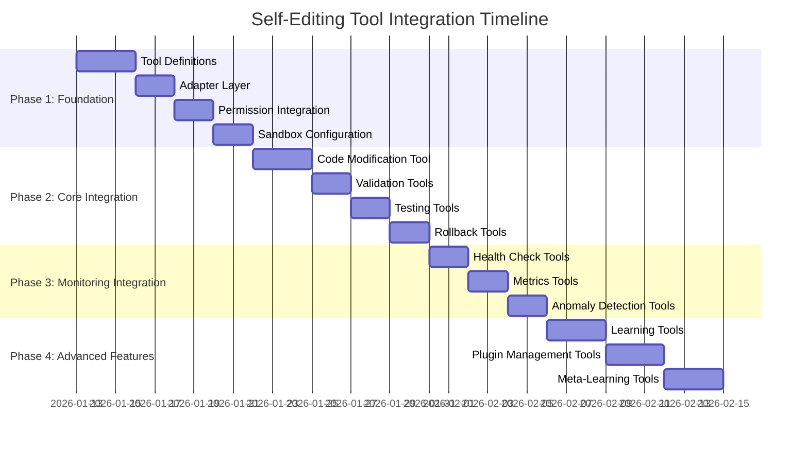
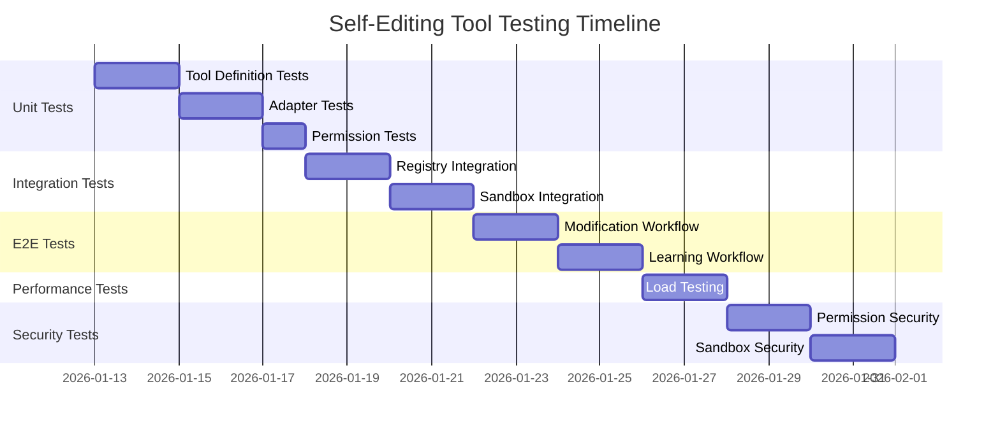

# Self-Editing Tool Integration Implementation Plan

**Date:** 2026-01-12
**Author:** Architect
**Status:** Draft
**Version:** 1.0

---

## Table of Contents

1. [Executive Summary](#executive-summary)
2. [Phased Implementation Approach](#phased-implementation-approach)
3. [Component Specifications](#component-specifications)
4. [Tool Specifications](#tool-specifications)
5. [Configuration Requirements](#configuration-requirements)
6. [Database Schema Changes](#database-schema-changes)
7. [Testing Strategy](#testing-strategy)
8. [Rollback Plan](#rollback-plan)
9. [Dependencies](#dependencies)
10. [Risk Mitigation](#risk-mitigation)

---

## Executive Summary

This implementation plan details the integration of self-editing capabilities into the bot's tool system. The self-editing system provides sophisticated code analysis, modification, and safety validation capabilities that will be exposed as tools following the existing [`Tool`](src/types/ai.ts:433) interface pattern.

### Key Objectives

- Expose self-editing operations as AI-callable tools
- Maintain security and safety through sandboxed execution
- Provide comprehensive monitoring and audit trails
- Enable gradual rollout with clear rollback procedures
- Follow existing codebase patterns and conventions

### Success Criteria

- All self-editing tools registered in [`ToolRegistry`](src/ai/tools/tool-registry.ts:113)
- Tools accessible via AI SDK format for provider integration
- Comprehensive safety validation and sandboxing in place
- Audit trail for all self-editing operations
- Zero production incidents during rollout

---

## Phased Implementation Approach



### Phase 1: Foundation (Days 1-9)

**Priority:** Critical
**Risk Level:** Low
**Dependencies:** None

#### 1.1 Tool Definitions

Create self-editing tool definitions following the [`Tool`](src/types/ai.ts:433) interface pattern from [`internal-tools.ts`](src/tools/internal-tools.ts:931).

**Deliverables:**
- [`src/tools/self-editing-tools.ts`](src/tools/self-editing-tools.ts) with tool definitions
- Type definitions for tool parameters and results
- Tool metadata with versioning

**Acceptance Criteria:**
- All tools validate against [`Tool`](src/types/ai.ts:433) interface
- Tools follow existing naming conventions
- Documentation included for each tool

#### 1.2 Adapter Layer

Create adapter layer to bridge self-editing operations with tool execution.

**Deliverables:**
- [`src/tools/self-editing-tool-adapter.ts`](src/tools/self-editing-tool-adapter.ts)
- Result transformation utilities
- Event tracking integration

**Acceptance Criteria:**
- Adapter handles all self-editing operations
- Error handling and logging in place
- Event correlation with tool calls

#### 1.3 Permission Integration

Integrate self-editing permissions with tool permission system.

**Deliverables:**
- Permission definitions in tool registry
- Permission mapping functions
- Permission escalation logic

**Acceptance Criteria:**
- Self-editing permissions defined and mapped
- Permission checks enforced
- Discord permissions isolated from self-editing permissions

#### 1.4 Sandbox Configuration

Configure sandbox for safe self-editing execution.

**Deliverables:**
- Self-editing sandbox configuration
- Resource limits defined
- API restrictions configured

**Acceptance Criteria:**
- Sandbox enabled for all self-editing tools
- Resource limits enforced
- Dangerous APIs blocked

### Phase 2: Core Integration (Days 10-21)

**Priority:** High
**Risk Level:** Medium
**Dependencies:** Phase 1 complete

#### 2.1 Code Modification Tool

Implement code modification tool with full safety validation.

**Deliverables:**
- Code modification tool implementation
- Pre/post validation hooks
- Rollback capability

**Acceptance Criteria:**
- Modifications pass safety validation
- Automatic rollback on failure
- Audit trail maintained

#### 2.2 Validation Tools

Implement validation tools for code and modifications.

**Deliverables:**
- Validation tool implementations
- Custom rule support
- Multi-stage validation pipeline

**Acceptance Criteria:**
- All validation stages functional
- Custom rules supported
- Validation results structured correctly

#### 2.3 Testing Tools

Implement testing tools for code modifications.

**Deliverables:**
- Test generation tool
- Test execution tool
- Coverage reporting tool

**Acceptance Criteria:**
- Tests generated and executed
- Coverage reports accurate
- Test results properly formatted

#### 2.4 Rollback Tools

Implement rollback tools for emergency recovery.

**Deliverables:**
- Rollback initiation tool
- Rollback status tool
- Rollback history tool

**Acceptance Criteria:**
- Rollback completes successfully
- Rollback status trackable
- History maintained

### Phase 3: Monitoring Integration (Days 22-29)

**Priority:** Medium
**Risk Level:** Low
**Dependencies:** Phase 2 complete

#### 3.1 Health Check Tools

Implement health monitoring tools.

**Deliverables:**
- Health check tool
- System status query tool
- Component health tools

**Acceptance Criteria:**
- Health checks accurate
- Status queries functional
- Component health monitored

#### 3.2 Metrics Tools

Implement metrics collection and query tools.

**Deliverables:**
- Metrics collection tool
- Metrics query tool
- Performance reporting tool

**Acceptance Criteria:**
- Metrics collected accurately
- Queries return correct data
- Reports generated correctly

#### 3.3 Anomaly Detection Tools

Implement anomaly detection and alerting tools.

**Deliverables:**
- Anomaly detection tool
- Alert configuration tool
- Alert history tool

**Acceptance Criteria:**
- Anomalies detected accurately
- Alerts configured properly
- History maintained

### Phase 4: Advanced Features (Days 30-40)

**Priority:** Low
**Risk Level:** Medium
**Dependencies:** Phase 3 complete

#### 4.1 Learning Tools

Implement learning system tools.

**Deliverables:**
- Pattern recognition tool
- Adaptation suggestion tool
- Learning status tool

**Acceptance Criteria:**
- Patterns recognized correctly
- Suggestions actionable
- Learning status accurate

#### 4.2 Plugin Management Tools

Implement plugin management tools.

**Deliverables:**
- Plugin discovery tool
- Plugin installation tool
- Plugin management tool

**Acceptance Criteria:**
- Plugins discovered correctly
- Installation safe
- Management functional

#### 4.3 Meta-Learning Tools

Implement meta-learning and introspection tools.

**Deliverables:**
- Self-awareness tool
- Capability assessment tool
- Introspection tool

**Acceptance Criteria:**
- Self-awareness accurate
- Capabilities assessed correctly
- Introspection functional

---

## Component Specifications

### 1. Self-Editing Tool Definitions

**File Location:** [`src/tools/self-editing-tools.ts`](src/tools/self-editing-tools.ts)

**Purpose:** Define all self-editing tools following the [`Tool`](src/types/ai.ts:433) interface pattern.

**Key Methods/Functions:**
- `codeAnalysisTool: Tool` - Code analysis tool definition
- `codeModificationTool: Tool` - Code modification tool definition
- `validationTool: Tool` - Validation tool definition
- `testingTool: Tool` - Testing tool definition
- `rollbackTool: Tool` - Rollback tool definition
- `healthCheckTool: Tool` - Health check tool definition
- `metricsTool: Tool` - Metrics tool definition
- `anomalyDetectionTool: Tool` - Anomaly detection tool definition
- `learningTool: Tool` - Learning tool definition
- `pluginManagementTool: Tool` - Plugin management tool definition
- `metaLearningTool: Tool` - Meta-learning tool definition

**Dependencies:**
- [`Tool`](src/types/ai.ts:433) interface from [`src/types/ai.ts`](src/types/ai.ts)
- [`SelfEditingConfig`](src/types/self-editing.ts:6) from [`src/types/self-editing.ts`](src/types/self-editing.ts)
- [`Logger`](src/utils/logger.ts) from [`src/utils/logger.ts`](src/utils/logger.ts)
- [`BotError`](src/utils/errors.ts) from [`src/utils/errors.ts`](src/utils/errors.ts)

**Integration Points:**
- Auto-discovery by [`ToolRegistry`](src/ai/tools/tool-registry.ts:113)
- AI SDK conversion via [`AISDKAdapter`](src/ai/sdk/ai-sdk-adapter.ts:334)
- Permission system integration

### 2. Self-Editing Tool Adapter

**File Location:** [`src/tools/self-editing-tool-adapter.ts`](src/tools/self-editing-tool-adapter.ts)

**Purpose:** Bridge self-editing operations with tool execution system.

**Key Methods/Functions:**
```typescript
export class SelfEditingToolAdapter {
  constructor(
    toolRegistry: ToolRegistry,
    selfEditingCore: SelfEditingCore,
    logger: Logger
  )
  
  async executeTool(
    toolName: string,
    parameters: Record<string, any>,
    context: ExecutionContext
  ): Promise<any>
  
  transformResult(
    result: any,
    operationType: string
  ): ToolExecutionResult
  
  validateParameters(
    toolName: string,
    parameters: Record<string, any>
  ): ValidationResult
  
  trackEvent(
    event: SelfEditingEvent,
    toolCallId: string
  ): void
}
```

**Dependencies:**
- [`ToolRegistry`](src/ai/tools/tool-registry.ts:113) from [`src/ai/tools/tool-registry.ts`](src/ai/tools/tool-registry.ts)
- [`SelfEditingCore`](src/self-editing/core/self-editing-core.ts:18) from [`src/self-editing/core/self-editing-core.ts`](src/self-editing/core/self-editing-core.ts)
- [`ExecutionContext`](src/ai/tools/tool-executor.ts:19) from [`src/ai/tools/tool-executor.ts`](src/ai/tools/tool-executor.ts)
- [`SelfEditingEvent`](src/types/self-editing.ts:1202) from [`src/types/self-editing.ts`](src/types/self-editing.ts)
- [`ToolExecutionResult`](src/ai/tools/tool-registry.ts:93) from [`src/ai/tools/tool-registry.ts`](src/ai/tools/tool-registry.ts)
- [`Logger`](src/utils/logger.ts) from [`src/utils/logger.ts`](src/utils/logger.ts)

**Integration Points:**
- [`ToolExecutor`](src/ai/tools/tool-executor.ts:85) for tool execution
- [`SelfEditingCore`](src/self-editing/core/self-editing-core.ts:18) for self-editing operations
- Event tracking system for audit trails

### 3. Permission Manager Integration

**File Location:** [`src/tools/self-editing-permissions.ts`](src/tools/self-editing-permissions.ts)

**Purpose:** Define and manage self-editing permissions.

**Key Methods/Functions:**
```typescript
export const SELF_EDITING_PERMISSIONS = {
  'self-edit:execute': ['code:modify', 'code:write', 'system:modify'],
  'self-edit:read': ['code:read', 'system:read'],
  'self-edit:approve': ['self-edit:approve'],
  'self-edit:rollback': ['self-edit:rollback']
} as const;

export class SelfEditingPermissionManager {
  static mapSafetyLevel(
    level: 'strict' | 'moderate' | 'permissive'
  ): 'safe' | 'restricted' | 'dangerous'
  
  static checkPermission(
    toolName: string,
    userPermissions: string[]
  ): boolean
  
  static getRequiredPermissions(
    toolName: string
  ): string[]
}
```

**Dependencies:**
- [`ToolSafety`](src/types/ai.ts:488) from [`src/types/ai.ts`](src/types/ai.ts)
- [`PermissionManager`](src/self-editing/safety/permission-manager.ts:7) from [`src/self-editing/safety/permission-manager.ts`](src/self-editing/safety/permission-manager.ts)

**Integration Points:**
- [`ToolRegistry`](src/ai/tools/tool-registry.ts:113) permission system
- [`ToolSandbox`](src/ai/tools/tool-sandbox.ts:109) permission checks

### 4. Sandbox Configuration

**File Location:** [`src/config/self-editing-sandbox-config.ts`](src/config/self-editing-sandbox-config.ts)

**Purpose:** Define sandbox configuration for self-editing tools.

**Key Methods/Functions:**
```typescript
export const SELF_EDITING_SANDBOX_CONFIG: SandboxConfig = {
  enabled: true,
  timeoutMs: 300000,
  maxMemoryMB: 512,
  maxCpuPercent: 80,
  enableNetworkIsolation: true,
  enableFileSystemIsolation: true,
  allowedPaths: ['./src/self-editing', './logs/self-editing'],
  blockedPaths: ['./src/discord', './src/ai'],
  allowedApis: [],
  blockedApis: ['fs', 'child_process', 'exec', 'eval', 'Function']
} as const;

export const SELF_EDITING_RATE_LIMITS: Record<string, RateLimit> = {
  'code_analysis': { maxRequests: 30, windowMs: 60000 },
  'code_modification': { maxRequests: 10, windowMs: 60000 },
  'validation': { maxRequests: 50, windowMs: 60000 },
  'testing': { maxRequests: 20, windowMs: 60000 },
  'rollback': { maxRequests: 5, windowMs: 60000 }
} as const;
```

**Dependencies:**
- [`SandboxConfig`](src/types/ai.ts:997) from [`src/types/ai.ts`](src/types/ai.ts)
- [`RateLimit`](src/types/ai.ts:130) from [`src/types/ai.ts`](src/types/ai.ts)

**Integration Points:**
- [`ToolSandbox`](src/ai/tools/tool-sandbox.ts:109) configuration
- [`ToolExecutor`](src/ai/tools/tool-executor.ts:85) rate limiting

### 5. Event Tracking Integration

**File Location:** [`src/tools/self-editing-event-tracker.ts`](src/tools/self-editing-event-tracker.ts)

**Purpose:** Track and correlate self-editing events with tool calls.

**Key Methods/Functions:**
```typescript
export class SelfEditingEventTracker {
  constructor(
    toolExecutor: ToolExecutor,
    logger: Logger
  )
  
  trackEvent(
    event: SelfEditingEvent,
    toolCallId?: string
  ): void
  
  getCorrelatedEvents(
    toolCallId: string
  ): SelfEditingEvent[]
  
  getEventHistory(
    timeRange?: { start: Date; end: Date }
  ): SelfEditingEvent[]
}
```

**Dependencies:**
- [`ToolExecutor`](src/ai/tools/tool-executor.ts:85) from [`src/ai/tools/tool-executor.ts`](src/ai/tools/tool-executor.ts)
- [`SelfEditingEvent`](src/types/self-editing.ts:1202) from [`src/types/self-editing.ts`](src/types/self-editing.ts)
- [`Logger`](src/utils/logger.ts) from [`src/utils/logger.ts`](src/utils/logger.ts)

**Integration Points:**
- [`ToolRegistry`](src/ai/tools/tool-registry.ts:113) execution history
- Database audit logs

### 6. Result Transformer

**File Location:** [`src/tools/self-editing-result-transformer.ts`](src/tools/self-editing-result-transformer.ts)

**Purpose:** Transform self-editing results to tool-compatible format.

**Key Methods/Functions:**
```typescript
export class SelfEditingResultTransformer {
  static transformCodeAnalysisResult(
    result: any
  ): CodeAnalysisResult
  
  static transformCodeModificationResult(
    result: any
  ): CodeModificationResult
  
  static transformValidationResult(
    result: any
  ): SafetyValidationResult
  
  static transformTestingResult(
    result: any
  ): TestingResult
  
  static transformRollbackResult(
    result: any
  ): RollbackResult
}
```

**Dependencies:**
- Result type definitions from [`src/tools/internal-tools.ts`](src/tools/internal-tools.ts:931)
- [`ToolExecutionResult`](src/ai/tools/tool-registry.ts:93) from [`src/ai/tools/tool-registry.ts`](src/ai/tools/tool-registry.ts)

**Integration Points:**
- [`SelfEditingToolAdapter`](src/tools/self-editing-tool-adapter.ts) result transformation
- AI SDK response formatting

### 7. Tool Executor Extensions

**File Location:** [`src/ai/tools/self-editing-executor.ts`](src/ai/tools/self-editing-executor.ts)

**Purpose:** Extend tool executor with self-editing-specific logic.

**Key Methods/Functions:**
```typescript
export class SelfEditingToolExecutor extends ToolExecutor {
  constructor(
    toolRegistry: ToolRegistry,
    toolSandbox: ToolSandbox,
    config: ToolExecutorConfig,
    logger: Logger,
    selfEditingAdapter: SelfEditingToolAdapter
  )
  
  async executeSelfEditingTool(
    toolName: string,
    parameters: Record<string, any>,
    context: SelfEditingExecutionContext
  ): Promise<ToolExecutionResult>
  
  validateSelfEditingPermissions(
    toolName: string,
    context: ExecutionContext
  ): boolean
}
```

**Dependencies:**
- [`ToolExecutor`](src/ai/tools/tool-executor.ts:85) from [`src/ai/tools/tool-executor.ts`](src/ai/tools/tool-executor.ts)
- [`ToolSandbox`](src/ai/tools/tool-sandbox.ts:109) from [`src/ai/tools/tool-sandbox.ts`](src/ai/tools/tool-sandbox.ts)
- [`SelfEditingToolAdapter`](src/tools/self-editing-tool-adapter.ts) from [`src/tools/self-editing-tool-adapter.ts`](src/tools/self-editing-tool-adapter.ts)

**Integration Points:**
- Main tool execution flow
- Self-editing tool routing

---

## Tool Specifications

### Tool 1: Code Analysis Tool

**Tool Name:** `self_editing_code_analysis`

**Description:** Analyze code for quality, security, and performance issues using self-editing analysis engine.

**Parameters:**

| Name | Type | Required | Description | Validation |
|------|------|----------|-------------|------------|
| `code` | string | Yes | The code to analyze | minLength: 1, maxLength: 100000 |
| `language` | string | No | Programming language of code | enum: ['typescript', 'javascript', 'python', 'java', 'csharp', 'go', 'rust', 'php', 'ruby'] |
| `analysisType` | string | No | Type of analysis to perform | enum: ['static', 'dynamic', 'security', 'performance', 'complexity', 'dependency'] |
| `options` | object | No | Additional analysis options | - |

**Safety Level:** `safe`

**Permissions Required:** `['self-edit:read']`

**Category:** `ai`

**Implementation Approach:**
1. Validate parameters using Zod schema
2. Call [`CodeAnalyzer`](src/self-editing/analysis/code-analyzer.ts) from self-editing system
3. Transform result using [`SelfEditingResultTransformer`](src/tools/self-editing-result-transformer.ts)
4. Track event in [`SelfEditingEventTracker`](src/tools/self-editing-event-tracker.ts)
5. Return [`CodeAnalysisResult`](src/tools/internal-tools.ts:29)

### Tool 2: Code Modification Tool

**Tool Name:** `self_editing_code_modification`

**Description:** Apply code modifications through self-editing engine with full safety validation and rollback capability.

**Parameters:**

| Name | Type | Required | Description | Validation |
|------|------|----------|-------------|------------|
| `changes` | array | Yes | Array of modification changes | minLength: 1 |
| `language` | string | No | Programming language of code | enum: ['typescript', 'javascript', 'python', 'java', 'csharp', 'go', 'rust', 'php', 'ruby'] |
| `options` | object | No | Modification options | - |

**Safety Level:** `dangerous`

**Permissions Required:** `['code:modify', 'code:write', 'self-edit:execute']`

**Category:** `ai`

**Implementation Approach:**
1. Validate parameters and check permissions
2. Pre-validate using [`SafetyValidator`](src/self-editing/safety/safety-validator.ts:290)
3. Execute modification through [`CodeModificationEngine`](src/self-editing/modification/code-modification-engine.ts:28)
4. Post-validate modified code
5. Create rollback plan
6. Track event and audit
7. Return [`CodeModificationResult`](src/tools/internal-tools.ts:131)

### Tool 3: Validation Tool

**Tool Name:** `self_editing_validation`

**Description:** Validate code modifications against safety rules and best practices using multi-stage validation pipeline.

**Parameters:**

| Name | Type | Required | Description | Validation |
|------|------|----------|-------------|------------|
| `code` | string | Yes | The code to validate | minLength: 1, maxLength: 100000 |
| `modifications` | array | No | Array of modifications to validate | - |
| `rules` | array | No | Array of validation rules to apply | - |
| `language` | string | No | Programming language of code | enum: ['typescript', 'javascript', 'python', 'java', 'csharp', 'go', 'rust', 'php', 'ruby'] |

**Safety Level:** `safe`

**Permissions Required:** `['self-edit:read', 'self-edit:execute']`

**Category:** `ai`

**Implementation Approach:**
1. Validate parameters
2. Execute multi-stage validation:
   - Syntax validation
   - Security validation
   - Performance validation
   - Stability validation
   - Compliance validation
3. Apply custom rules if provided
4. Return [`SafetyValidationResult`](src/tools/internal-tools.ts:182)

### Tool 4: Testing Tool

**Tool Name:** `self_editing_testing`

**Description:** Generate and run tests for code modifications with coverage reporting.

**Parameters:**

| Name | Type | Required | Description | Validation |
|------|------|----------|-------------|------------|
| `code` | string | Yes | The code to test | minLength: 1, maxLength: 100000 |
| `testType` | string | Yes | Type of tests to generate | enum: ['unit', 'integration', 'e2e', 'performance', 'security'] |
| `language` | string | No | Programming language of code | enum: ['typescript', 'javascript', 'python', 'java', 'csharp', 'go', 'rust', 'php', 'ruby'] |
| `options` | object | No | Testing options | - |

**Safety Level:** `restricted`

**Permissions Required:** `['self-edit:read', 'self-edit:execute']`

**Category:** `ai`

**Implementation Approach:**
1. Validate parameters
2. Generate tests based on code analysis
3. Execute tests in sandbox
4. Calculate coverage metrics
5. Return [`TestingResult`](src/tools/internal-tools.ts:203)

### Tool 5: Rollback Tool

**Tool Name:** `self_editing_rollback`

**Description:** Rollback code modifications to previous state using rollback manager.

**Parameters:**

| Name | Type | Required | Description | Validation |
|------|------|----------|-------------|------------|
| `modificationId` | string | Yes | The ID of modification to rollback | minLength: 1 |
| `options` | object | No | Rollback options | - |

**Safety Level:** `dangerous`

**Permissions Required:** `['code:modify', 'code:write', 'self-edit:execute']`

**Category:** `ai`

**Implementation Approach:**
1. Validate parameters and check permissions
2. Retrieve rollback plan from [`RollbackManager`](src/self-editing/core/rollback-manager.ts)
3. Execute rollback steps
4. Verify rollback success
5. Track event and audit
6. Return [`RollbackResult`](src/tools/internal-tools.ts:248)

### Tool 6: Health Check Tool

**Tool Name:** `self_editing_health_check`

**Description:** Check health status of self-editing system components.

**Parameters:**

| Name | Type | Required | Description | Validation |
|------|------|----------|-------------|------------|
| `component` | string | No | Specific component to check | enum: ['all', 'analysis', 'modification', 'validation', 'testing', 'learning', 'monitoring'] |

**Safety Level:** `safe`

**Permissions Required:** `['self-edit:read']`

**Category:** `ai`

**Implementation Approach:**
1. Validate parameters
2. Query [`HealthMonitor`](src/self-editing/monitoring/health-monitor.ts)
3. Aggregate component health status
4. Return health check result

### Tool 7: Metrics Tool

**Tool Name:** `self_editing_metrics`

**Description:** Get performance metrics from self-editing system.

**Parameters:**

| Name | Type | Required | Description | Validation |
|------|------|----------|-------------|------------|
| `timeRange` | string | No | Time range for metrics | enum: ['1h', '6h', '24h', '7d', '30d'] |
| `metricType` | string | No | Type of metrics to retrieve | enum: ['all', 'performance', 'modifications', 'learning', 'errors'] |

**Safety Level:** `safe`

**Permissions Required:** `['self-edit:read']`

**Category:** `ai`

**Implementation Approach:**
1. Validate parameters
2. Query [`MetricsCollector`](src/self-editing/monitoring/metrics-collector.ts)
3. Aggregate metrics based on time range
4. Return metrics result

### Tool 8: Anomaly Detection Tool

**Tool Name:** `self_editing_anomaly_detection`

**Description:** Detect anomalies in self-editing system behavior.

**Parameters:**

| Name | Type | Required | Description | Validation |
|------|------|----------|-------------|------------|
| `severity` | string | No | Minimum severity level | enum: ['low', 'medium', 'high', 'critical'] |
| `timeRange` | string | No | Time range for detection | enum: ['1h', '6h', '24h', '7d'] |

**Safety Level:** `safe`

**Permissions Required:** `['self-edit:read']`

**Category:** `ai`

**Implementation Approach:**
1. Validate parameters
2. Query [`AnomalyDetector`](src/self-editing/monitoring/anomaly-detector.ts)
3. Filter by severity and time range
4. Return anomaly detection result

### Tool 9: Learning Tool

**Tool Name:** `self_editing_learning`

**Description:** Access learning system for pattern recognition and adaptation suggestions.

**Parameters:**

| Name | Type | Required | Description | Validation |
|------|------|----------|-------------|------------|
| `action` | string | Yes | Learning action to perform | enum: ['get_patterns', 'get_suggestions', 'get_status', 'enable', 'disable'] |
| `options` | object | No | Additional options for learning action | - |

**Safety Level:** `restricted`

**Permissions Required:** `['self-edit:read', 'self-edit:execute']`

**Category:** `ai`

**Implementation Approach:**
1. Validate parameters and check permissions
2. Route to appropriate learning component:
   - [`PatternRecognizer`](src/self-editing/learning/pattern-recognizer.ts)
   - [`BehaviorAdapter`](src/self-editing/learning/behavior-adapter.ts)
   - [`PerformanceOptimizer`](src/self-editing/learning/performance-optimizer.ts)
3. Return learning result

### Tool 10: Plugin Management Tool

**Tool Name:** `self_editing_plugin_management`

**Description:** Manage self-editing plugins including discovery, installation, and configuration.

**Parameters:**

| Name | Type | Required | Description | Validation |
|------|------|----------|-------------|------------|
| `action` | string | Yes | Plugin management action | enum: ['list', 'install', 'uninstall', 'enable', 'disable', 'configure'] |
| `pluginId` | string | No | Plugin ID for action | minLength: 1 |
| `options` | object | No | Additional options for action | - |

**Safety Level:** `restricted`

**Permissions Required:** `['self-edit:read', 'self-edit:execute']`

**Category:** `ai`

**Implementation Approach:**
1. Validate parameters and check permissions
2. Route to [`PluginManager`](src/self-editing/plugins/plugin-manager.ts)
3. Execute action with sandbox validation
4. Return plugin management result

### Tool 11: Meta-Learning Tool

**Tool Name:** `self_editing_meta_learning`

**Description:** Access meta-learning capabilities including self-awareness and capability assessment.

**Parameters:**

| Name | Type | Required | Description | Validation |
|------|------|----------|-------------|------------|
| `action` | string | Yes | Meta-learning action | enum: ['self_awareness', 'capability_assessment', 'introspection', 'knowledge_query'] |
| `options` | object | No | Additional options for action | - |

**Safety Level:** `restricted`

**Permissions Required:** `['self-edit:read']`

**Category:** `ai`

**Implementation Approach:**
1. Validate parameters
2. Route to [`SelfImprovementEngine`](src/self-editing/learning/self-improvement-engine.ts)
3. Execute meta-learning action
4. Return meta-learning result

---

## Configuration Requirements

### 1. Tool Registry Configuration

**File:** `.env` or environment-specific configuration

**Required Changes:**

```typescript
// Tool Registry Configuration
TOOL_REGISTRY_AUTO_REGISTER_SELF_EDITING=true
TOOL_REGISTRY_SELF_EDITING_PATH=./src/tools/self-editing-tools.ts
TOOL_REGISTRY_ENABLE_SELF_EDITING_PERMISSIONS=true
TOOL_REGISTRY_SELF_EDITING_SANDBOX_ENABLED=true
```

**Integration Points:**
- [`ToolRegistry`](src/ai/tools/tool-registry.ts:113) configuration
- Application initialization

### 2. Self-Editing Configuration

**File:** `.env` or environment-specific configuration

**Required Changes:**

```typescript
// Self-Editing System Configuration
SELF_EDITING_ENABLED=true
SELF_EDITING_INTERVAL=60
SELF_EDITING_SAFETY_ENABLED=true
SELF_EDITING_VALIDATION_LEVEL=moderate
SELF_EDITING_ROLLBACK_ENABLED=true
SELF_EDITING_SANDBOX_ENABLED=true
SELF_EDITING_MAX_MODIFICATIONS_PER_SESSION=10
SELF_EDITING_APPROVAL_REQUIRED=true
SELF_EDITING_SECURITY_SCANNING=true

// Critical Systems Protection
SELF_EDITING_CRITICAL_SYSTEMS=./src/ai/tools,./src/ai/core,./src/ai/sdk,./src/discord

// Performance Thresholds
SELF_EDITING_MAX_RESPONSE_TIME_INCREASE=50
SELF_EDITING_MAX_MEMORY_USAGE_INCREASE=50
SELF_EDITING_MAX_CPU_USAGE_INCREASE=50
SELF_EDITING_MAX_ERROR_RATE_INCREASE=20
SELF_EDITING_MIN_TEST_COVERAGE=80
SELF_EDITING_MAX_COMPLEXITY_INCREASE=30

// Learning Configuration
SELF_EDITING_LEARNING_ENABLED=true
SELF_EDITING_ADAPTATION_RATE=0.5
SELF_EDITING_MAX_CHANGES_PER_SESSION=5
SELF_EDITING_LEARNING_ALGORITHM=hybrid
SELF_EDITING_FEEDBACK_WEIGHT=0.3
SELF_EDITING_PERFORMANCE_WEIGHT=0.5
SELF_EDITING_USER_BEHAVIOR_WEIGHT=0.2
SELF_EDITING_HISTORICAL_DATA_RETENTION=90
SELF_EDITING_MODEL_UPDATE_INTERVAL=24
```

**Integration Points:**
- [`SelfEditingConfig`](src/types/self-editing.ts:6) initialization
- Application configuration loading

### 3. Sandbox Configuration

**File:** `src/config/self-editing-sandbox-config.ts`

**Required Configuration:**

```typescript
export const SELF_EDITING_SANDBOX_CONFIG: SandboxConfig = {
  enabled: true,
  timeoutMs: 300000,
  maxMemoryMB: 512,
  maxCpuPercent: 80,
  enableNetworkIsolation: true,
  enableFileSystemIsolation: true,
  allowedPaths: ['./src/self-editing', './logs/self-editing'],
  blockedPaths: ['./src/discord', './src/ai'],
  allowedApis: [],
  blockedApis: ['fs', 'child_process', 'exec', 'eval', 'Function']
};
```

**Integration Points:**
- [`ToolSandbox`](src/ai/tools/tool-sandbox.ts:109) configuration
- Tool executor setup

### 4. AI SDK Configuration

**File:** `.env` or environment-specific configuration

**Required Changes:**

```typescript
// AI SDK Configuration for Self-Editing Tools
AI_SDK_USE_SELF_EDITING_TOOLS=true
AI_SDK_SELF_EDITING_TOOLS_ENABLED=true
AI_SDK_SELF_EDITING_VALIDATION_ENABLED=true
```

**Integration Points:**
- [`AISDKAdapter`](src/ai/sdk/ai-sdk-adapter.ts:334) configuration
- Tool registry AI SDK integration

### 5. Monitoring Configuration

**File:** `.env` or environment-specific configuration

**Required Changes:**

```typescript
// Self-Editing Monitoring Configuration
SELF_EDITING_MONITORING_ENABLED=true
SELF_EDITING_REAL_TIME_MONITORING=true
SELF_EDITING_PERFORMANCE_TRACKING=true
SELF_EDITING_ANOMALY_DETECTION=true
SELF_EDITING_SUCCESS_RATE_TRACKING=true
SELF_EDITING_IMPACT_ANALYSIS=true

// Alerting Configuration
SELF_EDITING_ALERTING_ENABLED=true
SELF_EDITING_ALERT_CHANNELS=logs
SELF_EDITING_ALERT_SEVERITY=medium

// Metrics Configuration
SELF_EDITING_COLLECT_PERFORMANCE_METRICS=true
SELF_EDITING_COLLECT_USER_METRICS=true
SELF_EDITING_COLLECT_SYSTEM_METRICS=true
SELF_EDITING_COLLECT_MODIFICATION_METRICS=true
SELF_EDITING_COLLECT_LEARNING_METRICS=true
SELF_EDITING_METRICS_RETENTION_PERIOD=90
```

**Integration Points:**
- [`MonitoringConfig`](src/types/self-editing.ts:115) initialization
- Monitoring system setup

---

## Database Schema Changes

### 1. New Tables Required

#### 1.1 Self-Editing Tool Executions Table

**Purpose:** Track all self-editing tool executions for audit and monitoring.

**Migration File:** `migrations/010_create_self_editing_tool_tables.sql`

```sql
-- Self-Editing Tool Executions Table
CREATE TABLE IF NOT EXISTS self_editing_tool_executions (
  id UUID PRIMARY KEY DEFAULT uuid_generate_v4(),
  tool_name VARCHAR(100) NOT NULL,
  operation_type VARCHAR(100) NOT NULL,
  user_id VARCHAR(255),
  guild_id VARCHAR(255),
  channel_id VARCHAR(255),
  parameters JSONB NOT NULL,
  result JSONB,
  error_message TEXT,
  execution_time_ms INTEGER,
  status VARCHAR(50) NOT NULL CHECK (status IN ('pending', 'executing', 'completed', 'failed')),
  safety_level VARCHAR(20) NOT NULL CHECK (safety_level IN ('safe', 'restricted', 'dangerous')),
  modification_id UUID,
  rollback_available BOOLEAN DEFAULT false,
  created_at TIMESTAMP WITH TIME ZONE DEFAULT CURRENT_TIMESTAMP,
  completed_at TIMESTAMP WITH TIME ZONE,
  metadata JSONB
);

CREATE INDEX idx_self_editing_tool_executions_tool_name ON self_editing_tool_executions(tool_name);
CREATE INDEX idx_self_editing_tool_executions_status ON self_editing_tool_executions(status);
CREATE INDEX idx_self_editing_tool_executions_created_at ON self_editing_tool_executions(created_at);
CREATE INDEX idx_self_editing_tool_executions_user_id ON self_editing_tool_executions(user_id);
CREATE INDEX idx_self_editing_tool_executions_modification_id ON self_editing_tool_executions(modification_id);
```

#### 1.2 Self-Editing Rollback Plans Table

**Purpose:** Store rollback plans for all modifications.

```sql
-- Self-Editing Rollback Plans Table
CREATE TABLE IF NOT EXISTS self_editing_rollback_plans (
  id UUID PRIMARY KEY DEFAULT uuid_generate_v4(),
  modification_id UUID NOT NULL,
  rollback_steps JSONB NOT NULL,
  verification_steps JSONB NOT NULL,
  backup_location TEXT,
  status VARCHAR(50) NOT NULL CHECK (status IN ('pending', 'in_progress', 'completed', 'failed')),
  estimated_time_seconds INTEGER,
  actual_time_seconds INTEGER,
  created_at TIMESTAMP WITH TIME ZONE DEFAULT CURRENT_TIMESTAMP,
  executed_at TIMESTAMP WITH TIME ZONE,
  metadata JSONB,
  CONSTRAINT fk_rollback_modification 
    FOREIGN KEY (modification_id) REFERENCES modifications(id) ON DELETE CASCADE
);

CREATE INDEX idx_self_editing_rollback_plans_modification_id ON self_editing_rollback_plans(modification_id);
CREATE INDEX idx_self_editing_rollback_plans_status ON self_editing_rollback_plans(status);
```

#### 1.3 Self-Editing Events Table

**Purpose:** Store all self-editing events for correlation and audit.

```sql
-- Self-Editing Events Table
CREATE TABLE IF NOT EXISTS self_editing_events (
  id UUID PRIMARY KEY DEFAULT uuid_generate_v4(),
  event_type VARCHAR(100) NOT NULL,
  source VARCHAR(100) NOT NULL,
  tool_call_id UUID,
  modification_id UUID,
  severity VARCHAR(20) NOT NULL CHECK (severity IN ('low', 'medium', 'high', 'critical')),
  data JSONB NOT NULL,
  context JSONB,
  created_at TIMESTAMP WITH TIME ZONE DEFAULT CURRENT_TIMESTAMP
);

CREATE INDEX idx_self_editing_events_type ON self_editing_events(event_type);
CREATE INDEX idx_self_editing_events_tool_call_id ON self_editing_events(tool_call_id);
CREATE INDEX idx_self_editing_events_modification_id ON self_editing_events(modification_id);
CREATE INDEX idx_self_editing_events_created_at ON self_editing_events(created_at);
```

#### 1.4 Self-Editing Learning Data Table

**Purpose:** Store learning system data and adaptation results.

```sql
-- Self-Editing Learning Data Table
CREATE TABLE IF NOT EXISTS self_editing_learning_data (
  id UUID PRIMARY KEY DEFAULT uuid_generate_v4(),
  learning_type VARCHAR(50) NOT NULL,
  input_data JSONB NOT NULL,
  output_data JSONB,
  feedback JSONB,
  context JSONB,
  success BOOLEAN NOT NULL,
  accuracy DECIMAL(5,2),
  user_satisfaction DECIMAL(5,2),
  performance_impact DECIMAL(5,2),
  created_at TIMESTAMP WITH TIME ZONE DEFAULT CURRENT_TIMESTAMP
);

CREATE INDEX idx_self_editing_learning_data_type ON self_editing_learning_data(learning_type);
CREATE INDEX idx_self_editing_learning_data_created_at ON self_editing_learning_data(created_at);
```

#### 1.5 Self-Editing Plugin Registry Table

**Purpose:** Track installed self-editing plugins and their status.

```sql
-- Self-Editing Plugin Registry Table
CREATE TABLE IF NOT EXISTS self_editing_plugins (
  id UUID PRIMARY KEY DEFAULT uuid_generate_v4(),
  plugin_id VARCHAR(100) NOT NULL UNIQUE,
  name VARCHAR(255) NOT NULL,
  version VARCHAR(50) NOT NULL,
  description TEXT,
  author VARCHAR(255),
  category VARCHAR(50) NOT NULL,
  enabled BOOLEAN DEFAULT true,
  installed BOOLEAN DEFAULT true,
  configuration JSONB,
  permissions JSONB,
  installed_at TIMESTAMP WITH TIME ZONE DEFAULT CURRENT_TIMESTAMP,
  updated_at TIMESTAMP WITH TIME ZONE DEFAULT CURRENT_TIMESTAMP,
  last_used_at TIMESTAMP WITH TIME ZONE,
  metadata JSONB
);

CREATE INDEX idx_self_editing_plugins_plugin_id ON self_editing_plugins(plugin_id);
CREATE INDEX idx_self_editing_plugins_enabled ON self_editing_plugins(enabled);
```

### 2. Existing Table Modifications

#### 2.1 Modifications Table Extension

**Purpose:** Add self-editing specific fields to existing modifications table.

```sql
-- Add self-editing specific fields to modifications table
ALTER TABLE modifications ADD COLUMN IF NOT EXISTS tool_call_id UUID;
ALTER TABLE modifications ADD COLUMN IF NOT EXISTS rollback_plan_id UUID;
ALTER TABLE modifications ADD COLUMN IF NOT EXISTS validation_passed BOOLEAN;
ALTER TABLE modifications ADD COLUMN IF NOT EXISTS testing_passed BOOLEAN;
ALTER TABLE modifications ADD COLUMN IF NOT EXISTS self_editing_event_id UUID;

CREATE INDEX idx_modifications_tool_call_id ON modifications(tool_call_id);
CREATE INDEX idx_modifications_rollback_plan_id ON modifications(rollback_plan_id);
```

#### 2.2 Performance Metrics Table Extension

**Purpose:** Add self-editing specific metrics.

```sql
-- Add self-editing specific fields to performance_metrics table
ALTER TABLE performance_metrics ADD COLUMN IF NOT EXISTS tool_name VARCHAR(100);
ALTER TABLE performance_metrics ADD COLUMN IF NOT EXISTS operation_type VARCHAR(100);
ALTER TABLE performance_metrics ADD COLUMN IF NOT EXISTS safety_level VARCHAR(20);

CREATE INDEX idx_performance_metrics_tool_name ON performance_metrics(tool_name);
```

### 3. Views and Functions

#### 3.1 Self-Editing Execution Summary View

```sql
-- Self-Editing Execution Summary View
CREATE OR REPLACE VIEW self_editing_execution_summary AS
SELECT 
  tool_name,
  COUNT(*) as total_executions,
  COUNT(*) FILTER (WHERE status = 'completed') as completed_executions,
  COUNT(*) FILTER (WHERE status = 'failed') as failed_executions,
  AVG(execution_time_ms) as avg_execution_time_ms,
  MAX(execution_time_ms) as max_execution_time_ms,
  MIN(execution_time_ms) as min_execution_time_ms,
  COUNT(DISTINCT user_id) as unique_users,
  MAX(created_at) as last_execution
FROM self_editing_tool_executions
GROUP BY tool_name;
```

#### 3.2 Self-Editing Event Correlation View

```sql
-- Self-Editing Event Correlation View
CREATE OR REPLACE VIEW self_editing_event_correlation AS
SELECT 
  e.id,
  e.event_type,
  e.tool_call_id,
  e.modification_id,
  t.tool_name,
  t.user_id,
  t.status as tool_status,
  e.created_at as event_time,
  t.created_at as tool_time
FROM self_editing_events e
LEFT JOIN self_editing_tool_executions t ON e.tool_call_id = t.id;
```

---

## Testing Strategy

### 1. Unit Testing

**Scope:** Test individual components in isolation.

**Test Files:**
- `tests/tools/self-editing-tools.test.ts`
- `tests/tools/self-editing-tool-adapter.test.ts`
- `tests/tools/self-editing-permissions.test.ts`
- `tests/tools/self-editing-event-tracker.test.ts`
- `tests/tools/self-editing-result-transformer.test.ts`

**Test Cases:**

#### 1.1 Tool Definition Tests
```typescript
describe('Self-Editing Tools', () => {
  describe('Tool Definitions', () => {
    it('should have valid tool structure', () => {
      // Test all tools have required fields
    });
    
    it('should have correct safety levels', () => {
      // Test safety levels match requirements
    });
    
    it('should have proper permissions', () => {
      // Test permissions are defined correctly
    });
    
    it('should validate parameters', () => {
      // Test parameter validation
    });
  });
});
```

#### 1.2 Adapter Tests
```typescript
describe('Self-Editing Tool Adapter', () => {
  describe('executeTool', () => {
    it('should execute code analysis tool', async () => {
      // Test code analysis execution
    });
    
    it('should execute code modification tool', async () => {
      // Test code modification execution
    });
    
    it('should handle errors gracefully', async () => {
      // Test error handling
    });
  });
  
  describe('transformResult', () => {
    it('should transform code analysis result', () => {
      // Test result transformation
    });
    
    it('should handle complex results', () => {
      // Test complex result handling
    });
  });
});
```

#### 1.3 Permission Tests
```typescript
describe('Self-Editing Permissions', () => {
  describe('Permission Mapping', () => {
    it('should map safety levels correctly', () => {
      // Test safety level mapping
    });
    
    it('should check permissions correctly', () => {
      // Test permission checking
    });
  });
});
```

### 2. Integration Testing

**Scope:** Test integration between components.

**Test Files:**
- `tests/integration/self-editing-tool-integration.test.ts`
- `tests/integration/self-editing-registry-integration.test.ts`
- `tests/integration/self-editing-sandbox-integration.test.ts`

**Test Cases:**

#### 2.1 Tool Registry Integration
```typescript
describe('Self-Editing Tool Registry Integration', () => {
  it('should discover and register self-editing tools', async () => {
    // Test tool discovery
  });
  
  it('should execute self-editing tools through registry', async () => {
    // Test tool execution through registry
  });
  
  it('should convert tools to AI SDK format', () => {
    // Test AI SDK conversion
  });
});
```

#### 2.2 Sandbox Integration
```typescript
describe('Self-Editing Sandbox Integration', () => {
  it('should execute tools in sandbox', async () => {
    // Test sandbox execution
  });
  
  it('should enforce resource limits', async () => {
    // Test resource limit enforcement
  });
  
  it('should block dangerous APIs', async () => {
    // Test API blocking
  });
});
```

### 3. End-to-End Testing

**Scope:** Test complete workflows from tool call to result.

**Test Files:**
- `tests/e2e/self-editing-workflows.test.ts`

**Test Cases:**

#### 3.1 Code Modification Workflow
```typescript
describe('Self-Editing Code Modification Workflow', () => {
  it('should complete full modification workflow', async () => {
    // 1. Analyze code
    // 2. Validate modification
    // 3. Apply modification
    // 4. Test modification
    // 5. Verify results
  });
  
  it('should rollback failed modification', async () => {
    // Test rollback workflow
  });
});
```

#### 3.2 Learning Workflow
```typescript
describe('Self-Editing Learning Workflow', () => {
  it('should learn from successful modifications', async () => {
    // Test learning from success
  });
  
  it('should adapt behavior based on feedback', async () => {
    // Test behavior adaptation
  });
});
```

### 4. Performance Testing

**Scope:** Test performance under load.

**Test Files:**
- `tests/performance/self-editing-tool-performance.test.ts`

**Test Cases:**

#### 4.1 Load Testing
```typescript
describe('Self-Editing Tool Performance', () => {
  it('should handle concurrent tool executions', async () => {
    // Test concurrent execution
  });
  
  it('should maintain performance under load', async () => {
    // Test performance under load
  });
  
  it('should respect rate limits', async () => {
    // Test rate limiting
  });
});
```

### 5. Security Testing

**Scope:** Test security and safety mechanisms.

**Test Files:**
- `tests/security/self-editing-tool-security.test.ts`

**Test Cases:**

#### 5.1 Permission Tests
```typescript
describe('Self-Editing Tool Security', () => {
  it('should enforce permission checks', async () => {
    // Test permission enforcement
  });
  
  it('should prevent unauthorized access', async () => {
    // Test unauthorized access prevention
  });
  
  it('should isolate Discord permissions', async () => {
    // Test permission isolation
  });
});
```

#### 5.2 Sandbox Tests
```typescript
describe('Self-Editing Sandbox Security', () => {
  it('should block dangerous APIs', async () => {
    // Test API blocking
  });
  
  it('should enforce resource limits', async () => {
    // Test resource limit enforcement
  });
  
  it('should isolate file system access', async () => {
    // Test file system isolation
  });
});
```

### 6. Testing Execution Plan



---

## Rollback Plan

### 1. Rollback Triggers

**Automatic Rollback Triggers:**
- Critical system instability detected
- Error rate exceeds threshold (e.g., > 10%)
- Performance degradation exceeds threshold (e.g., > 50% increase)
- Security violation detected
- Data corruption detected

**Manual Rollback Triggers:**
- Feature not working as expected
- User complaints exceed threshold
- Business impact identified

### 2. Rollback Procedures

#### 2.1 Code Rollback

**Procedure:**
1. Identify affected modifications using [`self_editing_rollback_plans`](#1.2-self-editing-rollback-plans-table) table
2. Execute rollback steps in reverse order
3. Verify rollback success using verification steps
4. Update modification status to 'rolled_back'
5. Notify stakeholders

**Command:**
```bash
# Rollback specific modification
npm run self-editing:rollback --modification-id <id>

# Rollback all modifications in time range
npm run self-editing:rollback --since <timestamp>
```

#### 2.2 Configuration Rollback

**Procedure:**
1. Restore previous configuration from backup
2. Restart affected services
3. Verify configuration is correct
4. Monitor system stability

**Command:**
```bash
# Restore configuration
cp .env.backup .env

# Restart services
npm run restart
```

#### 2.3 Database Rollback

**Procedure:**
1. Identify migration to rollback
2. Execute rollback migration
3. Verify data integrity
4. Update application version

**Command:**
```bash
# Rollback migration
npm run migrate:rollback --to <version>

# Verify data integrity
npm run db:verify
```

### 3. Rollback Verification

**Verification Steps:**
1. Health check passes
2. Error rates return to baseline
3. Performance metrics return to baseline
4. No data corruption detected
5. All services operational

**Verification Tools:**
- [`self_editing_health_check`](#tool-6-health-check-tool) tool
- [`self_editing_metrics`](#tool-7-metrics-tool) tool
- System monitoring dashboards

### 4. Rollback Communication

**Communication Plan:**
1. Notify team of rollback initiation
2. Provide estimated completion time
3. Update status every 15 minutes
4. Confirm completion and verification
5. Document root cause and lessons learned

**Communication Channels:**
- Team chat (Discord/Slack)
- Email notifications
- Status page updates

### 5. Rollback Prevention

**Prevention Measures:**
1. Comprehensive testing before deployment
2. Gradual rollout with monitoring
3. Feature flags for quick disable
4. Automated rollback triggers
5. Regular backups and snapshots

**Rollback Prevention Checklist:**
- [ ] All unit tests passing
- [ ] All integration tests passing
- [ ] All E2E tests passing
- [ ] Performance tests passing
- [ ] Security tests passing
- [ ] Code review completed
- [ ] Documentation updated
- [ ] Rollback plan documented
- [ ] Monitoring configured
- [ ] Alert thresholds set
- [ ] Communication plan ready

---

## Dependencies

### 1. External Dependencies

**Required Packages:**
- `zod` - Parameter validation
- `uuid` - Unique identifier generation
- `glob` - File pattern matching

**Installation:**
```bash
npm install zod uuid glob
```

### 2. Internal Dependencies

**Required Modules:**
- [`src/types/ai.ts`](src/types/ai.ts) - Tool type definitions
- [`src/types/self-editing.ts`](src/types/self-editing.ts) - Self-editing type definitions
- [`src/ai/tools/tool-registry.ts`](src/ai/tools/tool-registry.ts) - Tool registry
- [`src/ai/tools/tool-executor.ts`](src/ai/tools/tool-executor.ts) - Tool executor
- [`src/ai/tools/tool-sandbox.ts`](src/ai/tools/tool-sandbox.ts) - Tool sandbox
- [`src/ai/sdk/ai-sdk-adapter.ts`](src/ai/sdk/ai-sdk-adapter.ts) - AI SDK adapter
- [`src/self-editing/core/self-editing-core.ts`](src/self-editing/core/self-editing-core.ts) - Self-editing core
- [`src/self-editing/modification/code-modification-engine.ts`](src/self-editing/modification/code-modification-engine.ts) - Code modification engine
- [`src/self-editing/safety/safety-validator.ts`](src/self-editing/safety/safety-validator.ts) - Safety validator
- [`src/self-editing/monitoring/health-monitor.ts`](src/self-editing/monitoring/health-monitor.ts) - Health monitor
- [`src/self-editing/monitoring/metrics-collector.ts`](src/self-editing/monitoring/metrics-collector.ts) - Metrics collector
- [`src/utils/logger.ts`](src/utils/logger.ts) - Logger
- [`src/utils/errors.ts`](src/utils/errors.ts) - Error handling

### 3. Database Dependencies

**Required Tables:**
- `modifications` (existing)
- `performance_metrics` (existing)
- `self_editing_tool_executions` (new)
- `self_editing_rollback_plans` (new)
- `self_editing_events` (new)
- `self_editing_learning_data` (new)
- `self_editing_plugins` (new)

### 4. Configuration Dependencies

**Required Configuration:**
- Tool registry configuration
- Self-editing system configuration
- Sandbox configuration
- AI SDK configuration
- Monitoring configuration

---

## Risk Mitigation

### 1. Security Risks

| Risk | Severity | Mitigation |
|------|----------|------------|
| Code injection via self-editing | Critical | Sandbox isolation, input sanitization, no eval/Function, API blocking |
| Unauthorized code modification | Critical | Permission system, approval workflow, audit trail, permission isolation |
| Infinite loops via learning | High | Resource limits, timeout mechanisms, complexity limits, monitoring |
| Performance degradation | Medium | Performance thresholds, rollback triggers, monitoring, rate limiting |
| Data corruption | Medium | Backup system, validation, testing requirements, rollback capability |
| Permission escalation | Medium | Multi-factor approval, audit trail, rate limiting, permission isolation |

### 2. Operational Risks

| Risk | Severity | Mitigation |
|------|----------|------------|
| System instability | High | Rollback capability, monitoring, gradual rollout, feature flags |
| Resource exhaustion | High | Rate limiting, resource limits, monitoring, resource isolation |
| Configuration drift | Medium | Version control, approval requirements, configuration validation |
| Tool availability | Low | Health checks, monitoring, fallback mechanisms |
| Integration failures | Medium | Error handling, fallback mechanisms, comprehensive testing |

### 3. Implementation Risks

| Risk | Severity | Mitigation |
|------|----------|------------|
| Integration complexity | Medium | Phased approach, comprehensive testing, documentation |
| Breaking changes | Medium | Backward compatibility, version management, deprecation warnings |
| Performance impact | Medium | Performance testing, optimization, monitoring |
| Testing gaps | Medium | Comprehensive test coverage, E2E testing, security testing |

### 4. Rollback Risks

| Risk | Severity | Mitigation |
|------|----------|------------|
| Incomplete rollback | High | Comprehensive rollback procedures, verification steps, testing |
| Data loss | Critical | Regular backups, verification procedures, monitoring |
| Configuration conflicts | Medium | Configuration validation, testing, monitoring |
| Service disruption | Medium | Gradual rollback, monitoring, communication plan |

---

## Appendix

### A. File Structure

```
src/
├── tools/
│   ├── self-editing-tools.ts              # Tool definitions
│   ├── self-editing-tool-adapter.ts       # Adapter layer
│   ├── self-editing-permissions.ts         # Permission management
│   ├── self-editing-event-tracker.ts       # Event tracking
│   └── self-editing-result-transformer.ts  # Result transformation
├── ai/
│   └── tools/
│       └── self-editing-executor.ts       # Extended executor
├── config/
│   └── self-editing-sandbox-config.ts     # Sandbox configuration
└── types/
    ├── ai.ts                              # Tool types
    └── self-editing.ts                   # Self-editing types

tests/
├── tools/
│   ├── self-editing-tools.test.ts
│   ├── self-editing-tool-adapter.test.ts
│   ├── self-editing-permissions.test.ts
│   ├── self-editing-event-tracker.test.ts
│   └── self-editing-result-transformer.test.ts
├── integration/
│   ├── self-editing-tool-integration.test.ts
│   ├── self-editing-registry-integration.test.ts
│   └── self-editing-sandbox-integration.test.ts
├── e2e/
│   └── self-editing-workflows.test.ts
├── performance/
│   └── self-editing-tool-performance.test.ts
└── security/
    └── self-editing-tool-security.test.ts

migrations/
└── 010_create_self_editing_tool_tables.sql   # Database schema

plans/
└── self-editing-tool-integration-implementation-plan.md
```

### B. Reference Documents

- [`plans/self-editing-tool-integration-analysis.md`](plans/self-editing-tool-integration-analysis.md) - Integration analysis
- [`src/docs/SelfEditing_Architecture.md`](src/docs/SelfEditing_Architecture.md) - Self-editing architecture
- [`src/docs/AI_ToolCalling_Architecture.md`](src/docs/AI_ToolCalling_Architecture.md) - Tool calling architecture
- [`src/tools/internal-tools.ts`](src/tools/internal-tools.ts) - Internal tool patterns

### C. Change Log

| Version | Date | Changes |
|---------|------|---------|
| 1.0 | 2026-01-12 | Initial implementation plan |

---

**Document Status:** Draft
**Next Review Date:** 2026-01-15
**Approved By:** Pending
**Implementation Start Date:** TBD
