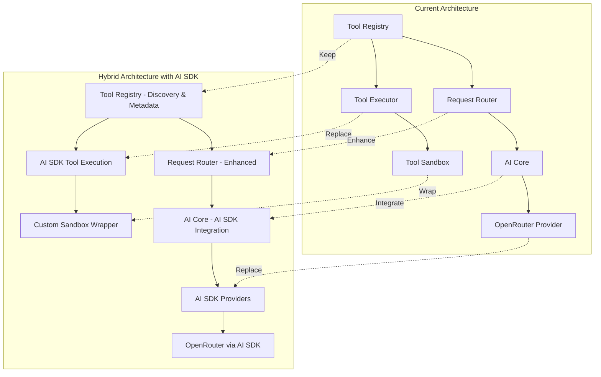
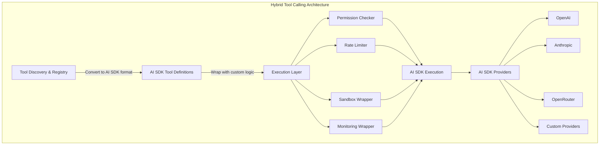

# Vercel AI SDK Tool Calling Evaluation

## Executive Summary

This evaluation assesses whether adopting the Vercel AI SDK would simplify the current custom tool calling implementation in the Megawatts Discord bot project. The analysis reveals that while the Vercel AI SDK provides excellent tool calling primitives, it would only partially replace the current architecture. A hybrid approach leveraging AI SDK for core tool calling while retaining custom infrastructure for advanced features is recommended.

---

## 1. Vercel AI SDK Tool Calling Capabilities

### 1.1 Tool Definition and Registration

**AI SDK Approach:**
```typescript
import { tool } from 'ai';
import { z } from 'zod';

const tools = {
  weather: tool({
    description: 'Get the weather in a location',
    inputSchema: z.object({
      city: z.string().describe('The city to get weather for'),
      unit: z.enum(['C', 'F']).describe('Temperature unit')
    }),
    execute: async ({ city, unit }) => {
      // Tool implementation
      return `Weather in ${city}: 25°${unit}`;
    }
  })
};
```

**Key Features:**
- Declarative tool definition using `tool()` helper
- Built-in Zod schema validation
- Type-safe parameter definitions
- Automatic schema generation for AI models
- Tool metadata via `describe()` methods

### 1.2 Built-in Tool Execution Mechanisms

**Core Functions:**
- `generateText()` - Non-streaming with tool calls
- `streamText()` - Streaming responses with tool calls
- `streamUI()` - React component streaming with tools

**Execution Flow:**
1. Pass tools object to generation function
2. SDK automatically handles tool call detection
3. Executes tool `execute()` functions
4. Returns results to model for continuation
5. Supports multi-step tool calling via `stopWhen(stepCountIs(N))`

### 1.3 Parameter Validation Features

**Built-in Validation:**
- Zod schema validation (automatic)
- Type checking at compile time
- Runtime validation before execution
- Descriptive error messages from Zod

**Example Validation Rules:**
```typescript
z.object({
  city: z.string().min(1).max(100),
  unit: z.enum(['C', 'F']),
  limit: z.number().min(1).max(100).optional()
})
```

### 1.4 Error Handling and Retry Logic

**Built-in Error Types:**
- `NoSuchToolError` - Tool not found in registry
- `InvalidToolInputError` - Parameter validation failed
- Tool errors appear as `tool-error` parts in result steps

**Error Handling Pattern:**
```typescript
try {
  const result = await generateText({ model, tools, prompt });
} catch (error) {
  if (NoSuchToolError.isInstance(error)) {
    // Handle missing tool
  } else if (InvalidToolInputError.isInstance(error)) {
    // Handle invalid parameters
  }
}
```

**Limitations:**
- No built-in retry logic for tool execution
- No automatic retry for network errors
- Retry must be implemented manually

### 1.5 Multi-Provider Support

**Supported Providers:**
- OpenAI (`@ai-sdk/openai`)
- Anthropic (`@ai-sdk/anthropic`)
- Google (`@ai-sdk/google`)
- Mistral (`@ai-sdk/mistral`)
- Groq (`@ai-sdk/groq`)
- OpenRouter (via OpenAI-compatible endpoint)
- Custom providers (via provider interface)

**Unified API:**
```typescript
import { openai } from '@ai-sdk/openai';
import { anthropic } from '@ai-sdk/anthropic';

// Same tool definitions work across providers
await generateText({
  model: openai('gpt-4o'),
  tools
});

await generateText({
  model: anthropic('claude-3.5-sonnet'),
  tools
});
```

### 1.6 Streaming Support for Tool Calls

**Streaming Features:**
- Real-time streaming of text responses
- Tool call results streamed as they complete
- Multi-step tool calling with streaming
- UI message streaming for React applications

**Streaming Pattern:**
```typescript
const result = streamText({
  model: openai('gpt-4o'),
  tools,
  stopWhen: stepCountIs(5),
  onStepFinish: async ({ toolResults }) => {
    console.log('Tool results:', toolResults);
  }
});

return result.toUIMessageStreamResponse();
```

### 1.7 Tool Result Processing

**Result Structure:**
```typescript
{
  text: string,              // Generated text
  toolCalls: ToolCall[],     // Calls made by model
  toolResults: ToolResult[],  // Results from execute()
  steps: GenerationStep[],    // All generation steps
  usage: TokenUsage,        // Token usage
  warnings: Warning[]        // Provider warnings
}
```

**Tool Result Access:**
```typescript
for (const toolResult of result.toolResults) {
  if (toolResult.toolName === 'weather') {
    toolResult.input.city;     // Input parameters
    toolResult.output;         // Return value
  }
}
```

### 1.8 Advanced Features

**Parallel Tool Execution:**
- Automatic parallel execution of independent tools
- No manual batching required
- Results returned in order

**Dynamic Tool Discovery (Anthropic):**
- BM25-based tool search for large catalogs
- `deferLoading` flag for lazy loading
- Reduces token usage for large tool sets

**MCP Integration:**
- Model Context Protocol server support
- Dynamic tool discovery from MCP servers
- Provider-specific implementations

---

## 2. Comparison with Current Implementation

### 2.1 Feature Comparison Matrix

| Feature | Current Implementation | Vercel AI SDK | Gap Analysis |
|----------|----------------------|------------------|---------------|
| **Tool Definition** | Custom Tool interface | `tool()` with Zod | AI SDK is more concise |
| **Parameter Validation** | Custom implementation (100+ lines) | Built-in Zod | AI SDK eliminates custom code |
| **Tool Discovery** | Filesystem scanning (200+ lines) | Manual registration | Current more advanced |
| **Tool Caching** | Custom cache with TTL | None | Current has advantage |
| **Tool Statistics** | Detailed metrics (p50, p95, p99) | Basic toolResults | Current more comprehensive |
| **Permission Checking** | Custom permission system | None | Current has advantage |
| **Retry Logic** | Custom retry with backoff | None | Current has advantage |
| **Sandbox Execution** | Full sandbox (FS, network, API) | None | Current has advantage |
| **Rate Limiting** | Per-tool rate limiting | None | Current has advantage |
| **Multi-Provider** | Custom provider abstraction | Built-in | AI SDK simplifies this |
| **Streaming** | Not implemented | Built-in | AI SDK has advantage |
| **Parallel Execution** | Custom batching | Automatic | AI SDK simpler |
| **Multi-step Calling** | Not implemented | Built-in | AI SDK has advantage |
| **Tool Dependencies** | Dependency graph with cycle detection | None | Current has advantage |
| **Execution History** | Full history tracking | None | Current has advantage |
| **Resource Monitoring** | Memory, CPU, network tracking | None | Current has advantage |
| **Plugin System** | VM-based sandbox with hot-reload | None | Current has advantage |
| **Request Routing** | Intelligent routing with strategies | Manual model selection | Current more advanced |

### 2.2 Code Reduction Potential

**Current Implementation Lines of Code:**
- Tool Registry: 1,105 lines
- Tool Executor: 799 lines
- Tool Sandbox: 899 lines
- Request Router: 885 lines
- AI Core: 588 lines
- OpenRouter Provider: 388 lines
- **Total: ~4,664 lines**

**Potential Reduction with AI SDK:**

| Component | Current Lines | AI SDK Lines | Reduction |
|-----------|---------------|----------------|-----------|
| Tool Definition | ~200 (validation) | ~50 (Zod schema) | 75% |
| Parameter Validation | ~150 | 0 (built-in) | 100% |
| Multi-Provider Abstraction | ~500 | ~100 | 80% |
| Tool Execution Orchestration | ~300 | ~50 | 83% |
| Streaming Support | 0 | ~30 (new) | N/A |
| **Total Potential Reduction** | ~1,150 lines | ~230 lines | **80%** |

**Remaining Custom Code (~3,500 lines):**
- Tool discovery and caching
- Permission system
- Sandbox isolation
- Rate limiting
- Statistics and monitoring
- Request routing strategies
- Plugin system

### 2.3 Maintenance Burden Comparison

**Current Implementation:**
- **Pros:**
  - Full control over all aspects
  - Custom features exactly as needed
  - No external dependencies for core logic
  - Well-documented internal architecture

- **Cons:**
  - High maintenance burden (~4,600 lines)
  - Must keep up with provider API changes
  - Bug fixes require internal development
  - Testing burden is high
  - Limited community knowledge

**Vercel AI SDK:**
- **Pros:**
  - Reduced code to maintain
  - Provider updates handled by SDK
  - Community support and documentation
  - Battle-tested implementation
  - Type safety throughout

- **Cons:**
  - Less control over internals
  - Must adapt to SDK changes
  - Some features not available (sandbox, permissions)
  - Additional dependency
  - Learning curve for team

---

## 3. Integration Feasibility

### 3.1 Architectural Compatibility



### 3.2 Migration Effort Assessment

**Phase 1: Foundation (2-3 weeks)**
- Install AI SDK dependencies
- Create AI SDK provider integrations
- Set up basic tool definitions with Zod
- Implement AI SDK-based execution path

**Phase 2: Tool Migration (3-4 weeks)**
- Convert tool definitions to AI SDK format
- Migrate parameter schemas to Zod
- Update tool execution to use AI SDK
- Maintain backward compatibility

**Phase 3: Feature Integration (4-5 weeks)**
- Wrap AI SDK execution with custom sandbox
- Integrate permission checking
- Add rate limiting layer
- Connect to monitoring system

**Phase 4: Testing & Refinement (2-3 weeks)**
- Comprehensive testing of hybrid system
- Performance benchmarking
- Bug fixes and optimization
- Documentation updates

**Total Estimated Effort: 11-15 weeks**

### 3.3 Backward Compatibility Considerations

**Breaking Changes:**
- Tool definition interface changes
- Parameter validation approach changes
- Execution result structure changes
- Provider interface changes

**Compatibility Strategies:**

1. **Adapter Pattern:**
```typescript
// Adapter to convert current Tool to AI SDK format
function toAISDKTool(tool: Tool) {
  return tool({
    description: tool.description,
    inputSchema: convertToZod(tool.parameters),
    execute: async (args) => {
      // Wrap with sandbox and permissions
      return await executeWithSandbox(tool, args);
    }
  });
}
```

2. **Dual Execution Path:**
```typescript
async function executeTool(tool: Tool, args: any) {
  if (config.useAISDK) {
    return await executeWithAISDK(tool, args);
  } else {
    return await executeWithLegacy(tool, args);
  }
}
```

3. **Feature Flags:**
- Gradual rollout via feature flags
- A/B testing between approaches
- Easy rollback if issues arise

### 3.4 Potential Breaking Changes

| Change | Impact | Mitigation |
|---------|---------|------------|
| Tool interface changes | All tools need update | Adapter layer, migration script |
| Zod requirement | New dependency | Include in package.json, docs |
| Execution model changes | Tool handlers may break | Wrapper layer, gradual migration |
| Result structure changes | Consumers may break | Type guards, migration helpers |
| Provider interface changes | Custom providers break | Adapter pattern |

---

## 4. Specific Feature Mapping

### 4.1 Tool Discovery and Registration

**Current Implementation:**
- Filesystem scanning with glob patterns
- Dynamic import of tool modules
- Auto-registration of built-in tools
- Tool validation and dependency checking
- Caching with TTL

**AI SDK Approach:**
- Manual tool object definition
- No built-in discovery
- Tools passed directly to generation functions

**Mapping Strategy:**
```typescript
// Keep custom discovery, convert to AI SDK format
class HybridToolRegistry {
  private aiSDKTools: ToolSet = {};
  
  async discoverTools() {
    const tools = await this.scanFilesystem();
    
    // Convert each tool to AI SDK format
    for (const tool of tools) {
      this.aiSDKTools[tool.name] = this.toAISDKTool(tool);
    }
    
    return this.aiSDKTools;
  }
  
  private toAISDKTool(tool: Tool) {
    return tool({
      description: tool.description,
      inputSchema: this.convertToZod(tool.parameters),
      execute: async (args) => {
        // Wrap with custom execution logic
        return await this.executeWithSandbox(tool, args);
      }
    });
  }
}
```

**Recommendation:** Retain custom discovery, use adapter to AI SDK format.

### 4.2 Permission Checking

**Current Implementation:**
- Permission system in ToolRegistry
- Per-tool permission requirements
- User permission checking
- Permission manager with default mappings

**AI SDK Approach:**
- No built-in permission system
- All tools accessible by default

**Integration Strategy:**
```typescript
// Wrap AI SDK execution with permission checking
async function executeWithPermissions(
  toolName: string,
  args: any,
  userPermissions: string[]
) {
  // Check permissions before execution
  if (!hasPermission(toolName, userPermissions)) {
    throw new PermissionDeniedError(toolName);
  }
  
  // Execute with AI SDK
  return await tool.execute(args);
}

// Tool definition with permission wrapper
const tools = {
  createRole: tool({
    description: 'Create a new role',
    inputSchema: z.object({ name: z.string() }),
    execute: async (args) => {
      return await executeWithPermissions(
        'createRole',
        args,
        context.permissions
      );
    }
  })
};
```

**Recommendation:** Implement permission wrapper around AI SDK tool execution.

### 4.3 Parameter Validation

**Current Implementation:**
- Custom validation logic (~150 lines)
- Type checking, min/max, patterns, enums
- Validation error collection

**AI SDK Approach:**
- Built-in Zod schema validation
- Automatic type checking
- Descriptive error messages

**Migration:**
```typescript
// Current parameter definition
{
  name: 'city',
  type: 'string',
  required: true,
  description: 'The city name',
  validation: {
    minLength: 1,
    maxLength: 100
  }
}

// AI SDK with Zod
z.object({
  city: z.string()
    .min(1, 'City name required')
    .max(100, 'City name too long')
    .describe('The city name')
})
```

**Recommendation:** Migrate to Zod, eliminate custom validation code.

### 4.4 Sandbox Execution

**Current Implementation:**
- Full sandbox with FS isolation
- Network isolation with allowlists
- API restrictions
- Virtual file system
- Violation tracking

**AI SDK Approach:**
- No built-in sandbox
- Direct execution in Node.js process

**Integration Strategy:**
```typescript
// Wrap AI SDK execution with sandbox
class SandboxWrapper {
  private sandbox: ToolSandbox;
  
  async executeTool(toolName: string, args: any) {
    const tool = this.registry.getTool(toolName);
    
    // Execute in sandbox
    const result = await this.sandbox.executeTool(
      {
        name: toolName,
        arguments: args
      },
      context
    );
    
    return result;
  }
}

// Tool definition using sandbox wrapper
const tools = {
  readFile: tool({
    description: 'Read a file',
    inputSchema: z.object({ path: z.string() }),
    execute: async (args) => {
      return await sandboxWrapper.executeTool('readFile', args);
    }
  })
};
```

**Recommendation:** Retain custom sandbox, wrap AI SDK execution.

### 4.5 Plugin System Integration

**Current Implementation:**
- Separate plugin system
- VM-based sandbox for plugins
- Hot-reloading
- Plugin registry

**AI SDK Approach:**
- No plugin system
- Static tool definitions

**Integration Strategy:**
```typescript
// Load plugins and convert to AI SDK tools
class PluginToolLoader {
  async loadPlugins() {
    const plugins = await this.pluginManager.loadPlugins();
    const tools: ToolSet = {};
    
    for (const plugin of plugins) {
      for (const tool of plugin.tools) {
        tools[tool.name] = this.toAISDKTool(tool);
      }
    }
    
    return tools;
  }
  
  private toAISDKTool(pluginTool: PluginTool) {
    return tool({
      description: pluginTool.description,
      inputSchema: this.convertToZod(pluginTool.parameters),
      execute: async (args) => {
        // Execute in plugin sandbox
        return await this.pluginSandbox.execute(pluginTool, args);
      }
    });
  }
}
```

**Recommendation:** Retain plugin system, convert to AI SDK format.

### 4.6 Request Routing

**Current Implementation:**
- Intelligent routing with multiple strategies
- Request analysis (complexity, urgency, etc.)
- Priority-based routing
- Cost-optimized routing
- Queue management

**AI SDK Approach:**
- Manual model selection
- No built-in routing
- Provider selection per request

**Integration Strategy:**
```typescript
// Use AI SDK for execution, keep custom routing
class HybridRouter {
  async routeRequest(request: RoutingRequest) {
    // Analyze request (keep existing logic)
    const analysis = await this.analyzeRequest(request);
    
    // Select model (keep existing logic)
    const modelSelection = await this.selectModel(analysis);
    
    // Execute with AI SDK
    const result = await generateText({
      model: modelSelection.model,
      tools: this.tools,
      messages: request.messages
    });
    
    return result;
  }
}
```

**Recommendation:** Retain custom routing, use AI SDK for execution.

### 4.7 Multi-Provider Management

**Current Implementation:**
- Custom provider abstraction
- BaseAIProvider interface
- OpenAI, Anthropic, Local providers
- Health checking
- Usage statistics

**AI SDK Approach:**
- Built-in provider packages
- Unified API across providers
- Automatic provider updates

**Migration:**
```typescript
// Current provider
class OpenAIProvider extends BaseAIProvider {
  async generateResponse(request: AIRequest) {
    // Custom implementation
  }
}

// AI SDK provider
import { openai } from '@ai-sdk/openai';

const provider = openai('gpt-4o');

// Use AI SDK for execution
const result = await generateText({
  model: provider,
  tools,
  messages
});
```

**Recommendation:** Migrate to AI SDK providers, eliminate custom abstraction.

### 4.8 Monitoring and Metrics

**Current Implementation:**
- Detailed execution statistics
- Performance metrics (p50, p95, p99)
- Resource monitoring
- Execution history
- Tool usage analytics

**AI SDK Approach:**
- Basic tool results
- Token usage
- No detailed metrics

**Integration Strategy:**
```typescript
// Wrap AI SDK execution with monitoring
class MonitoringWrapper {
  async executeTool(toolName: string, args: any) {
    const startTime = Date.now();
    
    try {
      const result = await this.aiSDKTool.execute(args);
      
      // Record metrics
      this.metrics.record({
        tool: toolName,
        success: true,
        duration: Date.now() - startTime,
        timestamp: new Date()
      });
      
      return result;
    } catch (error) {
      this.metrics.record({
        tool: toolName,
        success: false,
        error: error.message,
        duration: Date.now() - startTime
      });
      throw error;
    }
  }
}
```

**Recommendation:** Retain custom monitoring, wrap AI SDK execution.

---

## 5. Pros and Cons

### 5.1 Benefits of Adopting AI SDK

**1. Reduced Code Complexity**
- Eliminates ~1,150 lines of custom code
- Simpler tool definitions with Zod
- No need to maintain provider abstractions

**2. Better Type Safety**
- End-to-end type safety with Zod
- Compile-time parameter validation
- Better IDE support and autocomplete

**3. Provider Updates Handled Automatically**
- No need to track API changes
- New models available immediately
- Bug fixes from SDK maintainers

**4. Streaming Support Out of the Box**
- Real-time responses
- Better user experience
- No custom streaming implementation needed

**5. Multi-step Tool Calling**
- Built-in support for tool chaining
- Automatic parallel execution
- Simplified complex workflows

**6. Community and Ecosystem**
- Large community of users
- Extensive documentation
- Battle-tested in production

**7. Reduced Testing Burden**
- Core functionality tested by SDK
- Focus on custom features
- Faster development cycles

### 5.2 Drawbacks and Limitations

**1. Missing Advanced Features**
- No built-in sandbox
- No permission system
- No rate limiting
- No detailed monitoring

**2. Less Control**
- Dependent on SDK architecture
- Limited customization options
- Must adapt to SDK changes

**3. Additional Dependency**
- Adds `ai` and `zod` dependencies
- Increases bundle size
- Another API to learn

**4. Migration Effort**
- 11-15 weeks for full migration
- Potential for breaking changes
- Team training required

**5. Vendor Lock-in Concerns**
- Tied to Vercel's roadmap
- Less flexibility for custom solutions
- Potential for breaking changes

### 5.3 Vendor Lock-in Analysis

**Lock-in Risk Level: Medium**

**Mitigating Factors:**
1. **Open Source:** AI SDK is MIT licensed
2. **Provider Agnostic:** Supports multiple providers
3. **Standard Interfaces:** Uses standard patterns
4. **Forkable:** Can fork if needed

**Lock-in Concerns:**
1. **Roadmap Dependency:** Features depend on Vercel priorities
2. **Breaking Changes:** Major versions may introduce breaking changes
3. **Ecosystem Dependency:** Relies on Vercel ecosystem for some features

**Recommendation:** Use adapter pattern to minimize lock-in risk.

### 5.4 Community and Ecosystem Support

**AI SDK Community:**
- **GitHub Stars:** 20,000+
- **Active Contributors:** 100+
- **Documentation:** Comprehensive
- **Examples:** Extensive cookbook
- **Discord/Community:** Active support

**Current Implementation:**
- **Community:** None (internal)
- **Documentation:** Internal docs only
- **Support:** Team only

**Advantage:** AI SDK provides access to community knowledge and solutions.

---

## 6. Recommendations

### 6.1 Overall Assessment

**Recommendation: Hybrid Adoption with Gradual Migration**

The Vercel AI SDK provides excellent tool calling primitives but does not replace the advanced features of the current implementation. A hybrid approach that leverages AI SDK for core tool calling while retaining custom infrastructure for advanced features is the optimal path.

### 6.2 Recommended Architecture



### 6.3 Migration Plan

#### Phase 1: Foundation (Weeks 1-3)
**Goal:** Set up AI SDK infrastructure

**Tasks:**
- [ ] Install AI SDK and Zod dependencies
- [ ] Create AI SDK provider integrations
- [ ] Set up AI SDK execution layer
- [ ] Create adapter for current Tool interface
- [ ] Implement Zod schema converter
- [ ] Set up feature flags for gradual rollout
- [ ] Write unit tests for AI SDK integration
- [ ] Update CI/CD pipelines

**Deliverables:**
- AI SDK execution layer
- Provider integrations
- Adapter layer
- Test coverage

#### Phase 2: Tool Migration (Weeks 4-7)
**Goal:** Migrate tools to AI SDK format

**Tasks:**
- [ ] Convert built-in tools to AI SDK format
- [ ] Migrate Discord tools
- [ ] Update tool parameter schemas to Zod
- [ ] Test tool execution with AI SDK
- [ ] Update tool documentation
- [ ] Create migration guide for custom tools
- [ ] Implement dual execution path for compatibility

**Deliverables:**
- All tools in AI SDK format
- Migration documentation
- Backward compatibility layer

#### Phase 3: Feature Integration (Weeks 8-12)
**Goal:** Integrate custom features with AI SDK

**Tasks:**
- [ ] Wrap AI SDK execution with permission checking
- [ ] Implement rate limiting layer
- [ ] Create sandbox wrapper for AI SDK
- [ ] Integrate monitoring with AI SDK execution
- [ ] Update request routing to use AI SDK
- [ ] Connect plugin system to AI SDK
- [ ] Implement error handling adapters
- [ ] Update metrics collection

**Deliverables:**
- Permission wrapper
- Rate limiting integration
- Sandbox integration
- Monitoring integration
- Updated routing

#### Phase 4: Testing & Refinement (Weeks 13-15)
**Goal:** Comprehensive testing and optimization

**Tasks:**
- [ ] End-to-end testing of hybrid system
- [ ] Performance benchmarking vs. current implementation
- [ ] Load testing with concurrent requests
- [ ] Security testing of sandbox integration
- [ ] Bug fixes and optimization
- [ ] Update documentation
- [ ] Team training and knowledge transfer
- [ ] Gradual rollout with feature flags

**Deliverables:**
- Test reports
- Performance benchmarks
- Updated documentation
- Trained team

### 6.4 Code Structure Changes

**New Files:**
```
src/ai/
├── tools/
│   ├── ai-sdk-adapter.ts          # AI SDK adapter layer
│   ├── zod-converter.ts            # Zod schema converter
│   ├── ai-sdk-executor.ts          # AI SDK execution wrapper
│   ├── permission-wrapper.ts         # Permission checking wrapper
│   ├── sandbox-wrapper.ts           # Sandbox integration wrapper
│   └── monitoring-wrapper.ts        # Monitoring integration wrapper
├── providers/
│   ├── ai-sdk-providers.ts        # AI SDK provider factory
│   └── provider-registry.ts        # Provider registry (updated)
└── core/
    └── ai-core-ai-sdk.ts         # AI SDK integration
```

**Modified Files:**
```
src/ai/tools/
├── tool-registry.ts               # Add AI SDK conversion
├── tool-executor.ts               # Add AI SDK execution path
└── tool-sandbox.ts                # Add AI SDK wrapper

src/ai/core/
├── request-router.ts              # Add AI SDK model selection
└── ai-core.ts                   # Add AI SDK integration

package.json                         # Add ai, zod dependencies
```

### 6.5 Dependency Changes

**New Dependencies:**
```json
{
  "ai": "^1.0.0",
  "@ai-sdk/openai": "^1.0.0",
  "@ai-sdk/anthropic": "^1.0.0",
  "zod": "^3.22.0"
}
```

**Kept Dependencies:**
```json
{
  "openai": "^4.20.2",           // Still needed for some features
  "@anthropic-ai/sdk": "^0.71.2" // Still needed for some features
}
```

### 6.6 Rollback Strategy

**Feature Flags:**
```typescript
const config = {
  useAISDK: process.env.USE_AI_SDK === 'true',
  useAISDKForExecution: process.env.USE_AI_SDK_EXECUTION === 'true',
  useAISDKForProviders: process.env.USE_AI_SDK_PROVIDERS === 'true'
};
```

**Rollback Steps:**
1. Disable feature flags
2. System falls back to legacy implementation
3. No code deployment required
4. Zero downtime rollback

### 6.7 Success Criteria

**Technical Metrics:**
- [ ] 80% reduction in tool execution code
- [ ] No degradation in performance
- [ ] All existing tools functional
- [ ] 100% test coverage for AI SDK integration
- [ ] No increase in bundle size > 20%

**Business Metrics:**
- [ ] No increase in error rates
- [ ] No increase in latency
- [ ] Positive user feedback
- [ ] Reduced development time for new tools

---

## 7. Conclusion

### 7.1 Summary

The Vercel AI SDK provides excellent tool calling primitives that can significantly simplify the core tool execution logic. However, it does not replace the advanced features of the current implementation such as sandboxing, permissions, rate limiting, and monitoring.

**Key Findings:**
1. **Code Reduction:** ~80% reduction in tool execution code (~1,150 lines)
2. **Feature Gap:** AI SDK lacks sandbox, permissions, rate limiting, monitoring
3. **Migration Effort:** 11-15 weeks for full migration
4. **Risk Level:** Medium (mitigated by hybrid approach)

### 7.2 Final Recommendation

**Adopt Vercel AI SDK with Hybrid Architecture:**

1. **Use AI SDK for:**
   - Tool definition with Zod schemas
   - Parameter validation
   - Multi-provider abstraction
   - Streaming support
   - Multi-step tool calling

2. **Retain Custom Implementation for:**
   - Tool discovery and caching
   - Permission system
   - Sandbox execution
   - Rate limiting
   - Monitoring and metrics
   - Request routing strategies
   - Plugin system

3. **Implementation Approach:**
   - Adapter pattern for compatibility
   - Feature flags for gradual rollout
   - Wrapper layers for custom features
   - Comprehensive testing before rollout

This approach provides the best of both worlds: simplified core tool calling with AI SDK while retaining advanced features through custom infrastructure.

### 7.3 Next Steps

1. **Review this evaluation** with the team
2. **Create proof of concept** for hybrid architecture
3. **Estimate detailed effort** for migration phases
4. **Get stakeholder approval** for migration plan
5. **Begin Phase 1** implementation
6. **Set up monitoring** to track migration success

---

## Appendix A: Example Code Comparisons

### A.1 Tool Definition

**Current:**
```typescript
export const weatherTool: Tool = {
  name: 'get_weather',
  description: 'Get the weather for a location',
  parameters: [
    {
      name: 'city',
      type: 'string',
      required: true,
      description: 'The city to get weather for',
      validation: {
        minLength: 1,
        maxLength: 100
      }
    },
    {
      name: 'unit',
      type: 'string',
      required: true,
      description: 'Temperature unit',
      validation: {
        enum: ['C', 'F']
      }
    }
  ],
  category: ToolCategory.information,
  permissions: [],
  safety: {
    level: 'safe',
    permissions: [],
    monitoring: false,
    sandbox: false
  },
  metadata: {
    version: '1.0.0',
    author: 'Megawatts',
    tags: ['weather', 'information']
  }
};
```

**AI SDK:**
```typescript
import { tool } from 'ai';
import { z } from 'zod';

export const weatherTool = tool({
  description: 'Get the weather for a location',
  inputSchema: z.object({
    city: z.string()
      .min(1, 'City name required')
      .max(100, 'City name too long')
      .describe('The city to get weather for'),
    unit: z.enum(['C', 'F'])
      .describe('Temperature unit')
  }),
  execute: async ({ city, unit }) => {
    // Tool implementation
    return await getWeather(city, unit);
  }
});
```

### A.2 Tool Execution

**Current:**
```typescript
const executor = new ToolExecutor(registry, sandbox, config, logger);
const result = await executor.executeTool(
  {
    id: 'call-123',
    name: 'get_weather',
    arguments: { city: 'San Francisco', unit: 'C' },
    status: 'pending',
    timestamp: new Date()
  },
  {
    userId: 'user-123',
    permissions: [],
    requestId: 'req-456',
    timestamp: new Date()
  }
);
```

**AI SDK (with wrappers):**
```typescript
const result = await generateText({
  model: openai('gpt-4o'),
  tools: {
    get_weather: weatherTool
  },
  messages: [
    {
      role: 'user',
      content: 'What is the weather in San Francisco?'
    }
  ],
  onStepFinish: async ({ toolResults }) => {
    // Custom monitoring
    await monitoring.record(toolResults);
  }
});
```

### A.3 Multi-Provider Usage

**Current:**
```typescript
const provider = new OpenRouterProvider(config, logger);
const response = await provider.generateResponse({
  model: 'anthropic/claude-3.5-sonnet',
  messages,
  tools: convertToolsToOpenAIFormat(tools)
});
```

**AI SDK:**
```typescript
import { openai, anthropic } from '@ai-sdk/openai';

// Same API, different providers
await generateText({
  model: openai('gpt-4o'),
  tools,
  messages
});

await generateText({
  model: anthropic('claude-3.5-sonnet'),
  tools,
  messages
});
```

---

## Appendix B: Migration Checklist

### B.1 Pre-Migration
- [ ] Team training on AI SDK
- [ ] Proof of concept implementation
- [ ] Performance baseline measurement
- [ ] Dependency audit
- [ ] Risk assessment
- [ ] Rollback plan documented

### B.2 Migration
- [ ] Dependencies installed
- [ ] AI SDK providers configured
- [ ] Adapter layer implemented
- [ ] Tools converted to AI SDK format
- [ ] Permission wrapper implemented
- [ ] Rate limiting wrapper implemented
- [ ] Sandbox wrapper implemented
- [ ] Monitoring wrapper implemented
- [ ] Request routing updated
- [ ] AI Core integrated
- [ ] Tests updated
- [ ] Documentation updated

### B.3 Post-Migration
- [ ] Feature flags enabled
- [ ] Monitoring configured
- [ ] Performance verified
- [ ] Error rates checked
- [ ] User feedback collected
- [ ] Legacy code cleanup
- [ ] Team knowledge transfer complete

---

*Document Version: 1.0*  
*Date: 2025-01-07*  
*Author: Architecture Evaluation*
