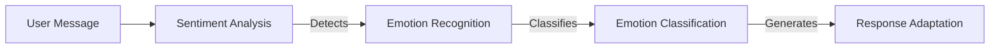

# AI Tool Calling and Conversational AI Architecture for Self-Editing Discord Bot

## Executive Summary

This document outlines comprehensive technical specifications for designing and implementing a sophisticated AI tool calling framework and conversational AI system for a self-editing Discord bot. The architecture balances advanced AI capabilities with robust safety mechanisms, creating an intelligent assistant that can safely improve its own functionality while maintaining the highest standards of reliability, security, and user experience.

The design addresses the unique challenges of self-modification, multi-modal AI integration, and autonomous learning while ensuring strict adherence to safety boundaries and privacy requirements.

## Table of Contents

1. [Conversational AI Architecture](#conversational-ai-architecture)
2. [Tool Calling Framework](#tool-calling-framework)
3. [Natural Language Understanding](#natural-language-understanding)
4. [Response Generation](#response-generation)
5. [Learning and Adaptation](#learning-and-adaptation)
6. [Integration with Self-Editing](#integration-with-self-editing)
7. [Safety and Moderation](#safety-and-moderation)
8. [Performance Optimization](#performance-optimization)
9. [Security and Privacy](#security-and-privacy)
10. [Technical Implementation](#technical-implementation)
11. [Monitoring and Observability](#monitoring-and-observability)

---

## 1. Conversational AI Architecture

### 1.1 AI Model Integration Strategy

#### Multi-Provider Architecture
The conversational AI system will implement a flexible, multi-provider architecture to ensure reliability and cost optimization:

**Primary AI Provider**: OpenAI GPT-4 for core conversational capabilities
- **Model**: gpt-4-turbo
- **Capabilities**: Advanced reasoning, context understanding, code generation
- **Use Cases**: Complex conversations, code analysis, strategic decision-making

**Secondary AI Providers**:
- **Anthropic Claude**: Fallback for advanced reasoning and safety-critical tasks
- **Local Models**: LLaMA, Mistral for offline capabilities and privacy
- **Specialized Models**: Fine-tuned models for specific domains (moderation, technical support)

#### AI Request Routing System
```mermaid
graph TB
    subgraph "AI Request Routing"
        UserRequest[User Input] --> Router[Request Router]
        Router -->|Analyzes| ModelSelector[Model Selection Engine]
        ModelSelector -->|Routes| OpenAI[OpenAI GPT-4]
        ModelSelector -->|Routes| Anthropic[Claude]
        ModelSelector -->|Routes| Local[Local Models]
        ModelSelector -->|Routes| Specialized[Domain-Specific Models]
        
        OpenAI -->|Processes| ResponseProcessor[Response Processing]
        Anthropic -->|Processes| ResponseProcessor
        Local -->|Processes| ResponseProcessor
        Specialized -->|Processes| ResponseProcessor
        
        ResponseProcessor -->|Combines| ResponseAggregator[Response Aggregation]
        ResponseAggregator -->|Validates| SafetyValidator[Response Validation]
        ResponseAggregator -->|Formats| ResponseFormatter[Output Formatting]
        ResponseFormatter -->|Returns| UserRequest[Complete Response]
```

#### Context Management System
**Multi-Turn Context Tracking**:
- Conversation threading with hierarchical context windows
- Cross-channel context awareness and isolation
- Temporal context with automatic summarization
- User preference integration for personalized responses
- Relationship mapping for social context understanding

**Memory Architecture**:
- **Short-term Memory**: Current conversation context (last 50 messages)
- **Medium-term Memory**: User preferences and interaction patterns (30 days)
- **Long-term Memory**: Learned knowledge and community insights (indefinite)

### 1.2 Emotional Intelligence Framework

#### Sentiment Analysis Pipeline


**Emotion Recognition Capabilities**:
- Primary emotions: Joy, Sadness, Anger, Fear, Surprise, Disgust
- Secondary emotions: Trust, Anticipation, Love
- Confidence scoring for emotion detection
- Temporal emotion tracking for conversation flow analysis

**Response Adaptation Engine**:
- Empathy-driven response generation
- Tone adjustment based on user emotional state
- Conflict de-escalation detection and intervention
- Positive reinforcement and celebration mechanisms

---

## 2. Tool Calling Framework

### 2.1 Tool Discovery and Registration

#### Dynamic Tool Registry
```python
class ToolRegistry:
    def __init__(self):
        self.tools = {}
        self.tool_metadata = {}
        self.security_policies = {}
    
    def register_tool(self, tool_name: str, tool_class: Type[Tool], 
                   permissions: List[str], safety_requirements: Dict):
        """Register a new tool with security validation"""
        # Security validation
        self._validate_tool_safety(tool_class, safety_requirements)
        
        # Tool registration
        tool_id = self._generate_tool_id(tool_name)
        self.tools[tool_id] = {
            'name': tool_name,
            'class': tool_class,
            'permissions': permissions,
            'safety_requirements': safety_requirements,
            'usage_stats': {},
            'last_used': None,
            'version': '1.0.0'
        }
        
        # Metadata storage
        self.tool_metadata[tool_id] = {
            'description': self._generate_tool_description(tool_class),
            'parameters': self._extract_tool_parameters(tool_class),
            'examples': self._generate_tool_examples(tool_class),
            'registered_at': datetime.utcnow()
        }
    
    def _validate_tool_safety(self, tool_class: Type[Tool], requirements: Dict):
        """Validate tool against safety requirements"""
        # Check for dangerous operations
        if hasattr(tool_class, 'execute_system_command'):
            raise SecurityError("System command execution not allowed")
        
        # Validate resource access patterns
        for requirement in requirements.get('resource_access', []):
            if not self._check_resource_safety(tool_class, requirement):
                raise SecurityError(f"Tool violates resource access requirement: {requirement}")
    
    def _generate_tool_id(self, tool_name: str) -> str:
        """Generate unique tool identifier"""
        return f"tool_{tool_name.lower().replace(' ', '_')}_{uuid.uuid4().hex[:8]}"
```

#### Tool Execution Sandbox
```python
class ToolSandbox:
    def __init__(self, resource_limits: Dict[str, int]):
        self.limits = resource_limits
        self.execution_history = []
    
    async def execute_tool(self, tool_id: str, parameters: Dict, 
                    user_context: UserContext) -> ToolResult:
        """Execute tool in isolated environment"""
        # Resource monitoring
        monitor = ResourceMonitor(self.limits)
        
        # Security validation
        validator = SecurityValidator()
        if not validator.validate_parameters(tool_id, parameters):
            raise SecurityError("Invalid tool parameters")
        
        # Tool execution
        start_time = time.time()
        try:
            result = await self._execute_tool_safely(tool_id, parameters, monitor)
            
            # Log execution
            self.execution_history.append({
                'tool_id': tool_id,
                'parameters': parameters,
                'result': result,
                'execution_time': time.time() - start_time,
                'resource_usage': monitor.get_usage()
            })
            
            return result
            
        except Exception as e:
            # Automatic rollback on failure
            await self._rollback_unsafe_state()
            raise ToolExecutionError(f"Tool execution failed: {str(e)}")
        finally:
            monitor.cleanup()
```

### 2.2 Function Calling Architecture

#### Parameter Validation System
```python
class ParameterValidator:
    def __init__(self):
        self.schemas = self._load_tool_schemas()
    
    def validate_parameters(self, tool_id: str, parameters: Dict) -> bool:
        """Validate tool parameters against JSON schemas"""
        schema = self.schemas.get(tool_id)
        if not schema:
            return False
        
        try:
            jsonschema.validate(parameters, schema)
            return True
        except ValidationError as e:
            self._log_validation_error(tool_id, parameters, str(e))
            return False
    
    def _load_tool_schemas(self) -> Dict[str, Dict]:
        """Load tool schemas from configuration"""
        return {
            'file_reader': {
                'type': 'object',
                'properties': {
                    'file_path': {'type': 'string', 'required': True},
                    'max_size_mb': {'type': 'integer', 'maximum': 100}
                }
            },
            'web_search': {
                'type': 'object',
                'properties': {
                    'query': {'type': 'string', 'required': True, 'max_length': 1000},
                    'max_results': {'type': 'integer', 'maximum': 50}
                }
            }
            }
        }
```

#### Tool Result Processing
```python
class ToolResultProcessor:
    def __init__(self):
        self.formatters = {
            'json': self._format_json_result,
            'text': self._format_text_result,
            'file': self._format_file_result
        }
    
    def process_result(self, tool_id: str, result: Any, 
                       format_type: str = 'json') -> ProcessedResult:
        """Process and format tool execution result"""
        formatter = self.formatters.get(format_type, self._format_json_result)
        
        processed_result = formatter(result, tool_id)
        
        # Log processing for analytics
        self._log_tool_usage(tool_id, result, len(str(processed_result)))
        
        return processed_result
```

### 2.3 Tool Security Framework

#### Permission-Based Access Control
```mermaid
graph TB
    subgraph "Tool Security Framework"
        ToolRequest[Tool Execution Request] --> PermissionChecker[Permission Validation]
        PermissionChecker -->|Validates| SecurityPolicy[Security Policy Engine]
        SecurityPolicy -->|Enforces| AccessControl[Access Control]
        AccessControl -->|Grants| ToolExecution[Authorized Execution]
        ToolExecution -->|Monitors| AuditLogger[Audit Trail]
        AuditLogger -->|Stores| SecurityDatabase[Security Logs]
```

**Security Layers**:
1. **Input Validation**: Parameter sanitization and type checking
2. **Resource Limits**: CPU, memory, and network restrictions
3. **Execution Monitoring**: Real-time resource usage tracking
4. **Audit Logging**: Complete execution trail with timestamps
5. **Emergency Stops**: Immediate termination capability for dangerous operations

---

## 3. Natural Language Understanding

### 3.1 Multi-Modal Processing Pipeline

#### Text Processing Engine
```python
class TextProcessor:
    def __init__(self):
        self.tokenizer = tiktoken.get_encoding("cl100k_base")
        self.max_tokens = 8192  # GPT-4 context limit
    
    def process_message(self, text: str, context: ConversationContext) -> ProcessedText:
        """Process incoming message with context awareness"""
        # Token counting for context management
        tokens = self.tokenizer.encode(text)
        if len(tokens) + context.token_count > self.max_tokens:
            # Summarize old context
            context = self.summarize_context(context)
        
        # Entity extraction
        entities = self.extract_entities(text)
        
        # Intent classification
        intent = self.classify_intent(text, context)
        
        return ProcessedText(
            original=text,
            tokens=len(tokens),
            entities=entities,
            intent=intent,
            context=context,
            processed_at=datetime.utcnow()
        )
```

#### Context-Aware Understanding
```python
class ContextManager:
    def __init__(self):
        self.context_window = deque(maxlen=50, maxlen=1000)
        self.entity_tracker = EntityTracker()
        self.sentiment_analyzer = SentimentAnalyzer()
    
    def update_context(self, message: ProcessedText) -> ConversationContext:
        """Update conversation context with new message"""
        # Add to context window
        self.context_window.append(message)
        
        # Update entity tracker
        self.entity_tracker.update(message.entities)
        
        # Analyze sentiment trends
        sentiment_trend = self.sentiment_analyzer.analyze_trend(
            [msg for msg in self.context_window[-10:]]
        )
        
        # Generate context summary
        summary = self.generate_context_summary(self.context_window)
        
        return ConversationContext(
            messages=list(self.context_window),
            entities=self.entity_tracker.get_active_entities(),
            sentiment_trend=sentiment_trend,
            summary=summary,
            token_count=sum(len(msg.tokens) for msg in self.context_window),
            updated_at=datetime.utcnow()
        )
```

### 3.2 Intent Recognition and Entity Extraction

#### Intent Classification System
```python
class IntentClassifier:
    def __init__(self):
        self.intents = {
            'greeting': ['hello', 'hi', 'hey'],
            'question': ['what', 'how', 'why', 'when'],
            'command': ['help', 'status', 'config'],
            'moderation': ['kick', 'ban', 'mute'],
            'self_edit': ['improve', 'optimize', 'learn'],
            'file_operation': ['read', 'write', 'delete', 'search']
        }
        self.model = self._load_intent_model()
    
    def classify_intent(self, text: str, context: ConversationContext) -> Intent:
        """Classify user intent from message"""
        # Preprocessing
        cleaned_text = self._preprocess_text(text)
        
        # Feature extraction
        features = self._extract_features(cleaned_text, context)
        
        # Model prediction
        probabilities = self.model.predict_proba(features)
        
        # Get top intent
        top_intent = max(self.intents.keys(), 
                           key=lambda x: probabilities[self.intents[x]], 
                           default='unknown')
        
        confidence = probabilities[self.intents[top_intent]]
        
        return Intent(
            type=top_intent,
            confidence=confidence,
            probabilities=probabilities,
            features=features
        )
```

---

## 4. Response Generation

### 4.1 Dynamic Response Generation

#### Response Strategy Engine
```python
class ResponseStrategy:
    def __init__(self):
        self.strategies = {
            'conversational': ConversationalResponse,
            'informational': InformationalResponse,
            'command': CommandResponse,
            'emotional_support': EmotionalSupportResponse,
            'creative': CreativeResponse
        }
        self.context_analyzer = ContextAnalyzer()
    
    def select_strategy(self, intent: Intent, context: ConversationContext) -> str:
        """Select appropriate response strategy based on intent and context"""
        if intent.type == 'command':
            return 'command'
        elif context.sentiment_trend.get('negative', 0) > 0.3:
            return 'emotional_support'
        elif intent.type == 'question':
            return 'informational'
        else:
            return 'conversational'
    
    def generate_response(self, strategy: str, intent: Intent, 
                       context: ConversationContext) -> Response:
        """Generate response using selected strategy"""
        strategy_class = self.strategies[strategy]
        return strategy_class.generate(intent, context)
```

#### Personalization Engine
```python
class PersonalizationEngine:
    def __init__(self):
        self.user_profiles = UserProfileManager()
        self.learning_engine = LearningEngine()
    
    def personalize_response(self, response: Response, 
                         user_id: str) -> PersonalizedResponse:
        """Personalize response based on user profile and learning"""
        profile = self.user_profiles.get_profile(user_id)
        
        # Apply user preferences
        if profile.get('formal_tone', False):
            response.style = 'casual'
        
        # Apply learned patterns
        learned_patterns = self.learning_engine.get_user_patterns(user_id)
        response = self._apply_learned_patterns(response, learned_patterns)
        
        # Apply emotional intelligence
        emotional_context = self._analyze_emotional_context(user_id)
        response = self._apply_emotional_intelligence(response, emotional_context)
        
        return PersonalizedResponse(
            original=response,
            personalized=True,
            user_profile=profile,
            applied_patterns=learned_patterns,
            emotional_adjustments=emotional_context
        )
```

---

## 5. Learning and Adaptation

### 5.1 Self-Improvement Learning Framework

#### Pattern Recognition System
```python
class PatternRecognition:
    def __init__(self):
        self.pattern_types = {
            'conversation': ConversationPattern,
            'moderation': ModerationPattern,
            'performance': PerformancePattern,
            'error': ErrorPattern,
            'security': SecurityPattern
        }
        self.pattern_detector = PatternDetector()
    
    def analyze_patterns(self, data_stream: List[Dict]) -> List[Pattern]:
        """Analyze data stream for recurring patterns"""
        patterns = []
        
        for pattern_type in self.pattern_types.values():
            detector = self.pattern_detector.get_detector(pattern_type)
            pattern_instances = detector.detect(data_stream)
            patterns.extend(pattern_instances)
        
        return patterns
    
    def learn_from_feedback(self, feedback: UserFeedback) -> LearningUpdate:
        """Learn from user feedback to improve pattern recognition"""
        for pattern_type, feedback_data in feedback.pattern_feedback.items():
            learning_engine = self.get_learning_engine(pattern_type)
            learning_engine.update_pattern(pattern_type, feedback_data)
        
        return LearningUpdate(
            pattern_type=pattern_type,
            improvement_confidence=feedback_data.confidence,
            new_pattern=feedback_data.suggested_pattern
        )
```

#### Reinforcement Learning System
```python
class ReinforcementLearning:
    def __init__(self):
        self.reward_function = self._define_reward_function()
        self.exploration_rate = 0.1
        self.learning_rate = 0.01
    
    def update_policy(self, state: State, action: Action, reward: float) -> PolicyUpdate:
        """Update AI behavior policy based on reinforcement learning"""
        current_value = self.policy_network.get_value(state, action)
        
        # Update using temporal difference learning
        new_value = current_value + self.learning_rate * (reward - current_value)
        
        self.policy_network.update_value(state, action, new_value)
        
        return PolicyUpdate(
            state=state,
            action=action,
            old_value=current_value,
            new_value=new_value,
            improvement=reward - current_value
        )
```

---

## 6. Integration with Self-Editing

### 6.1 Code Analysis and Generation

#### Self-Modification Interface
```python
class SelfModificationInterface:
    def __init__(self):
        self.code_analyzer = CodeAnalyzer()
        self.modification_engine = ModificationEngine()
        self.safety_validator = SafetyValidator()
    
    async def analyze_and_improve(self, improvement_request: ImprovementRequest) -> ModificationResult:
        """Analyze code and generate improvements"""
        # Code analysis
        analysis = await self.code_analyzer.analyze(improvement_request.target_code)
        
        # Generate improvement suggestions
        suggestions = await self.modification_engine.generate_suggestions(
            analysis, improvement_request.goal
        )
        
        # Safety validation
        validation = await self.safety_validator.validate_modifications(suggestions)
        
        if not validation.is_safe:
            raise SafetyError("Modifications failed safety validation")
        
        # Apply modifications
        result = await self._apply_modifications(suggestions)
        
        return ModificationResult(
            original_code=improvement_request.target_code,
            modifications_applied=suggestions,
            validation_results=validation,
            success=True,
            rollback_info=self._create_rollback_point(improvement_request.target_code)
        )
```

#### Automated Improvement Pipeline
```python
class AutomatedImprovement:
    def __init__(self):
        self.performance_monitor = PerformanceMonitor()
        self.a_b_tester = ABTester()
    
    async def continuous_improvement(self) -> ImprovementCycle:
        """Continuous improvement loop"""
        while True:
            # Analyze performance
            metrics = await self.performance_monitor.get_metrics()
            
            # Identify improvement opportunities
            opportunities = self._identify_improvements(metrics)
            
            for opportunity in opportunities:
                # Generate improvement
                improvement = await self._generate_improvement(opportunity)
                
                # A/B test improvement
                test_result = await self.a_b_tester.test_improvement(improvement)
                
                if test_result.is_successful:
                    # Apply improvement
                    await self._apply_improvement(improvement)
                else:
                    # Rollback improvement
                    await self._rollback_improvement(improvement)
            
            # Wait for next cycle
            await asyncio.sleep(3600)  # 1 hour cycles
```

---

## 7. Safety and Moderation

### 7.1 Multi-Layer Safety Framework

#### Content Safety Pipeline
```python
class ContentSafetyPipeline:
    def __init__(self):
        self.filters = {
            'toxicity': ToxicityFilter(),
            'harmful_content': HarmfulContentFilter(),
            'personal_info': PersonalInfoFilter(),
            'spam': SpamFilter()
            'security_threats': SecurityThreatFilter()
        }
        self.mod_queue = ModerationQueue()
    
    async def process_content(self, content: str, context: ContentContext) -> SafetyResult:
        """Process content through multi-stage safety pipeline"""
        safety_result = SafetyResult(is_safe=True, issues=[])
        
        # Apply all safety filters
        for filter_name, filter_instance in self.filters.items():
            filter_result = await filter_instance.check(content, context)
            
            if not filter_result.is_safe:
                safety_result.is_safe = False
                safety_result.issues.append(filter_result.issue)
        
        # Escalate to human moderation if needed
        if not safety_result.is_safe and safety_result.requires_human_review:
            await self._escalate_to_human(content, safety_result)
        
        return safety_result
```

#### Behavioral Safety Monitoring
```python
class BehavioralSafetyMonitor:
    def __init__(self):
        self.anomaly_detector = AnomalyDetector()
        self.behavior_analyzer = BehaviorAnalyzer()
        self.alert_thresholds = self._load_alert_thresholds()
    
    async def monitor_behavior(self, behavior_stream: List[BehaviorEvent]) -> List[SafetyAlert]:
        """Monitor behavioral patterns for safety violations"""
        alerts = []
        
        # Detect anomalies
        anomalies = await self.anomaly_detector.detect(behavior_stream)
        
        for anomaly in anomalies:
            if anomaly.severity >= self.alert_thresholds[anomaly.type]:
                alert = SafetyAlert(
                    type=anomaly.type,
                    severity=anomaly.severity,
                    description=anomaly.description,
                    timestamp=anomaly.timestamp,
                    requires_immediate_action=anomaly.requires_immediate_action
                )
                alerts.append(alert)
        
        return alerts
```

---

## 8. Performance Optimization

### 8.1 Multi-Level Caching Strategy

#### Intelligent Cache Management
```python
class IntelligentCache:
    def __init__(self):
        self.cache_levels = {
            'l1_memory': MemoryCache(max_size_mb=100),
            'l2_redis': RedisCache(ttl=3600),
            'l3_cdn': CDNCache(ttl=86400),
            'l4_archive': ArchiveCache()
        }
        self.cache_analytics = CacheAnalytics()
    
    def get(self, key: str, context: CacheContext) -> Optional[CacheEntry]:
        """Intelligent cache retrieval with multi-level fallback"""
        # Try L1 cache first
        entry = self.cache_levels['l1_memory'].get(key)
        if entry and not entry.is_expired:
            return entry
        
        # Try L2 cache
        entry = self.cache_levels['l2_redis'].get(key)
        if entry and not entry.is_expired:
            return entry
        
        # Try L3 cache
        entry = self.cache_levels['l3_cdn'].get(key)
        if entry and not entry.is_expired:
            return entry
        
        # Cache miss - load from source
        return None
    
    def put(self, key: str, value: Any, context: CacheContext) -> bool:
        """Intelligent cache storage with tier assignment"""
        # Determine cache tier based on access patterns
        tier = self._determine_cache_tier(key, context)
        
        # Store in appropriate cache
        cache = self.cache_levels[tier]
        success = cache.put(key, value, context.ttl)
        
        # Update analytics
        self.cache_analytics.record_access(key, tier, success)
        
        return success
```

#### Performance Monitoring Framework
```python
class PerformanceMonitor:
    def __init__(self):
        self.metrics_collector = MetricsCollector()
        self.alert_manager = AlertManager()
        self.baseline_calculator = BaselineCalculator()
    
    async def monitor_performance(self) -> PerformanceReport:
        """Comprehensive performance monitoring"""
        # Collect metrics
        metrics = await self.metrics_collector.collect_all()
        
        # Calculate baselines
        baseline = self.baseline_calculator.calculate_baseline(metrics)
        
        # Detect anomalies
        anomalies = self._detect_performance_anomalies(metrics, baseline)
        
        # Generate alerts
        for anomaly in anomalies:
            if anomaly.severity >= 'high':
                await self.alert_manager.send_critical_alert(anomaly)
            else:
                await self.alert_manager.send_warning_alert(anomaly)
        
        return PerformanceReport(
            metrics=metrics,
            baseline=baseline,
            anomalies=anomalies,
            timestamp=datetime.utcnow()
        )
```

---

## 9. Security and Privacy

### 9.1 Data Protection Framework

#### End-to-End Encryption
```python
class DataProtection:
    def __init__(self):
        self.encryption_manager = EncryptionManager()
        self.key_manager = KeyManager()
    
    def encrypt_user_data(self, data: UserData, context: EncryptionContext) -> EncryptedData:
        """Encrypt sensitive user data with context-aware key selection"""
        # Select appropriate key based on data sensitivity
        key_id = self.key_manager.get_key(context.data_type, context.user_id)
        
        # Encrypt data
        encrypted_data = self.encryption_manager.encrypt(data, key_id)
        
        # Log encryption for audit
        self._log_encryption_event(data.user_id, key_id, context.data_type)
        
        return EncryptedData(
            encrypted_data=encrypted_data,
            key_id=key_id,
            encryption_context=context,
            timestamp=datetime.utcnow()
        )
```

#### Access Control System
```python
class AccessControl:
    def __init__(self):
        self.permission_matrix = PermissionMatrix()
        self.session_manager = SessionManager()
    
    def check_permission(self, user_id: str, resource: str, 
                         action: str, context: AccessContext) -> PermissionResult:
        """Check user permissions with context-aware evaluation"""
        # Get user permissions
        user_permissions = self.permission_matrix.get_user_permissions(user_id)
        
        # Check resource-specific permissions
        required_permission = self.permission_matrix.get_required_permission(resource, action)
        
        # Evaluate context-based permissions
        context_factor = self._evaluate_context_factor(context)
        
        # Make permission decision
        has_permission = (
            user_permissions.has_permission(required_permission) and
            self._check_contextual_allowance(user_id, resource, context_factor)
        )
        
        return PermissionResult(
            granted=has_permission,
            user_id=user_id,
            resource=resource,
            action=action,
            context_factors=context_factor,
            timestamp=datetime.utcnow()
        )
```

---

## 10. Technical Implementation

### 10.1 API Design Specifications

#### RESTful API Architecture
```yaml
# OpenAPI 3.0 specification for self-editing Discord bot
openapi: 3.0.0
info:
  title: Self-Editing Discord Bot API
  description: Advanced Discord bot with AI tool calling and self-modification capabilities
  version: 1.0.0
  contact:
    name: Bot Development Team
    email: dev@discord-bot.com
  url: https://github.com/discord-bot/docs

servers:
  - url: https://api.discord-bot.com/v1
    description: Production API with full capabilities
    
  - url: https://staging-api.discord-bot.com/v1
    description: Staging environment for testing
    
  - url: https://dev-api.discord-bot.com/v1
    description: Development environment with debug features

paths:
  /ai/chat:
    post:
      summary: Send message to AI for processing
      requestBody:
        content:
          application/json:
            schema:
              $ref: '#/components/schemas/ChatRequest'
      responses:
        '200':
          description: Successful AI response
          content:
            application/json:
              schema:
                $ref: '#/components/schemas/ChatResponse'

  /ai/tools:
    post:
      summary: Execute AI tool
      requestBody:
        content:
          application/json:
            schema:
              $ref: '#/components/schemas/ToolRequest'
      responses:
        '200':
          description: Tool execution result
          content:
            application/json:
              schema:
                $ref: '#/components/schemas/ToolResponse'

  /self-modify:
    post:
      summary: Initiate self-modification process
      requestBody:
        content:
          application/json:
            schema:
              $ref: '#/components/schemas/ModificationRequest'
      responses:
        '200':
          description: Modification process initiated
          content:
            application/json:
              schema:
                $ref: '#/components/schemas/ModificationResponse'

  /tools/register:
    post:
      summary: Register new tool
      requestBody:
        content:
          application/json:
            schema:
              $ref: '#/components/schemas/ToolRegistration'
      responses:
        '201':
          description: Tool registered successfully
        '400':
          description: Invalid tool registration

components:
  schemas:
    ChatRequest:
      type: object
      properties:
        message:
          type: string
          description: User message to process
        context:
          type: object
          description: Conversation context
          properties:
            conversation_id:
              type: string
            user_preferences:
              type: object
        user_id:
          type: string
          description: User identifier

    ChatResponse:
      type: object
      properties:
        message:
          type: string
          description: AI-generated response
        tool_calls:
          type: array
          description: Tools executed during processing
        metadata:
          type: object
          properties:
            processing_time:
              type: number
            model_used:
              type: string
            confidence_score:
              type: number
```

#### WebSocket Integration
```python
class WebSocketManager:
    def __init__(self):
        self.connections = {}
        self.message_queue = asyncio.Queue()
        self.rate_limiter = RateLimiter()
    
    async def handle_connection(self, websocket, user_id: str):
        """Handle WebSocket connection with rate limiting"""
        # Rate limiting
        if not self.rate_limiter.can_connect(user_id):
            await websocket.close(code=4298, reason="Rate limit exceeded")
            return
        
        # Register connection
        self.connections[user_id] = websocket
        await self.message_queue.put({"type": "connected", "user_id": user_id})
        
        try:
            async for message in self.message_queue:
                await websocket.send(json.dumps(message))
        except ConnectionClosed:
            del self.connections[user_id]
```

---

## 11. Monitoring and Observability

### 11.1 Comprehensive Monitoring Stack

#### Metrics Collection System
```python
class MetricsCollector:
    def __init__(self):
        self.prometheus_client = PrometheusClient()
        self.custom_metrics = {}
    
    def record_tool_execution(self, tool_id: str, execution_time: float, 
                         success: bool, error_type: str = None):
        """Record tool execution metrics"""
        self.prometheus_client.increment(
            'tool_executions_total',
            labels={'tool_id': tool_id, 'success': str(success)}
        )
        
        self.prometheus_client.histogram(
            'tool_execution_duration_seconds',
            execution_time,
            labels={'tool_id': tool_id}
        )
        
        if error_type:
            self.prometheus_client.increment(
                'tool_execution_errors_total',
                labels={'tool_id': tool_id, 'error_type': error_type}
            )
    
    def record_ai_response(self, model: str, response_time: float, 
                       token_count: int, confidence: float):
        """Record AI response generation metrics"""
        self.prometheus_client.histogram(
            'ai_response_duration_seconds',
            response_time,
            labels={'model': model}
        )
        
        self.prometheus_client.histogram(
            'ai_tokens_used_total',
            token_count,
            labels={'model': model}
        )
        
        self.prometheus_client.gauge(
            'ai_confidence_score',
            confidence,
            labels={'model': model}
        )
```

#### Distributed Tracing
```python
class DistributedTracing:
    def __init__(self):
        self.jaeger = JaegerClient()
        self.trace_context = TraceContext()
    
    def start_trace(self, operation: str, user_id: str) -> TraceContext:
        """Start distributed trace for operation"""
        trace_id = self.jaeger.start_trace(
            operation_name=operation,
            tags={'user_id': user_id, 'operation_type': operation}
        )
        
        return TraceContext(
            trace_id=trace_id,
            span_stack=[],
            start_time=time.time()
        )
    
    def add_span(self, trace_context: TraceContext, span_name: str, 
                operation: str, duration: float) -> Span:
        """Add span to existing trace"""
        span = self.jaeger.add_span(
            trace_context=trace_context.trace_id,
            operation_name=span_name,
            duration=duration,
            tags={'operation': operation}
        )
        
        trace_context.span_stack.append(span)
        return span
```

---

## Conclusion

This comprehensive AI tool calling and conversational AI architecture provides a robust foundation for implementing a sophisticated self-editing Discord bot. The design addresses the unique challenges of autonomous self-modification while maintaining strict safety boundaries and ensuring reliable, intelligent user interactions.

Key architectural principles:
- **Safety-First Design**: All autonomous operations occur within validated, sandboxed environments
- **Multi-Provider AI Integration**: Flexible routing between OpenAI, Anthropic, and local models
- **Comprehensive Context Management**: Multi-turn conversation tracking with intelligent summarization
- **Dynamic Tool Framework**: Extensible system for discovering, registering, and executing tools
- **Performance Optimization**: Multi-level caching and intelligent resource management
- **Robust Security**: End-to-end encryption with granular access controls
- **Observability**: Comprehensive monitoring, tracing, and alerting for operational insights

The architecture supports the bot's core requirements for self-improvement, learning, and adaptation while providing the foundation for a truly intelligent, evolving Discord assistant that can safely modify its own behavior based on community needs and user interactions.