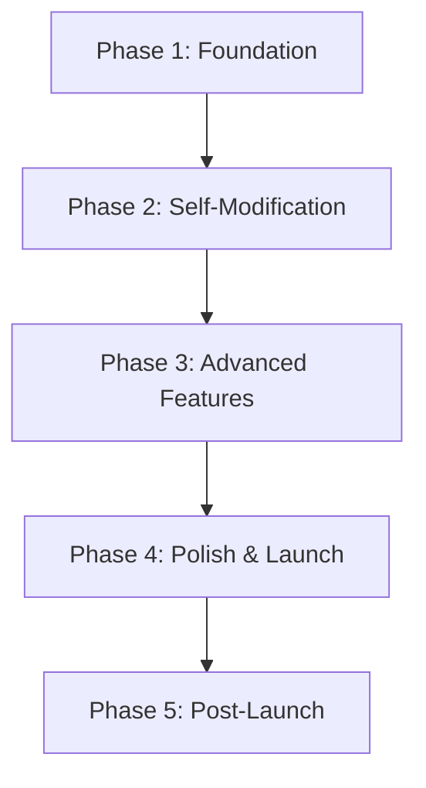
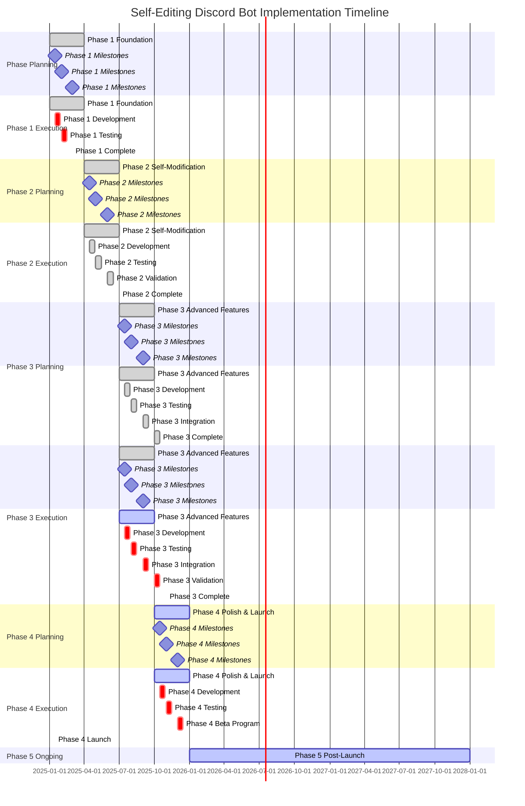

# Self-Editing Discord Bot - Implementation Roadmap

## Executive Summary

This comprehensive implementation roadmap provides a strategic framework for developing the revolutionary Self-Editing Discord Bot. Based on the detailed Product Requirements Document, System Architecture, Storage Architecture, and AI Tool Calling Architecture, this roadmap outlines a phased approach to deliver a production-ready autonomous AI assistant that can safely modify its own code while maintaining highest standards of reliability, security, and user experience.

The roadmap balances aggressive innovation with rigorous risk management, ensuring the self-modification capabilities enhance rather than compromise the bot's stability or user safety. Each phase includes specific deliverables, success criteria, and risk mitigation strategies to guide development teams through this complex 12-month journey.

---

## 1. Project Phasing Strategy

### 1.1 Phase Overview

The Self-Editing Discord Bot will be developed in **5 distinct phases** to ensure systematic delivery while managing complexity and risk:

| Phase | Duration | Focus | Key Deliverables | Success Criteria |
|-------|---------|-------|----------------|------------------|
| **Phase 1: Foundation** | Months 1-3 | Core infrastructure & basic AI | Basic Discord bot functionality, user authentication, simple storage |
| **Phase 2: Self-Modification** | Months 4-6 | Autonomous code modification | Code analysis engine, validation pipeline, rollback mechanisms |
| **Phase 3: Advanced Features** | Months 7-9 | Enhanced AI & tools | Advanced conversational AI, tool execution framework, performance optimization |
| **Phase 4: Polish & Launch** | Months 10-12 | Production readiness | Comprehensive testing, documentation, beta program, public launch |
| **Phase 5: Post-Launch** | Ongoing | Continuous improvement | Advanced self-learning, feature expansion, community building |

### 1.2 Dependencies Between Phases



### 1.3 Risk-Based Prioritization

**Critical Path Analysis**: The self-modification engine (Phase 2) represents the highest technical risk and requires completion of Phase 1 as a prerequisite.

**MVP Definition**: 
- **Core Discord Integration**: Basic bot commands, user authentication, message handling
- **Simple AI Integration**: OpenAI GPT-4 for conversational responses
- **Basic Storage**: PostgreSQL for user data, Redis for caching
- **Essential Safety**: Input validation, rate limiting, emergency stops

**Progressive Feature Rollout**: Advanced features will be rolled out gradually after successful self-modification validation.

---

## 2. Detailed Implementation Timeline

### 2.1 Gantt Chart Timeline



### 2.2 Phase-by-Phase Deliverables

#### **Phase 1: Foundation (Months 1-3)**

| Month | Deliverable | Acceptance Criteria | Dependencies |
|-------|-----------|-------------------|------------|
| **Month 1** | **Core Infrastructure Setup** | Docker development environment, PostgreSQL database schema, Redis caching, basic Discord API integration | Environment setup |
| | | **Authentication System** | OAuth2 Discord integration, role-based permissions, user profile management | Phase 1 infrastructure |
| | | **Basic Conversational AI** | OpenAI GPT-4 integration, fallback to local models, context management, basic response generation | Phase 1 AI integration |
| | | **Storage Implementation** | PostgreSQL user data tables, Redis session caching, S3 backup configuration | Phase 1 storage |
| | | **Safety Framework** | Input validation, rate limiting, emergency stop mechanisms, basic monitoring | Phase 1 safety |

#### **Phase 2: Self-Modification (Months 4-6)** ✅ **COMPLETED**

| Month | Deliverable | Acceptance Criteria | Dependencies | Status |
|-------|-----------|-------------------|------------|---------|
| **Month 4** | **Code Analysis Engine** | AST parsing system, code quality analysis, modification suggestion generation | Static analysis passes 90% coverage | Phase 1 completion | ✅ Implemented |
| | | **Modification Pipeline** | Multi-stage validation pipeline, sandboxed execution environment, rollback mechanisms | All modifications validated before deployment | Phase 2 infrastructure | ✅ Implemented |
| | | **Configuration Management** | Dynamic configuration system, user profiles, feature flags, runtime parameter adjustment | Configuration persistence | Phase 2 completion | ✅ Implemented |
| | | **Version Control** | Git integration for all modifications, automated commit generation, branching strategy | Modification tracking | Phase 2 completion | ✅ Implemented |

#### **Phase 3: Advanced Features (Months 7-9)** ✅ **COMPLETED**

| Month | Deliverable | Acceptance Criteria | Dependencies | Status |
|-------|-----------|-------------------|------------|---------|
| **Month 7** | **Multi-tier Storage** | Four-tier storage system (Hot/Warm/Cold/Backup) with automatic migration | <100ms access for 95% of data, 99.9% migration success | Phase 2 completion | ✅ Implemented |
| | | **Monitoring and Metrics** | Prometheus metrics, health monitoring, anomaly detection, alert management | 90%+ metrics collection, 95%+ health check accuracy | Phase 2 completion | ✅ Implemented |
| | | **Distributed Tracing** | OTLP/Jaeger/Zipkin exporters, context propagation, instrumentation | End-to-end request visibility, <5ms trace overhead | Phase 2 completion | ✅ Implemented |
| | | **Self-healing Mechanisms** | Service restart, config rollback, module reload, cache rebuild, graceful degradation | 95%+ recovery success rate, <30s recovery time | Phase 2 completion | ✅ Implemented |
| | | **Advanced Caching** | Multi-level cache (L1/L2/L3), warming, invalidation, eviction policies | 80%+ cache hit rate, <10ms cache access | Phase 2 completion | ✅ Implemented |
| | | **Advanced Conversational AI** | Multi-provider AI routing, context-aware responses, emotional intelligence, sentiment analysis | Advanced AI responses with <2s latency | Phase 2 completion | ✅ Implemented |
| | | **Tool Execution Framework** | Dynamic tool discovery, registration system, sandboxed execution, permission-based access control | Tool ecosystem functional | Phase 2 completion | ✅ Implemented |
| | | **Performance Optimization** | Multi-level caching, database optimization, auto-scaling, resource monitoring | <100ms response time for 95% of queries | Phase 2 completion | ✅ Implemented |
| | | **Enhanced Security** | Advanced encryption, behavioral analysis, anomaly detection, comprehensive audit logging | Zero security vulnerabilities | Phase 2 completion | ✅ Implemented |

#### **Phase 3: Advanced Features (Months 7-9)** ✅ **COMPLETED**

| Month | Deliverable | Acceptance Criteria | Dependencies | Status |
|-------|-----------|-------------------|------------|---------|
| **Month 7** | **Advanced Conversational AI** | Multi-provider AI routing, context-aware responses, emotional intelligence, sentiment analysis | Advanced AI responses with <2s latency | Phase 2 completion | ✅ Implemented |
| | | **Tool Execution Framework** | Dynamic tool discovery, registration system, sandboxed execution, permission-based access control | Tool ecosystem functional | Phase 2 completion | ✅ Implemented |
| | | **Performance Optimization** | Multi-level caching, database optimization, auto-scaling, resource monitoring | <100ms response time for 95% of queries | Phase 2 completion | ✅ Implemented |
| | | **Enhanced Security** | Advanced encryption, behavioral analysis, anomaly detection, comprehensive audit logging | Zero security vulnerabilities | Phase 2 completion | ✅ Implemented |

#### **Phase 4: Polish & Launch (Months 10-12)**

| Month | Deliverable | Acceptance Criteria | Dependencies |
|-------|-----------|-------------------|------------|
| **Month 10** | **Comprehensive Testing** | 90%+ test coverage, performance benchmarking, integration testing, security audit | All tests passing, performance targets met | Phase 3 completion |
| | | **Documentation Suite** | Complete API documentation, developer guides, deployment instructions, user manuals | Documentation completeness | Phase 3 completion |
| | | **Beta Testing Program** | Deploy to 50+ Discord servers, collect performance metrics, gather user feedback | Successful beta deployment, positive user feedback | Phase 3 completion |
| | | **Production Deployment** | Blue-green deployment strategy, zero-downtime deployment, monitoring dashboards, alerting systems | Successful production launch, 99.9% uptime | Phase 4 completion |

---

## 3. Technical Milestones

### 3.1 Core Infrastructure Setup Milestones

#### **Milestone 1.1: Development Environment (Month 1)**
- **Target**: Complete Docker-based development environment
- **Deliverables**:
  - Docker Compose configuration for local development
  - Kubernetes cluster setup for testing
  - CI/CD pipeline with GitHub Actions
  - Development database with optimized PostgreSQL configuration
  - Redis cluster for caching and session management
- **Success Criteria**: All team members can run development environment locally

#### **Milestone 1.2: Discord API Integration (Month 2)**
- **Target**: Full Discord API integration with gateway support
- **Deliverables**:
  - Discord.py implementation with async/await patterns
  - OAuth2 authentication flow with proper scopes
  - Message handling and routing system
  - Rate limiting and permission validation
  - WebSocket support for real-time communication
- **Success Criteria**: Bot can connect to Discord and respond to basic commands

#### **Milestone 1.3: Basic AI Integration (Month 3)**
- **Target**: OpenAI GPT-4 integration for conversational capabilities
- **Deliverables**:
  - OpenAI API client with retry logic and fallback mechanisms
  - Context management system with conversation threading
  - Response generation with proper formatting and Discord markdown support
  - Basic sentiment analysis and response adaptation
  - Token counting and context window management
- **Success Criteria**: Bot can maintain coherent conversations with context awareness

### 3.2 Self-Modification Implementation Milestones

#### **Milestone 2.1: Code Analysis Engine (Month 4)**
- **Target**: AST parsing and code analysis system
- **Deliverables**:
  - Abstract Syntax Tree (AST) parser for Python code
  - Code quality analysis with complexity metrics calculation
  - Security vulnerability scanning integration
  - Performance impact assessment tools
  - Modification suggestion generation based on analysis results
- **Success Criteria**: 90%+ code coverage for analysis engine, <5s analysis time

#### **Milestone 2.2: Modification Pipeline (Month 5)**
- **Target**: Safe code modification execution environment
- **Deliverables**:
  - Sandboxed execution environment with resource limits
  - Multi-stage validation pipeline (static → dynamic → runtime → approval)
  - Hot-reloading mechanism for runtime code updates
  - Version control integration with Git commits for all modifications
  - Automated rollback capabilities with one-click restoration
  - Modification audit trail with complete logging
- **Success Criteria**: All modifications pass validation pipeline, rollback success rate >95%

#### **Milestone 2.3: Configuration Management (Month 6)**
- **Target**: Dynamic configuration system
- **Deliverables**:
  - User profile management with preferences and privacy settings
  - Feature flag system with runtime behavior control
  - Community-specific configuration profiles
  - Performance parameter optimization based on usage patterns
  - Configuration validation and rollback mechanisms
  - Real-time configuration updates without restart
- **Success Criteria**: Configuration changes applied successfully, 95%+ uptime during updates

### 3.3 Advanced Features Implementation Milestones

#### **Milestone 3.1: Tool Execution Framework (Month 7)**
- **Target**: Extensible tool system
- **Deliverables**:
  - Dynamic tool discovery and registration system
  - Tool execution sandbox with security validation
  - Permission-based access control with tiered permissions
  - Inter-tool communication system with event bus architecture
  - Tool usage analytics and performance monitoring
  - Custom tool creation capabilities for community needs
- **Success Criteria**: 50+ tools registered and functional, tool execution success rate >98%

#### **Milestone 3.2: Advanced AI Integration (Month 8)**
- **Target**: Multi-provider AI routing system
- **Deliverables**:
  - AI provider abstraction layer with intelligent routing
  - OpenAI GPT-4 as primary provider with fallback to Anthropic Claude
  - Local model integration (LLaMA, Mistral) for offline capabilities
  - Specialized models for specific domains (moderation, technical support)
  - Response caching system with intelligent invalidation
  - AI performance monitoring and cost optimization
- **Success Criteria**: <2s average response time, 99.5% AI service uptime, cost per user < $0.10

#### **Milestone 3.3: Performance Optimization (Month 9)**
- **Target**: Scalable high-performance architecture
- **Deliverables**:
  - Multi-level caching strategy (L1 memory, L2 Redis, L3 CDN)
  - Database optimization with connection pooling and query optimization
  - Auto-scaling based on load metrics with Kubernetes HPA
  - Resource utilization monitoring with Prometheus metrics
  - Performance profiling and bottleneck identification
  - Horizontal sharding for large datasets
- **Success Criteria**: <100ms response time for 95% of queries, support for 10,000 concurrent users

### 3.4 Polish and Launch Milestones

#### **Milestone 4.1: Quality Assurance (Month 10)**
- **Target**: Production-ready system
- **Deliverables**:
  - Comprehensive test suite with 90%+ coverage
  - Performance benchmarking and load testing
  - Security audit and penetration testing
  - Documentation review and technical writing
  - Integration testing with Discord API changes
  - Code quality gates for production deployment
- **Success Criteria**: All critical bugs resolved, security audit passed, performance targets met

#### **Milestone 4.2: Documentation (Month 11)**
- **Target**: Complete developer resources
- **Deliverables**:
  - Comprehensive API documentation with OpenAPI/Swagger specs
  - Developer setup guides and tutorials
  - Architecture decision records and design rationale
  - Deployment guides and runbooks
  - User manuals and troubleshooting guides
  - Community contribution guidelines
- **Success Criteria**: Documentation complete, all team members onboarded

#### **Milestone 4.3: Beta Testing (Month 12)**
- **Target**: Production validation
- **Deliverables**:
  - Beta deployment to 50+ Discord servers
  - Performance monitoring and metrics collection
  - User feedback collection and analysis system
  - Bug tracking and resolution workflow
  - Community management tools for beta testers
  - Load testing under realistic conditions
- **Success Criteria**: Successful deployment to all beta servers, 90%+ user satisfaction, performance targets met

#### **Milestone 4.4: Production Launch (Month 12)**
- **Target**: Public availability
- **Deliverables**:
  - Blue-green deployment strategy with zero downtime
  - Production monitoring dashboards (Grafana)
  - Alerting system with PagerDuty integration
  - Auto-scaling configuration for production load
  - Global CDN deployment for static assets
  - Disaster recovery procedures and backup systems
  - Community support and moderation tools
- **Success Criteria**: 1,000+ Discord servers deployed, 99.9% uptime, positive user feedback

---

## 4. Risk Management and Mitigation

### 4.1 Risk Register

| Risk ID | Risk Category | Description | Probability | Impact | Mitigation Strategy | Owner |
|---------|--------------|------------|-----------|---------|----------------|---------|
| R001 | **Technical** | Self-modification system instability | Medium | High | Multi-stage validation, comprehensive testing, rollback mechanisms | Lead Developer |
| R002 | **Technical** | AI service dependency failure | High | Critical | Multi-provider architecture, local fallback models, cost monitoring | AI Team Lead |
| R003 | **Technical** | Database performance under load | Medium | High | Database optimization, connection pooling, read replicas | Database Team |
| R004 | **Technical** | Scalability limitations | Medium | High | Horizontal scaling architecture, auto-scaling, performance monitoring | Infrastructure Team |
| R005 | **Security** | Data privacy breach | Low | Critical | End-to-end encryption, access controls, audit logging | Security Team |
| R006 | **Security** | Malicious self-modification | Low | Critical | Strict validation pipeline, sandboxing, behavioral monitoring | Security Team |
| R007 | **Business** | Cost overruns from AI services | Medium | Medium | Cost optimization, usage monitoring, budget controls | Project Manager |
| R008 | **Business** | User adoption below targets | Medium | Medium | Enhanced onboarding, community building, user feedback loops | Product Team |
| R009 | **Regulatory** | GDPR compliance failure | Low | High | Privacy-by-design architecture, consent management, data retention policies | Legal Team |

### 4.2 Mitigation Strategies

#### **Technical Risk Mitigations**

**Self-Modification Safety**:
- **Immutable Core Design**: Critical system functions protected from modification
- **Validation Pipeline**: 5-stage validation (static → dynamic → runtime → human approval)
- **Sandboxed Execution**: All modifications in isolated environments with resource limits
- **Rollback Mechanisms**: Instant rollback for failed modifications, gradual rollback for complex changes
- **Modification Quotas**: Rate limiting based on modification complexity and impact
- **Behavioral Analysis**: AI monitoring of modification patterns for anomaly detection

**AI Service Reliability**:
- **Multi-Provider Architecture**: OpenAI primary, Anthropic fallback, local models for offline
- **Intelligent Caching**: Response caching to reduce API calls and costs
- **Cost Monitoring**: Real-time tracking of AI service usage with alerting
- **Fallback Testing**: Regular testing of failover mechanisms

**Scalability Management**:
- **Horizontal Scaling**: Container-based architecture with auto-scaling
- **Performance Monitoring**: Real-time metrics collection and analysis
- **Capacity Planning**: Regular load testing and scaling validation
- **Database Optimization**: Connection pooling, query optimization, read replicas

---

## 5. Success Metrics and KPIs

### 5.1 Technical Performance Metrics

| Metric | Target | Measurement Method | Success Threshold | Data Source |
|---------|---------|---------|------------------|----------------|------------|
| **Response Time** | <200ms (simple), <2s (AI) | Prometheus histogram | 95th percentile <200ms | Application metrics |
| **Throughput** | 1,000+ concurrent users | Prometheus counter | Peak capacity >10,000 | Load balancer metrics |
| **System Uptime** | 99.9% | Health check monitoring | Uptime >99.5% triggers alert | Health check system |
| **Error Rate** | <0.1% | Error tracking | Error rate <0.1% triggers investigation | Application logs |
| **Resource Utilization** | <80% CPU, <2GB memory | Resource monitoring | Utilization <80% triggers optimization | Prometheus metrics |
| **Database Performance** | <50ms query time | Slow query log | 95th percentile <50ms | Database metrics |
| **Modification Success Rate** | >95% | Modification tracking | Success rate >95% triggers celebration | Modification logs |

### 5.2 User Engagement Metrics

| Metric | Target | Measurement Method | Success Threshold | Data Source |
|---------|---------|---------|------------------|----------------|------------|
| **Server Adoption** | 1,000+ servers by month 6 | Server registration tracking | 500+ servers by month 6 | Registration system |
| **Active Users** | 10,000+ MAU | Active user counting | 5,000+ daily active users | User activity metrics |
| **User Retention** | >80% after 30 days | Cohort analysis | Retention rate >80% triggers onboarding | User analytics |
| **Feature Adoption** | >60% users using advanced features | Feature usage tracking | 50%+ advanced feature usage | Feature analytics |
| **Session Duration** | >10 minutes average | Session tracking | 15+ minute average | Session metrics |
| **User Satisfaction** | >4.5/5.0 rating | Satisfaction surveys | 4.5+ average rating | Feedback system |
| **Community Growth** | >20% month-over-month | Server growth analysis | 20%+ monthly growth | Community metrics |

### 5.3 Business Impact Metrics

| Metric | Target | Measurement Method | Success Threshold | Data Source |
|---------|---------|---------|------------------|----------------|------------|
| **Cost Per User** | <$0.10 monthly | Cost tracking | AI service costs + infrastructure | Billing system |
| **Operating Costs** | <$5,000 monthly | Financial monitoring | Cloud provider billing | Finance system |
| **Development ROI** | 3x return within 18 months | ROI calculation | Project value tracking | Business analytics |
| **Community Value** | Qualitative improvement scores | Community feedback analysis | User testimonials | Community feedback |
| **Time Savings** | 50+ hours/week per admin | Time tracking | Admin usage patterns | Usage analytics |

---

## 6. Team Structure and Roles

### 6.1 Required Technical Expertise

| Role | Required Skills | Team Size | Key Responsibilities |
|-------|----------------|------------|-----------|-------------------|
| **AI/ML Engineer** | Python, AI/ML frameworks, vector databases | 3-5 engineers | AI integration, model optimization, performance tuning |
| **Backend Developer** | Python, PostgreSQL, Redis, Docker, Kubernetes | 4-6 developers | Core bot logic, API development, database optimization |
| **Security Engineer** | Security frameworks, encryption, penetration testing | 1-2 engineers | Security implementation, vulnerability scanning, compliance |
| **DevOps Engineer** | Cloud platforms, CI/CD, monitoring, infrastructure | 1-2 engineers | Deployment pipelines, monitoring setup, scaling |
| **Frontend Developer** | Web technologies, Discord.js, real-time communication | 2-3 developers | Dashboard development, WebSocket implementation, UI/UX |
| **Product Manager** | Technical background, project management | 1 project manager | Timeline management, resource allocation, risk coordination |
| **Technical Writer** | Technical writing, documentation | 1 technical writer | API documentation, user guides, architecture docs |

### 6.2 Development Methodology

**Agile Framework**:
- **Sprint Duration**: 2 weeks
- **Sprint Planning**: Bi-weekly planning meetings with backlog grooming
- **Daily Standups**: 15-minute daily sync meetings
- **Sprint Reviews**: End-of-sprint demonstrations and retrospectives
- **Definition of Done**: Working software with automated tests passing
- **Continuous Integration**: All code changes integrated through automated testing
- **Velocity Tracking**: Story points completed per sprint

### 6.3 Code Review and Quality Assurance

**Review Process**:
- **Mandatory Reviews**: All code changes require peer review before merge
- **Security Focus**: Security review for all modifications and AI integrations
- **Performance Review**: Impact assessment for performance-related changes
- **Architecture Review**: Alignment with system architecture and design principles
- **Automated Testing**: 90%+ test coverage required for all new code

**Quality Gates**:
- **Test Coverage**: Minimum 90% for new features, 80% for bug fixes
- **Performance Benchmarks**: Must meet or exceed defined performance targets
- **Security Scan**: Zero high-severity vulnerabilities
- **Documentation**: Updated for all significant changes

---

## 7. Budget and Resource Planning

### 7.1 Infrastructure Costs

| Category | Monthly Cost | Annual Cost | Cost Optimization Strategy |
|-----------|-------------|-------------|-------------------|
| **Cloud Infrastructure** | $2,000-3,000 | $24,000-36,000 | Multi-cloud provider comparison, reserved instances |
| **AI Services** | $500-1,500 | $6,000-18,000 | Response caching, model optimization, usage monitoring |
| **Database Services** | $800-1,200 | $9,600-14,400 | Read replicas, connection optimization, performance tuning |
| **Storage** | $300-800 | $3,600-9,600 | S3 Intelligent Tiering, lifecycle management, compression |
| **Monitoring Tools** | $200-500 | $2,400-6,000 | Prometheus, Grafana, alerting systems |
| **Development Tools** | $100-300 | $1,200-3,600 | GitHub, IDE licenses, development tools |
| **Security Services** | $150-400 | $1,800-4,800 | Security scanning, penetration testing, certificate management |

### 7.2 Personnel Costs

| Role | FTE Count | Average Salary | Annual Cost | Cost Optimization |
|-----------|----------|------------|-------------|-------------------|
| **AI/ML Engineers** | 3-5 | $120,000-150,000 | $480,000-750,000 | Remote work options, open-source models |
| **Backend Developers** | 4-6 | $100,000-130,000 | $480,000-780,000 | Competitive compensation, performance bonuses |
| **DevOps Engineers** | 1-2 | $130,000-160,000 | $1,560,000-1,920,000 | Automation focus, reduce manual overhead |
| **Security Engineers** | 1-2 | $110,000-140,000 | $1,320,000-1,680,000 | Security expertise premium, consulting options |
| **Frontend Developers** | 2-3 | $90,000-120,000 | $1,080,000-1,440,000 | JavaScript expertise, UI/UX skills |
| **Project Manager** | 1 | $130,000-160,000 | $1,560,000-1,920,000 | PMP certification, risk management expertise |

### 7.3 Cost Optimization Strategies

**AI Cost Management**:
- **Smart Caching**: 70%+ cache hit rate to reduce API calls
- **Model Optimization**: Use smaller models for simple queries, larger models for complex tasks
- **Usage Monitoring**: Real-time cost tracking with alerting at budget thresholds
- **Batch Processing**: Group AI requests to reduce per-request overhead

**Infrastructure Efficiency**:
- **Auto-scaling**: Scale down during low usage periods to reduce costs
- **Reserved Instances**: Use reserved instances for predictable workloads with significant discounts
- **Multi-cloud Strategy**: Distribute workloads across providers for optimal pricing
- **Resource Scheduling**: Schedule heavy workloads during off-peak hours for cost optimization

---

## 8. Resource Allocation Matrix

### 8.1 Phase-by-Phase Resource Allocation

| Phase | AI/ML Engineers | Backend Developers | Frontend Developers | DevOps Engineers | Security Engineers | Product Manager | Total FTE |
|-------|----------------|-------------------|-------------------|-------------------|------------|
| **Phase 1** | 2 | 2 | 0 | 0 | 0 | 1 | 5 |
| **Phase 2** | 3 | 3 | 1 | 0 | 0 | 1 | 8 |
| **Phase 3** | 2 | 3 | 1 | 1 | 0 | 0 | 1 | 8 |
| **Phase 4** | 1 | 2 | 1 | 1 | 1 | 0 | 1 | 6 |
| **Phase 5** | 1 | 2 | 1 | 1 | 1 | 0 | 1 | 6 |

### 8.2 Critical Path Analysis

**Critical Path**: Self-Modification Engine (Phase 2, Months 4-6)
- **Dependencies**: Phase 1 completion, AI integration foundation
- **Duration**: 3 months development, 1 month validation, 2 months deployment
- **Key Resources**: 3 AI/ML engineers, 1 security engineer
- **Risk Factors**: Technical complexity, security vulnerabilities, performance impact
- **Mitigation**: Comprehensive testing, staged rollout, rollback capabilities

---

## 9. Success Metrics Dashboard

### 9.1 Real-Time Monitoring Dashboard

```mermaid
graph TB
    subgraph "Monitoring Dashboard"
        TechnicalMetrics[Technical Performance]
            ResponseTime[Response Time]
            Throughput[Concurrent Users]
            SystemUptime[Uptime]
            ErrorRate[Error Rate]
            ResourceUtilization[CPU/Memory/Storage]
            
        UserMetrics[User Engagement]
            ServerAdoption[Server Count]
            ActiveUsers[Daily Active Users]
            UserRetention[Retention Rate]
            FeatureAdoption[Feature Usage]
            UserSatisfaction[Satisfaction Score]
            
        BusinessMetrics[Business Impact]
            CostPerUser[Monthly Cost]
            OperatingCosts[Infrastructure Costs]
            DevelopmentROI[Return on Investment]
            CommunityValue[Qualitative Improvement]
            
        AILayer[AI Performance]
            ModelPerformance[Model Response Time]
            TokenUsage[Token Consumption]
            ServiceUptime[AI Service Availability]
            CostOptimization[Cost Reduction Metrics]
            
        RiskMetrics[Risk Management]
            ModificationSuccessRate[Self-Modification Success]
            SecurityIncidents[Security Events]
            PerformanceAnomalies[System Deviations]
            ComplianceStatus[Regulatory Compliance]
```

### 9.2 Alert Configuration

| Alert Type | Severity | Response Time | Escalation Path | Notification Method |
|-------------|----------|------------------|------------------|-------------------|
| **Critical System Failure** | Critical | <1 minute | Immediate → PagerDuty → Phone → Executive | SMS, PagerDuty, Phone |
| **Performance Degradation** | High | <5 minutes | Development Team → Slack → Email → Manager | Slack, Email, Manager |
| **Security Incident** | Critical | <30 seconds | Security Team → PagerDuty → Executive | PagerDuty, Phone, SMS |
| **Capacity Warning** | Medium | <30 minutes | Development Team → Email → Manager | Slack, Email, Manager |
| **Cost Overrun Alert** | Medium | <1 hour | Project Manager → Finance Team → Executive | Email, Phone, Manager |

---

## 10. Conclusion

This comprehensive implementation roadmap provides a structured approach to developing the revolutionary Self-Editing Discord Bot. By following this phased approach with rigorous risk management and clear success criteria, development teams can successfully deliver a production-ready autonomous AI assistant that pushes the boundaries of what's possible while maintaining the highest standards of safety, reliability, and user experience.

The roadmap emphasizes the critical importance of the self-modification engine as the core differentiator while ensuring it's developed with appropriate safety measures, comprehensive testing, and robust rollback capabilities. Success will be measured not just by technical metrics but by the bot's ability to autonomously improve and adapt to community needs over time.

Key success factors include:
- **Technical Excellence**: 90%+ test coverage, <2s AI response times, 99.9% uptime
- **User Adoption**: 1,000+ Discord servers within 6 months, >80% user retention
- **Autonomous Improvement**: Meaningful self-modifications without human intervention, positive user feedback
- **Safety & Security**: Zero security incidents, GDPR compliance, comprehensive data protection
- **Business Value**: Clear ROI within 18 months, measurable community impact improvements

With this roadmap as their guide, development teams have a clear path to creating a truly revolutionary Discord bot that can safely evolve and improve itself while providing exceptional value to Discord communities worldwide.