# Self-Editing Discord Bot - System Architecture Design

## Executive Summary

This document outlines the comprehensive system architecture for a revolutionary Discord bot capable of autonomous self-modification, meta-learning, and continuous evolution. The architecture balances cutting-edge AI capabilities with robust safety mechanisms, creating an intelligent assistant that can safely improve its own functionality while maintaining the highest standards of reliability and user experience.

## Table of Contents

1. [Architecture Overview](#architecture-overview)
2. [Self-Modification Architecture](#self-modification-architecture)
3. [Meta-Learning System](#meta-learning-system)
4. [Safety and Validation Framework](#safety-and-validation-framework)
5. [Configuration Management](#configuration-management)
6. [Plugin System Architecture](#plugin-system-architecture)
7. [Monitoring and Observability](#monitoring-and-observability)
8. [Component Interaction Diagrams](#component-interaction-diagrams)
9. [Security Boundaries and Isolation](#security-boundaries-and-isolation)
10. [Failure Modes and Recovery](#failure-modes-and-recovery)
11. [Scalability Considerations](#scalability-considerations)
12. [Technical Specifications](#technical-specifications)
13. [Implementation Guidelines](#implementation-guidelines)

---

## Architecture Overview

### System Philosophy

The Self-Editing Discord Bot implements a **Layered Security Model** with **Autonomous Adaptation Capabilities**. The architecture follows these core principles:

- **Safety-First Design**: All autonomous modifications occur within strict, validated boundaries
- **Modular Evolution**: Components can be independently updated and rolled back
- **Observable Intelligence**: Every modification and decision is tracked and analyzable
- **User-Centric Privacy**: All learning occurs with explicit user consent and privacy controls

### Core Architectural Layers

```
┌─────────────────────────────────────────────────────────────────┐
│                 User Interface & API Layer                │
├─────────────────────────────────────────────────────────────────┤
│              AI Integration & NLP Layer            │
├─────────────────────────────────────────────────────────────────┤
│           Self-Modification & Learning Layer           │
├─────────────────────────────────────────────────────────────────┤
│              Safety & Validation Layer               │
├─────────────────────────────────────────────────────────────────┤
│            Core Bot Engine & State Layer            │
├─────────────────────────────────────────────────────────────────┤
│           Storage & Persistence Layer                │
├─────────────────────────────────────────────────────────────────┤
│            Infrastructure & Monitoring Layer            │
└─────────────────────────────────────────────────────────────────┘
```

### Component Interaction Flow

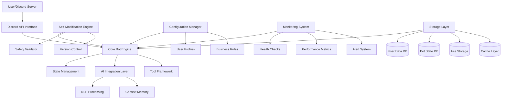

---

## Self-Modification Architecture

### 1.1 Code Modification Engine

#### Core Components

**Static Core (Immutable)**
- Critical Discord API handlers
- Authentication and permission systems
- Core message routing logic
- Essential safety validators
- **Protected from modification**

**Dynamic Modules (Modifiable)**
- Response generation logic
- Behavior pattern handlers
- Tool execution frameworks
- Configuration parameter handlers
- **Safely modifiable**

#### Modification Pipeline

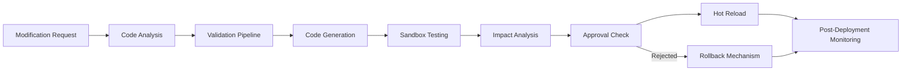

#### Hot-Reloading Mechanism

**Runtime Code Injection System**
- **Module Hot-Swapping**: Replace modules without restart
- **Configuration Updates**: Dynamic parameter adjustment
- **Behavior Modification**: Real-time pattern adaptation
- **Memory Management**: Efficient memory reallocation

**Safety Constraints**
- **Immutable Core**: Critical functions cannot be modified
- **Modification Quotas**: Rate limits on changes
- **Validation Gates**: Multi-stage approval process
- **Rollback Triggers**: Automatic failure detection

### 1.2 Version Control and Rollback

#### Version Management

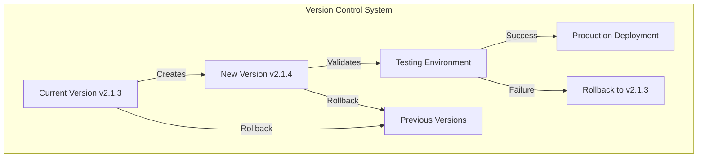

#### Rollback Mechanisms

- **Instant Rollback**: Revert to last stable version
- **Gradual Rollback**: Step-by-step reversion for complex changes
- **Emergency Stop**: Immediate halt of all modifications
- **Selective Rollback**: Rollback specific modules only

### 1.3 Sandboxing and Isolation

#### Secure Execution Environment

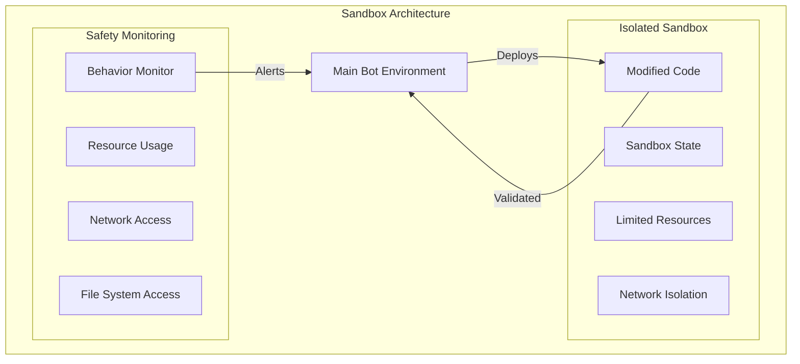

---

## Meta-Learning System

### 2.1 Self-Discovery Architecture

#### Architecture Introspection

**Capability Discovery**
- **Module Analysis**: Automatic discovery of available functions
- **Limitation Mapping**: Understanding of current constraints
- **Performance Profiling**: Self-assessment of capabilities
- **Integration Points**: Identification of external dependencies

#### Knowledge Representation

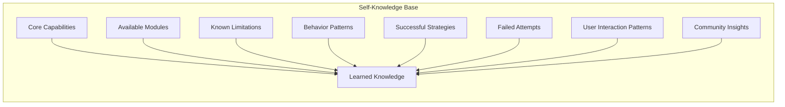

### 2.2 Learning Framework

#### Multi-Layer Learning

**1. Pattern Recognition Layer**
- **Interaction Analysis**: User behavior pattern detection
- **Success Metrics**: Identification of effective strategies
- **Failure Analysis**: Understanding what doesn't work
- **Context Mapping**: Situation-response correlation

**2. Adaptation Layer**
- **Strategy Optimization**: Refining successful approaches
- **Parameter Tuning**: Dynamic configuration adjustment
- **Behavior Modification**: Safe response pattern changes
- **Tool Enhancement**: Improving tool effectiveness

**3. Validation Layer**
- **A/B Testing**: Controlled experiment validation
- **Performance Monitoring**: Impact assessment
- **User Feedback**: Satisfaction measurement
- **Safety Checks**: Constraint compliance verification

### 2.3 Knowledge Management

#### Knowledge Lifecycle

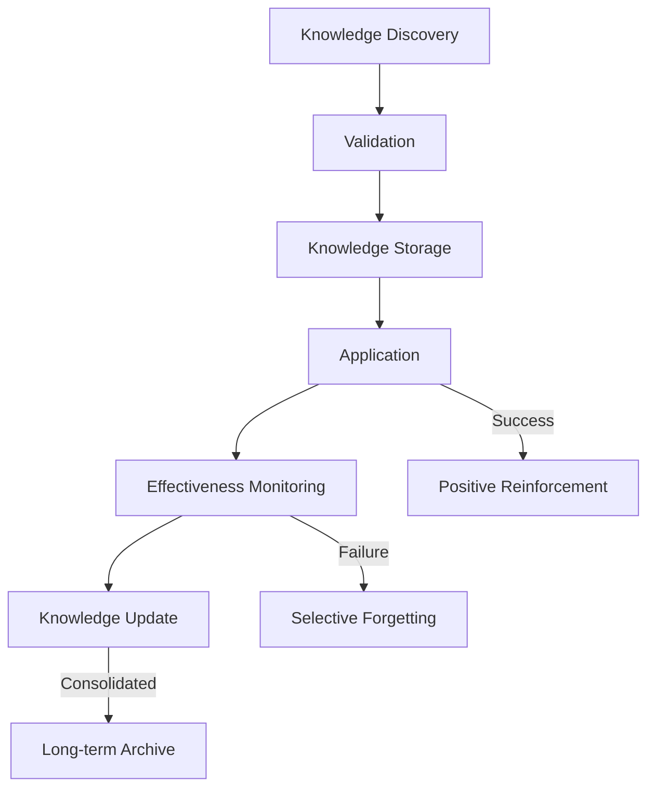

---

## Safety and Validation Framework

### 3.1 Code Validation Pipeline

#### Multi-Stage Validation

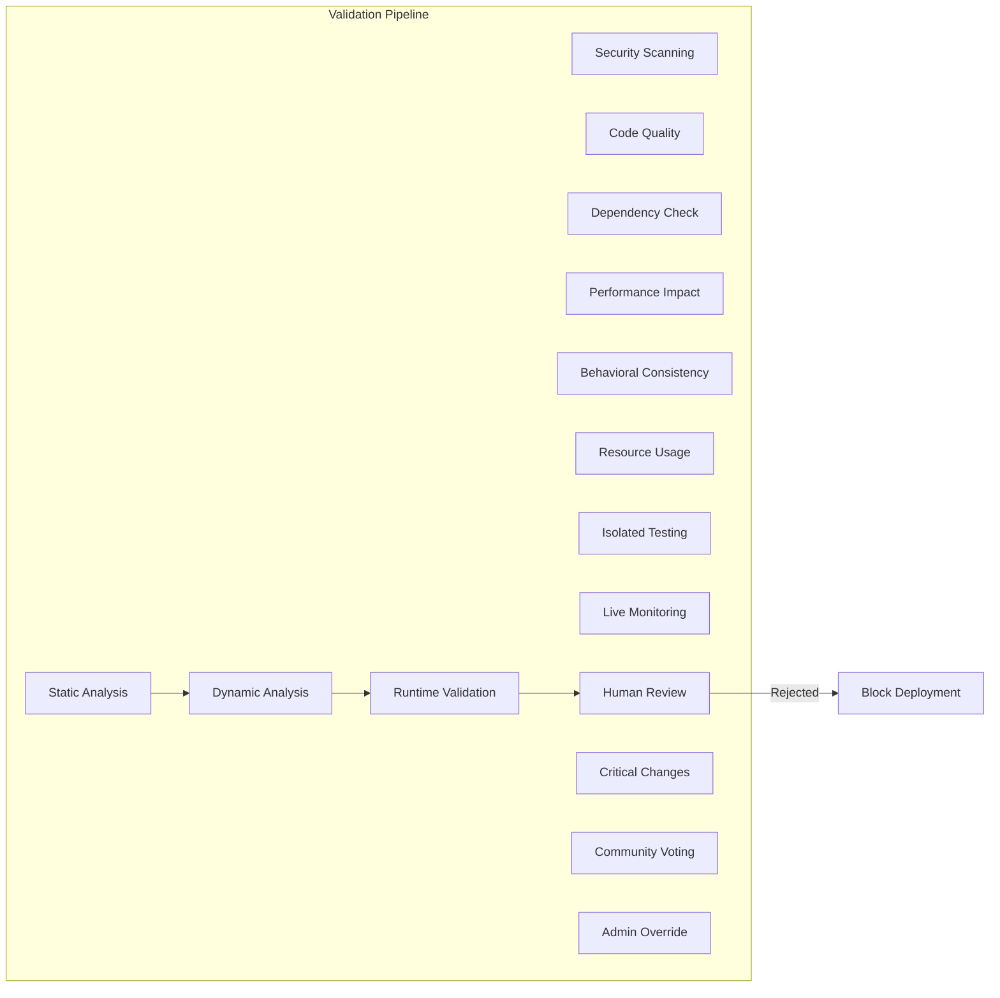

#### Validation Rules

**Static Validation Rules**
- **Security Scanning**: Automated vulnerability detection
- **Code Quality**: Minimum 90% test coverage
- **Complexity Limits**: Maximum cyclomatic complexity
- **Dependency Security**: Known vulnerability database check

**Dynamic Validation Rules**
- **Performance Impact**: <10% resource usage increase
- **Behavioral Consistency**: No breaking changes to core functions
- **Memory Safety**: No memory leaks or corruption
- **Network Safety**: No unauthorized external connections

### 3.2 Permission Systems

#### Tiered Permission Model

```mermaid
graph TB
    subgraph "Permission Tiers"
        Tier1[Tier 1: Safe Operations]
            Style[Response Style]
            Config[Configuration]
            Tools[Tool Parameters]
            
        Tier2[Tier 2: Validated Operations]
            Behavior[Behavior Patterns]
            Modules[Module Updates]
            Features[Feature Toggles]
            
        Tier3[Tier 3: Critical Operations]
            Core[Core Logic]
            Security[Security Settings]
            Infrastructure[Infrastructure Changes]
            
        Tier4[Tier 4: Emergency Operations]
            Emergency[Emergency Stop]
            Rollback[Forced Rollback]
            Admin[Admin Override]
    end
    
    User[User/Admin] --> Tier1
    AI[AI Recommendation] --> Tier2
    System[System Analysis] --> Tier3
    Emergency[Emergency Conditions] --> Tier4
```

### 3.3 Impact Analysis

#### Change Impact Assessment

**Pre-Modification Analysis**
- **Performance Impact**: CPU, memory, and latency projections
- **Security Impact**: Attack surface and vulnerability analysis
- **User Experience Impact**: Response time and quality assessment
- **System Stability Impact**: Error rate and reliability projection

**Post-Modification Monitoring**
- **Real-time Metrics**: Live performance and behavior tracking
- **Anomaly Detection**: Automated unusual pattern identification
- **Rollback Triggers**: Automatic failure detection and response
- **User Feedback Loop**: Continuous satisfaction monitoring

---

## Configuration Management

### 4.1 Dynamic Configuration System

#### Configuration Architecture

```mermaid
graph TB
    subgraph "Configuration Management"
        BaseConfig[Base Configuration]
            Defaults[System Defaults]
            Constraints[Safety Limits]
            Permissions[Permission Matrix]
            
        UserConfig[User Profiles]
            Preferences[User Preferences]
            Server[Server-Specific]
            Community[Community Standards]
            
        RuntimeConfig[Runtime Configuration]
            Performance[Performance Tuning]
            Features[Feature Flags]
            Resources[Resource Allocation]
            
        Validation[Configuration Validation]
            Schema[Schema Validation]
            Consistency[Consistency Checks]
            Security[Security Validation]
    end
    
    BaseConfig --> Validation
    UserConfig --> Validation
    RuntimeConfig --> Validation
    
    External[External Triggers] --> RuntimeConfig
        Usage[Usage Patterns]
        Feedback[User Feedback]
        Performance[Performance Metrics]
        Community[Community Needs]
    end
```

### 4.2 Feature Flags and Runtime Control

#### Feature Flag System

**Flag Categories**
- **Safety Flags**: Control potentially risky modifications
- **Performance Flags**: Optimize resource usage
- **Behavioral Flags**: Adjust interaction patterns
- **Experimental Flags**: Test new capabilities safely

#### Runtime Behavior Control

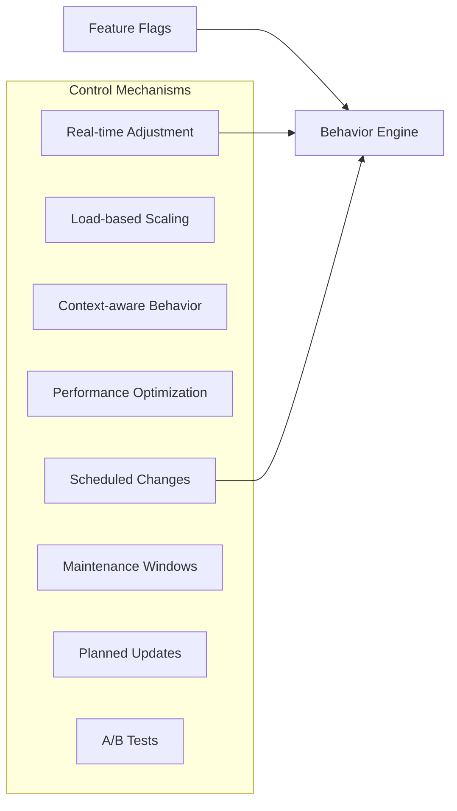

### 4.3 Environment-Specific Configurations

#### Configuration Profiles

**Development Environment**
- **Debug Mode**: Enhanced logging and validation
- **Test Mode**: Mock services and controlled testing
- **Experimental Features**: Early access to new capabilities

**Production Environment**
- **Stable Mode**: Conservative safety settings
- **Performance Mode**: Optimized for throughput
- **Compliance Mode**: Enhanced privacy and audit logging

---

## Plugin System Architecture

### 5.1 Dynamic Plugin Loading

#### Plugin Lifecycle Management

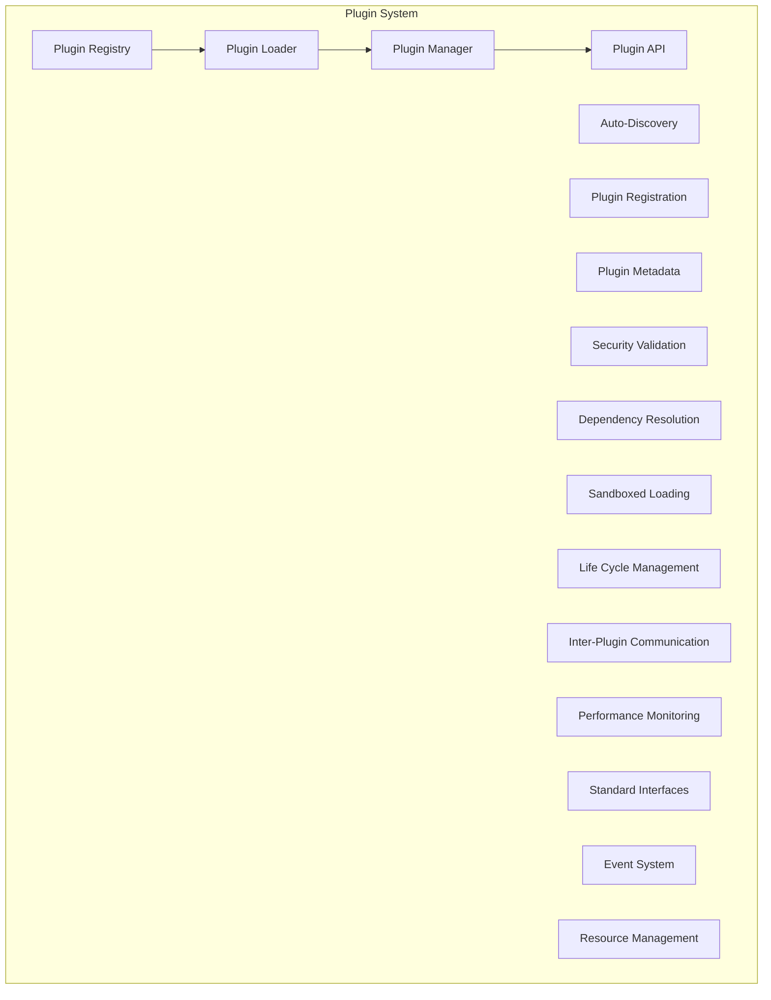

#### Plugin Discovery and Registration

**Discovery Mechanisms**
- **Marketplace Integration**: Browse and install plugins from trusted sources
- **File System Scanning**: Automatic detection of plugin files
- **Network Discovery**: Discover plugins from community repositories
- **Manual Registration**: Direct plugin installation by administrators

**Registration Process**
- **Metadata Validation**: Plugin information and capability verification
- **Security Scanning**: Vulnerability and malicious code detection
- **Dependency Analysis**: Compatibility and conflict checking
- **Permission Granting**: Controlled access to bot capabilities

### 5.2 Inter-Plugin Communication

#### Communication Architecture

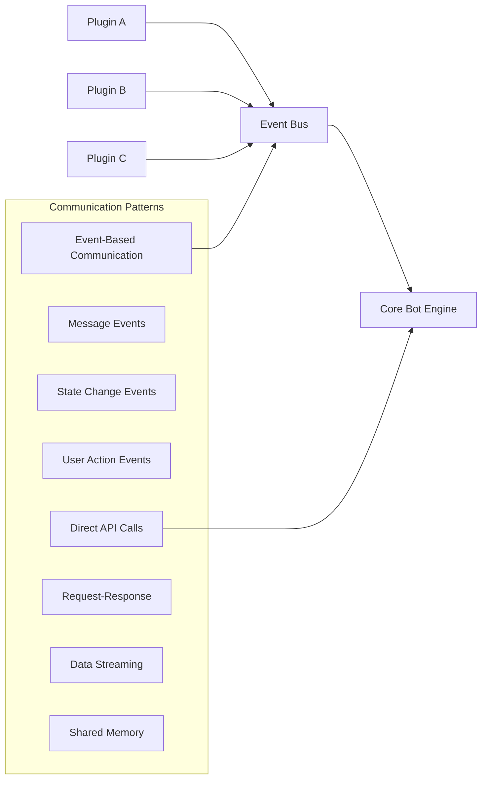

### 5.3 Plugin Safety

#### Security Boundaries

**Plugin Sandboxing**
- **Resource Limits**: CPU, memory, and network restrictions
- **API Restrictions**: Limited access to core functions
- **File System Isolation**: Controlled file access permissions
- **Network Isolation**: Restricted external communication

**Permission Model**
- **Capability-Based Access**: Plugins request specific capabilities
- **User Consent**: User approval for sensitive operations
- **Audit Logging**: All plugin actions are logged
- **Revocation**: Immediate plugin disabling capability

---

## Monitoring and Observability

### 6.1 Self-Monitoring Capabilities

#### Health Check Architecture

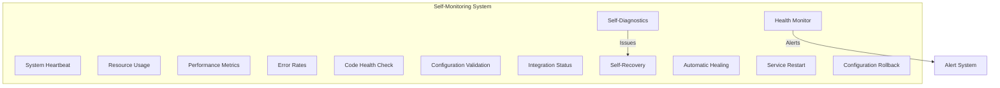

#### Performance Impact Tracking

**Real-time Metrics**
- **Response Latency**: Per-operation timing analysis
- **Throughput**: Messages and operations per second
- **Resource Utilization**: CPU, memory, and storage usage
- **Error Rates**: Failure rates and patterns

**Impact Analysis**
- **Modification Impact**: Before/after performance comparison
- **User Experience Impact**: Response quality and satisfaction
- **System Stability**: Uptime and reliability metrics
- **Cost Impact**: AI service and infrastructure costs

### 6.2 Anomaly Detection

#### Behavioral Analysis

```mermaid
graph LR
    Normal[Normal Behavior Patterns] --> Compare[Pattern Comparison]
    Current[Current Behavior] --> Compare
    
    Compare --> Anomaly[Anomaly Detection]
        Statistical[Statistical Deviations]
        Behavioral[Behavioral Changes]
        Performance[Performance Issues]
        Security[Security Concerns]
    end
    
    Anomaly -->|Alerts| Response[Response System]
        Automatic[Automatic Corrections]
        Alerts[Admin Notifications]
        Investigation[Trigger Investigation]
        Quarantine[Safety Mode]
    end
```

### 6.3 Recovery Mechanisms

#### Self-Healing Strategies

**Automatic Recovery**
- **Service Restart**: Graceful restart of failed components
- **Configuration Rollback**: Revert to last known good state
- **Module Reload**: Reload corrupted or failed modules
- **Cache Rebuild**: Rebuild corrupted cache data

**Manual Recovery**
- **Admin Intervention**: Human override for critical issues
- **Emergency Mode**: Safe mode with limited functionality
- **Debug Mode**: Enhanced logging for troubleshooting
- **External Recovery**: Import configuration from backup

---

## Component Interaction Diagrams

### 7.1 System-Level Data Flow

#### Primary Data Flow Architecture

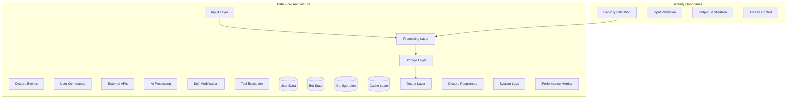

### 7.2 Component Communication Patterns

#### Event-Driven Architecture

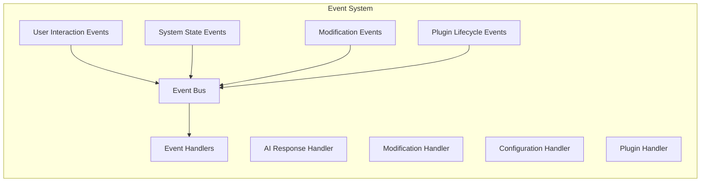

---

## Security Boundaries and Isolation

### 8.1 Multi-Layer Security Model

#### Security Architecture

```mermaid
graph TB
    subgraph "Security Boundaries"
        Network[Network Security]
            Firewall[Network Firewall]
            TLS[TLS Encryption]
            Auth[Authentication]
            
        Application[Application Security]
            InputValidation[Input Validation]
            OutputSanitization[Output Sanitization]
            PermissionChecks[Permission Validation]
            
        Data[Data Security]
            Encryption[Data Encryption]
            AccessControl[Access Control]
            AuditLogging[Audit Logging]
            
        Runtime[Runtime Security]
            Sandboxing[Code Sandboxing]
            ResourceLimits[Resource Limits]
            Monitoring[Security Monitoring]
    end
    
    Network --> Core[Core Bot Engine]
    Application --> Core
    Data --> Core
    Runtime --> Core
```

### 8.2 Isolation Mechanisms

#### Process and Memory Isolation

```mermaid
graph TB
    subgraph "Isolation Architecture"
        MainProcess[Main Bot Process]
            CoreLogic[Core Logic]
            StateManagement[State Management]
            
        IsolatedProcess[Modification Process]
            ModifiedCode[Modified Code]
            SandboxEnvironment[Sandbox Environment]
            LimitedResources[Limited Resources]
            
        SharedMemory[Secure Shared Memory]
            ReadOnly[Read-Only Data]
            Events[Event Communication]
            StateSync[State Synchronization]
    end
    
    MainProcess -->|Secure Communication| SharedMemory
    IsolatedProcess -->|Secure Communication| SharedMemory
    
    subgraph "Security Controls"
        Validation[Communication Validation]
            MessageIntegrity[Message Integrity]
            AccessControl[Access Control]
            RateLimiting[Rate Limiting]
    end
    
    Validation --> SharedMemory
```

---

## Failure Modes and Recovery

### 9.1 System Failure Modes

#### Failure Classification

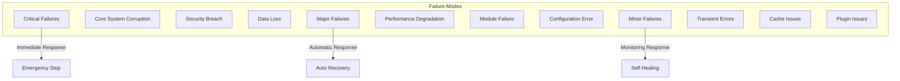

### 9.2 Recovery Procedures

#### Recovery Strategy Matrix

| Failure Type | Detection Time | Recovery Time | Recovery Method | Human Intervention |
|-------------|----------------|----------------|------------------|-------------------|
| Core Corruption | <1s | <5s | Emergency Rollback | Required |
| Security Breach | <10s | <30s | Security Protocol | Required |
| Performance Degradation | <30s | <2m | Auto-scaling | Optional |
| Module Failure | <5s | <30s | Module Reload | Optional |
| Configuration Error | <10s | <1m | Config Rollback | Optional |
| Transient Error | <5s | <10s | Retry Logic | Not Required |

---

## Scalability Considerations

### 10.1 Horizontal Scaling Architecture

#### Container-Based Scaling

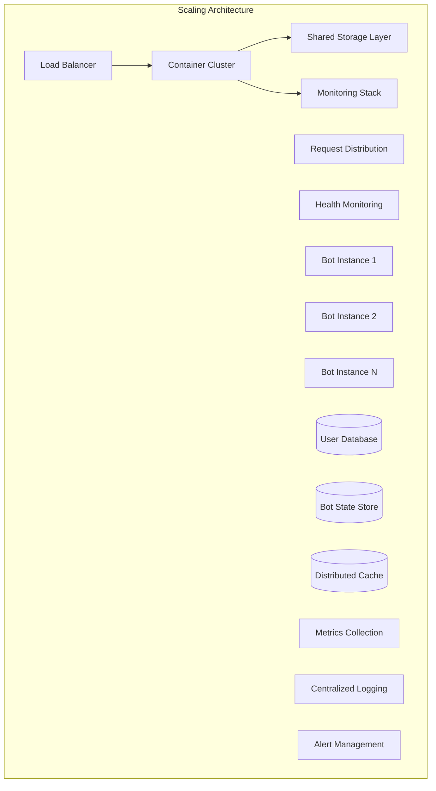

### 10.2 Performance Optimization

#### Caching Strategy

```mermaid
graph LR
    Request[User Request] --> L1Cache[L1 Cache - Memory]
    L1Cache -->|Miss| L2Cache[L2 Cache - Redis]
    L2Cache -->|Miss| Database[(Database)]
    
    Database -->|Update| L2Cache
    L2Cache -->|Update| L1Cache
    
    subgraph "Cache Management"
        Invalidation[Cache Invalidation]
            TimeBased[Time-based Expiry]
            EventBased[Event-driven Invalidation]
            Manual[Manual Invalidation]
            
        Warming[Cache Warming]
            Predictive[Predictive Preloading]
            Scheduled[Scheduled Preloading]
    end
    
    Invalidation --> L1Cache
    Invalidation --> L2Cache
    Warming --> L1Cache
    Warming --> L2Cache
```

### 10.3 Geographic Distribution

#### Multi-Region Deployment

```mermaid
graph TB
    subgraph "Global Architecture"
        DNS[Global DNS]
            GeoRouting[Geographic Routing]
            LatencyOptimization[Latency-based Routing]
            
        Region1[Region 1 - US East]
            Cluster1[Container Cluster]
            Storage1[(Regional Storage)]
            CDN1[Regional CDN]
            
        Region2[Region 2 - Europe]
            Cluster2[Container Cluster]
            Storage2[(Regional Storage)]
            CDN2[Regional CDN]
            
        Region3[Region 3 - Asia]
            Cluster3[Container Cluster]
            Storage3[(Regional Storage)]
            CDN3[Regional CDN]
    end
    
    DNS --> Region1
    DNS --> Region2
    DNS --> Region3
    
    subgraph "Data Replication"
        Primary[(Primary Database)]
            Replication1[Replica 1]
            Replication2[Replica 2]
            Replication3[Replica 3]
    end
    
    Primary --> Replication1
    Primary --> Replication2
    Primary --> Replication3
    
    Replication1 --> Storage1
    Replication2 --> Storage2
    Replication3 --> Storage3
```

---

## Technical Specifications

### 11.1 Core Technology Stack

#### Primary Technologies

| Component | Technology | Version | Purpose |
|-----------|------------|--------|---------|
| Core Language | Python | 3.9+ | AI/ML libraries, async support |
| Discord Framework | discord.py | 2.0+ | Discord API integration |
| AI Integration | OpenAI API | GPT-4 | Primary conversational AI |
| Fallback AI | Transformers | 4.30+ | Local AI processing |
| Database | PostgreSQL | 15+ | Structured data storage |
| Cache | Redis | 7.0+ | High-performance caching |
| File Storage | AWS S3 | - | Persistent file storage |
| Containerization | Docker | 24.0+ | Application containerization |
| Orchestration | Kubernetes | 1.28+ | Container orchestration |
| Monitoring | Prometheus | 2.40+ | Metrics collection |
| Visualization | Grafana | 10.0+ | Dashboard visualization |

#### Security Technologies

| Security Layer | Technology | Implementation |
|---------------|------------|----------------|
| Network Security | TLS 1.3, WAF | Encrypted communication |
| Application Security | Input validation, OWASP standards | Secure coding practices |
| Data Security | AES-256, RSA-2048 | Encryption at rest/transit |
| Runtime Security | Seccomp, AppArmor | Process isolation |
| Monitoring | Falco, SIEM integration | Threat detection |

### 11.2 Performance Specifications

#### Response Time Requirements

| Operation Type | Target Response Time | 95th Percentile | Maximum |
|----------------|-------------------|----------------|---------|
| Simple Commands | <100ms | <200ms | <500ms |
| Database Queries | <50ms | <100ms | <200ms |
| AI Responses | <2s | <3s | <5s |
| File Operations | <500ms | <1s | <2s |
| Modifications | <5s | <10s | <30s |

#### Throughput Requirements

| Metric | Target | Maximum |
|--------|--------|---------|
| Concurrent Users | 10,000 | 50,000 |
| Messages/Second | 1,000 | 5,000 |
| API Requests/Minute | 5,000 | 20,000 |
| File Operations | 100 | 500 |
| Concurrent Modifications | 10 | 50 |

### 11.3 Resource Utilization

#### Resource Efficiency Targets

| Resource | Base Usage | Per 1,000 Users | Maximum |
|----------|------------|----------------|---------|
| Memory | <1GB | <100MB | <2GB |
| CPU | <50% | <30% | <80% |
| Storage | <10GB | <1GB | <20GB |
| Network Bandwidth | <100Mbps | <10Mbps | <1Gbps |
| Database Connections | <100 | <10 | <50 |

---

## Implementation Guidelines

### 12.1 Development Phases

#### Phase 1: Foundation (Months 1-3)

**Core Infrastructure**
- Set up development environment with Docker and Kubernetes
- Implement basic Discord bot functionality
- Create PostgreSQL database schema
- Set up Redis caching layer
- Implement basic authentication and permissions

**Basic AI Integration**
- Integrate OpenAI API for conversational capabilities
- Implement fallback to local models
- Create context management system
- Set up basic response generation

**Initial Safety Systems**
- Implement input validation and sanitization
- Create basic logging and monitoring
- Set up container security boundaries
- Implement emergency stop mechanisms

#### Phase 2: Self-Modification (Months 4-6)

**Modification Engine Development**
- Create code analysis and AST parsing
- Implement sandboxed execution environment
- Develop validation pipeline
- Create version control integration

**Configuration Management**
- Implement dynamic configuration system
- Create user profile management
- Set up feature flags system
- Develop configuration validation

**Advanced Safety**
- Implement multi-stage validation
- Create rollback mechanisms
- Set up modification quotas
- Develop security scanning

#### Phase 3: Advanced Features (Months 7-9)

**Plugin System**
- Implement plugin discovery and loading
- Create plugin API framework
- Set up inter-plugin communication
- Develop plugin security model

**Advanced AI Integration**
- Implement multi-provider AI routing
- Create response caching system
- Develop AI performance monitoring
- Set up cost optimization

**Monitoring and Observability**
- Implement comprehensive health checks
- Create performance metrics collection
- Set up anomaly detection
- Develop self-healing mechanisms

#### Phase 4: Polish and Launch (Months 10-12)

**Quality Assurance**
- Achieve 90%+ test coverage
- Implement comprehensive integration tests
- Set up automated testing pipeline
- Create performance benchmarking

**Documentation and Deployment**
- Create comprehensive API documentation
- Set up CI/CD pipeline
- Implement blue-green deployment
- Create monitoring dashboards

**Beta Testing**
- Deploy to selected Discord servers
- Collect performance and usage metrics
- Gather user feedback and satisfaction data
- Iterate based on beta results

### 12.2 Development Standards

#### Code Quality Requirements

**Static Analysis**
- **Test Coverage**: Minimum 90% for all new code
- **Complexity Metrics**: Cyclomatic complexity <10 for new functions
- **Security Scanning**: Zero high-severity vulnerabilities
- **Code Style**: Consistent formatting with Black and flake8

**Dynamic Analysis**
- **Performance Testing**: Load testing to 10x expected capacity
- **Memory Profiling**: No memory leaks in long-running operations
- **Concurrency Testing**: Thread safety and race condition detection
- **Resource Monitoring**: CPU, memory, and I/O profiling

#### Security Requirements

**Secure Development**
- **Dependency Management**: Regular vulnerability scanning of dependencies
- **Secret Management**: No hardcoded secrets, use environment variables
- **Input Validation**: All external inputs validated and sanitized
- **Error Handling**: No information leakage in error messages

**Operational Security**
- **Container Security**: Minimal base images, regular vulnerability scanning
- **Network Security**: TLS 1.3+, firewall rules, rate limiting
- **Access Control**: Principle of least privilege, regular audits
- **Monitoring**: Real-time security event monitoring and alerting

### 12.3 Deployment Standards

#### Container Security

```dockerfile
# Security-hardened base image
FROM python:3.11-slim

# Create non-root user
RUN useradd -m -u 1000 botuser && \
    chown -R botuser:botuser /app

# Set up security boundaries
COPY --chown=botuser:botuser . /app
USER botuser

# Install security tools
RUN apt-get update && \
    apt-get install -y \
    python3-dev \
    build-essential \
    security-scanner

# Set up resource limits
HEALTHCHECK --interval=30s --timeout=3s \
    CMD python3 -c "import requests; requests.get('http://localhost:8080/health')"

# Resource limits
LABEL security.policy="strict"
LABEL modification.allowed="false"
```

#### Kubernetes Security

```yaml
apiVersion: v1
kind: Pod
metadata:
  name: discord-bot
  labels:
    security.policy: strict
    modification.allowed: "false"
spec:
  securityContext:
    runAsNonRoot: true
    runAsUser: 1000
    fsGroup: 1000
    seccompProfile:
      type: RuntimeDefault
  resources:
    limits:
      memory: "1Gi"
      cpu: "500m"
    containers:
  - name: bot
    image: discord-bot:secure
    securityContext:
      allowPrivilegeEscalation: false
      readOnlyRootFilesystem: true
      capabilities:
        drop:
        - ALL
```

### 12.4 Monitoring Configuration

#### Prometheus Metrics Configuration

```yaml
# Prometheus configuration for self-editing bot
global:
  scrape_interval: 15s
  evaluation_interval: 15s

scrape_configs:
  - job_name: 'discord-bot'
    static_configs:
      - targets: ['discord-bot:8080']
    metrics_path: /metrics
    scrape_interval: 5s
    
    # Custom metrics for self-modification
    metric_relabel_configs:
      - source_labels: [modification_type]
        regex: 'modification_type_(.+)'
        target_label: type
      - source_labels: [validation_result]
        regex: 'validation_(.+)'
        target_label: result
```

#### Grafana Dashboard Configuration

```json
{
  "dashboard": {
    "title": "Self-Editing Bot Monitoring",
    "panels": [
      {
        "title": "Self-Modification Activity",
        "type": "graph",
        "targets": [
          {
            "expr": "rate(modifications_total[5m])",
            "legendFormat": "Modifications per 5m"
          }
        ]
      },
      {
        "title": "Validation Results",
        "type": "stat",
        "targets": [
          {
            "expr": "sum(validation_success_total)",
            "legendFormat": "Successful Validations"
          }
        ]
      },
      {
        "title": "System Health",
        "type": "singlestat",
        "targets": [
          {
            "expr": "up{job=\"discord-bot\"}",
            "legendFormat": "System Uptime"
          }
        ]
      }
    ]
  }
}
```

---

## Conclusion

This architecture provides a comprehensive foundation for building a revolutionary self-editing Discord bot that balances innovation with safety. The modular design allows for autonomous evolution while maintaining strict security boundaries, ensuring the bot can continuously improve without compromising user safety or system stability.

The layered approach with clear separation between immutable core components and modifiable modules provides the flexibility needed for self-improvement while maintaining the reliability required for production deployment.

Key success factors will be:
- **Rigorous validation** of all modifications before deployment
- **Comprehensive monitoring** of system behavior and performance
- **Quick rollback capabilities** for any problematic changes
- **User privacy protection** throughout all learning and adaptation processes
- **Scalable architecture** that grows with community needs

With proper implementation of this architecture, development teams can create a truly autonomous AI assistant that pushes the boundaries of what's possible while maintaining the highest standards of safety and reliability.