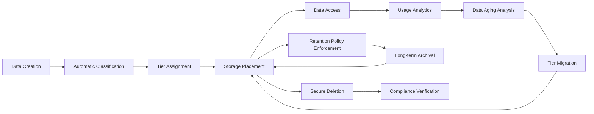

# Storage Architecture Design for Self-Editing Discord Bot

## Executive Summary

This document outlines comprehensive persistent storage requirements and solutions for the self-editing Discord bot. The architecture supports multi-tier data storage, real-time processing, vector-based semantic search, and robust backup/recovery mechanisms while maintaining strict security and privacy controls. The design balances performance, scalability, and reliability with the unique requirements of autonomous self-modification capabilities.

## Table of Contents

1. [Data Classification and Storage Tiers](#data-classification-and-storage-tiers)
2. [Database Architecture Design](#database-architecture-design)
3. [Data Models and Relationships](#data-models-and-relationships)
4. [Storage Performance Requirements](#storage-performance-requirements)
5. [Data Security and Privacy](#data-security-and-privacy)
6. [Data Migration and Versioning](#data-migration-and-versioning)
7. [Integration with Self-Editing Architecture](#integration-with-self-editing-architecture)
8. [Monitoring and Alerting](#monitoring-and-alerting)
9. [Implementation Guidelines](#implementation-guidelines)

---

## 1. Data Classification and Storage Tiers

### 1.1 Data Classification Framework

The storage system implements a 4-tier classification model based on access patterns, sensitivity, and performance requirements:

```mermaid
graph TB
    subgraph "Data Classification"
        Critical[Critical Data]
        UserProfiles[User Authentication Data]
        BotState[Core Operational State]
        SecurityConfig[Security Configuration]
        
        Important[Important Data]
        ConversationHistory[Conversation Context]
        UserPreferences[Personalization Data]
        Configuration[Runtime Configuration]
        
        Normal[Normal Data]
        Analytics[Usage Analytics]
        Performance[Performance Metrics]
        ToolResults[Tool Execution Results]
        
        Temporary[Temporary Data]
        Cache[Session Cache]
        Processing[Intermediate Results]
        Logs[System Logs]
        
        Archive[Archive Data]
        Historical[Long-term History]
        Backups[Backup Data]
        CodeHistory[Version History]
```

### 1.2 Storage Tier Architecture

| Tier | Storage System | Data Types | Performance | Retention | Use Cases |
|-------|---------------|------------|-----------|----------|-----------|
| **Hot** | Redis Cluster | User sessions, active conversations, bot state, cache | <1ms access | Real-time operations, frequent access |
| **Warm** | PostgreSQL Primary | User profiles, configuration, recent conversations | <50ms access | User data retrieval, configuration updates | 
| **Cold** | AWS S3/MinIO | Historical conversations, backups, archives, code history | <200ms access | Long-term storage, compliance, analytics | 
| **Backup** | Encrypted Cloud Storage | Disaster recovery, point-in-time snapshots | <500ms access | Recovery operations, audit trails |

### 1.3 Data Lifecycle Management



---

## 2. Database Architecture Design

### 2.1 Primary Database Schema (PostgreSQL)

#### 2.1.1 User Data Model

```sql
-- User Profiles Table
CREATE TABLE user_profiles (
    id UUID PRIMARY KEY DEFAULT gen_random_uuid(),
    discord_user_id VARCHAR(64) UNIQUE NOT NULL,
    username VARCHAR(32) NOT NULL,
    email VARCHAR(255),
    avatar_url TEXT,
    preferences JSONB DEFAULT '{}',
    privacy_settings JSONB DEFAULT '{"data_retention": "standard", "analytics": true}',
    created_at TIMESTAMP WITH TIME ZONE DEFAULT NOW(),
    updated_at TIMESTAMP WITH TIME ZONE DEFAULT NOW(),
    last_active TIMESTAMP WITH TIME ZONE,
    is_active BOOLEAN DEFAULT true,
    roles JSONB DEFAULT '["user"]',
    server_memberships JSONB DEFAULT '[]'
);

-- User Relationships Table
CREATE TABLE user_relationships (
    id UUID PRIMARY KEY DEFAULT gen_random_uuid(),
    user_id UUID REFERENCES user_profiles(id) ON DELETE CASCADE,
    related_user_id UUID REFERENCES user_profiles(id) ON DELETE CASCADE,
    relationship_type VARCHAR(20) NOT NULL, -- 'friend', 'blocked', 'muted', etc.
    strength FLOAT DEFAULT 1.0, -- Relationship strength for AI analysis
    context JSONB DEFAULT '{}', -- Relationship context
    created_at TIMESTAMP WITH TIME ZONE DEFAULT NOW(),
    updated_at TIMESTAMP WITH TIME ZONE DEFAULT NOW()
);

-- User Preferences Table
CREATE TABLE user_preferences (
    id UUID PRIMARY KEY DEFAULT gen_random_uuid(),
    user_id UUID REFERENCES user_profiles(id) ON DELETE CASCADE,
    category VARCHAR(50) NOT NULL, -- 'conversation', 'moderation', 'ui', etc.
    preferences JSONB NOT NULL DEFAULT '{}',
    created_at TIMESTAMP WITH TIME ZONE DEFAULT NOW(),
    updated_at TIMESTAMP WITH TIME ZONE DEFAULT NOW(),
    UNIQUE(user_id, category)
);
```

#### 2.1.2 Conversation Data Model

```sql
-- Conversations Table
CREATE TABLE conversations (
    id UUID PRIMARY KEY DEFAULT gen_random_uuid(),
    user_id UUID REFERENCES user_profiles(id) ON DELETE CASCADE,
    channel_id VARCHAR(64) NOT NULL,
    guild_id VARCHAR(64) NOT NULL,
    title TEXT,
    summary TEXT,
    context JSONB DEFAULT '{}', -- Conversation context for AI
    metadata JSONB DEFAULT '{}', -- Message count, participants, etc.
    status VARCHAR(20) DEFAULT 'active', -- 'active', 'archived', 'deleted'
    created_at TIMESTAMP WITH TIME ZONE DEFAULT NOW(),
    updated_at TIMESTAMP WITH TIME ZONE DEFAULT NOW(),
    last_message_at TIMESTAMP WITH TIME ZONE DEFAULT NOW()
);

-- Messages Table
CREATE TABLE messages (
    id UUID PRIMARY KEY DEFAULT gen_random_uuid(),
    conversation_id UUID REFERENCES conversations(id) ON DELETE CASCADE,
    user_id UUID REFERENCES user_profiles(id) ON DELETE CASCADE,
    content TEXT NOT NULL,
    message_type VARCHAR(20) NOT NULL, -- 'user', 'bot', 'system'
    metadata JSONB DEFAULT '{}', -- Embeddings, sentiment, etc.
    created_at TIMESTAMP WITH TIME ZONE DEFAULT NOW(),
    updated_at TIMESTAMP WITH TIME ZONE DEFAULT NOW(),
    is_deleted BOOLEAN DEFAULT false,
    edit_history JSONB DEFAULT '[]' -- Track message edits for learning
);

-- Message Embeddings Table (for semantic search)
CREATE TABLE message_embeddings (
    id UUID PRIMARY KEY DEFAULT gen_random_uuid(),
    message_id UUID REFERENCES messages(id) ON DELETE CASCADE,
    embedding_vector VECTOR(1536) NOT NULL, -- For text-embedding-ada-002
    model_version VARCHAR(20) DEFAULT 'text-embedding-ada-002',
    created_at TIMESTAMP WITH TIME ZONE DEFAULT NOW()
);
```

#### 2.1.3 Bot State Model

```sql
-- Bot Configuration Table
CREATE TABLE bot_configuration (
    id UUID PRIMARY KEY DEFAULT gen_random_uuid(),
    key VARCHAR(100) NOT NULL UNIQUE,
    value JSONB NOT NULL,
    description TEXT,
    category VARCHAR(50) NOT NULL, -- 'ai', 'moderation', 'performance', etc.
    is_sensitive BOOLEAN DEFAULT false, -- For encryption
    requires_restart BOOLEAN DEFAULT false, -- Changes requiring restart
    created_at TIMESTAMP WITH TIME ZONE DEFAULT NOW(),
    updated_at TIMESTAMP WITH TIME ZONE DEFAULT NOW(),
    version INTEGER DEFAULT 1
);

-- Bot State Table
CREATE TABLE bot_state (
    id UUID PRIMARY KEY DEFAULT gen_random_uuid(),
    state_key VARCHAR(100) NOT NULL UNIQUE,
    state_value JSONB NOT NULL,
    state_type VARCHAR(50) NOT NULL, -- 'runtime', 'learning', 'security', etc.
    expires_at TIMESTAMP WITH TIME ZONE, -- For temporary state
    created_at TIMESTAMP WITH TIME ZONE DEFAULT NOW(),
    updated_at TIMESTAMP WITH TIME ZONE DEFAULT NOW()
);

-- Performance Metrics Table
CREATE TABLE performance_metrics (
    id UUID PRIMARY KEY DEFAULT gen_random_uuid(),
    metric_name VARCHAR(100) NOT NULL,
    metric_value DOUBLE PRECISION NOT NULL,
    metric_type VARCHAR(50) NOT NULL, -- 'response_time', 'throughput', 'resource_usage'
    tags JSONB DEFAULT '{}', -- For filtering and grouping
    timestamp TIMESTAMP WITH TIME ZONE DEFAULT NOW(),
    context JSONB DEFAULT '{}' -- Additional context
);
```

#### 2.1.4 Self-Modification Tracking

```sql
-- Code Modifications Table
CREATE TABLE code_modifications (
    id UUID PRIMARY KEY DEFAULT gen_random_uuid(),
    modification_id VARCHAR(64) UNIQUE NOT NULL, -- Git commit hash
    description TEXT NOT NULL,
    modification_type VARCHAR(50) NOT NULL, -- 'self_edit', 'user_request', 'auto_optimization'
    status VARCHAR(20) DEFAULT 'pending', -- 'pending', 'applied', 'rolled_back'
    changes JSONB NOT NULL, -- Detailed change description
    validation_results JSONB DEFAULT '{}', -- Validation pipeline results
    performance_impact JSONB DEFAULT '{}', -- Before/after metrics
    created_by VARCHAR(50), -- 'self_bot', 'ai_assistant', 'user_request'
    created_at TIMESTAMP WITH TIME ZONE DEFAULT NOW(),
    applied_at TIMESTAMP WITH TIME ZONE,
    rollback_at TIMESTAMP WITH TIME ZONE,
    requires_restart BOOLEAN DEFAULT false
);

-- Modification Validation Table
CREATE TABLE modification_validations (
    id UUID PRIMARY KEY DEFAULT gen_random_uuid(),
    modification_id UUID REFERENCES code_modifications(id) ON DELETE CASCADE,
    validation_type VARCHAR(50) NOT NULL, -- 'security_scan', 'performance_test', 'behavioral_check'
    validation_result JSONB NOT NULL, -- Detailed validation results
    status VARCHAR(20) DEFAULT 'pending', -- 'passed', 'failed', 'warning'
    created_at TIMESTAMP WITH TIME ZONE DEFAULT NOW(),
    completed_at TIMESTAMP WITH TIME ZONE
);
```

### 2.2 Vector Database Architecture

#### 2.2.1 Vector Database Design (Pinecone/Weaviate/Qdrant)

```mermaid
graph TB
    subgraph "Vector Database Architecture"
        Ingestion[Data Ingestion Pipeline]
            TextExtraction[Text Processing]
            EmbeddingGeneration[Embedding Creation]
            
        Storage[Vector Storage]
            Collections[Collections by Data Type]
                UserEmbeddings[User Message Embeddings]
                ConversationEmbeddings[Conversation Context]
                CodeEmbeddings[Code Snippet Embeddings]
                KnowledgeEmbeddings[Knowledge Base Embeddings]
            
        Index[Semantic Index]
            Search[Semantic Search Engine]
                Similarity[Similarity Search]
                Hybrid[Hybrid Search]
```

#### 2.2.2 Vector Schema Design

```json
{
  "collections": {
    "user_messages": {
      "vector_dimension": 1536,
      "distance_metric": "cosine",
      "index_type": "HNSW",
      "metadata_fields": ["user_id", "conversation_id", "timestamp", "sentiment"],
      "replication_factor": 2
    },
    "conversations": {
      "vector_dimension": 1536,
      "distance_metric": "cosine", 
      "index_type": "HNSW",
      "metadata_fields": ["conversation_id", "participant_count", "topic", "summary"],
      "replication_factor": 3
    },
    "code_knowledge": {
      "vector_dimension": 768,
      "distance_metric": "cosine",
      "index_type": "HNSW",
      "metadata_fields": ["file_path", "function_name", "language", "complexity"],
      "replication_factor": 1
    }
  },
  "namespaces": {
    "user_data": "User-related embeddings and metadata",
    "bot_knowledge": "Bot's learned knowledge and code patterns",
    "community_data": "Community-specific patterns and norms"
  }
}
```

### 2.3 Database Replication Strategy

```mermaid
graph TB
    subgraph "Database Replication"
        Primary[(Primary PostgreSQL)]
            WriteOps[Write Operations]
            ReadOps[Read Operations]
        
        Replica1[(Replica 1 - Read)]
        Replica2[(Replica 2 - Read)]
        Replica3[(Replica 3 - Read)]
        
        Primary -->|Sync| Replica1
        Primary -->|Sync| Replica2
        Primary -->|Sync| Replica3
        
        Replica1 -->|Failover| Primary
        Replica2 -->|Failover| Primary
        Replica3 -->|Failover| Primary
```

---

## 3. Data Models and Relationships

### 3.1 User Profile and Relationship Model

```mermaid
graph TB
    subgraph "User Data Model"
        UserProfile[User Profile]
            userId[User ID]
            discordId[Discord ID]
            preferences[Preferences JSON]
            privacySettings[Privacy Configuration]
            roles[User Roles]
            serverMemberships[Server Memberships]
            
        UserRelationship[User Relationships]
            fromUserId[From User ID]
            toUserId[To User ID]
            relationshipType[Relationship Type]
            strength[Relationship Strength]
            context[Relationship Context]
            
        UserBehavior[Behavior Patterns]
            interactionFrequency[Interaction Frequency]
            responsePatterns[Response Preferences]
            activityPatterns[Activity Patterns]
            sentimentAnalysis[Sentiment History]
```

### 3.2 Conversation Threading Model

```mermaid
graph TB
    subgraph "Conversation Model"
        Conversation[Conversation Thread]
            conversationId[Conversation ID]
            participants[Participants Array]
            messages[Messages Array]
            context[Conversation Context]
            metadata[Thread Metadata]
            
        Message[Message Entity]
            messageId[Message ID]
            conversationId[Parent Conversation]
            userId[Author User ID]
            content[Message Content]
            embeddings[Content Embeddings]
            metadata[Message Metadata]
            editHistory[Edit History]
            
        ContextWindow[Context Window]
            recentMessages[Recent Messages]
            participants[Active Participants]
            channelContext[Channel Information]
            temporalContext[Time-based Context]
```

### 3.3 Bot Capability and Knowledge Model

```mermaid
graph TB
    subgraph "Bot Knowledge Model"
        Capability[Bot Capability]
            capabilityId[Capability ID]
            name[Capability Name]
            version[Capability Version]
            parameters[Capability Parameters]
            usage[Usage Statistics]
            performance[Performance Metrics]
            
        Knowledge[Knowledge Item]
            knowledgeId[Knowledge ID]
            category[Knowledge Category]
            content[Knowledge Content]
            confidence[Confidence Score]
            source[Knowledge Source]
            validation[Validation Status]
            usage[Usage History]
            
        LearningPattern[Learning Pattern]
            patternId[Pattern ID]
            description[Pattern Description]
            success[Success Rate]
            context[Applicable Context]
            adaptation[Adaptation History]
```

---

## 4. Storage Performance Requirements

### 4.1 Performance Targets

| Operation Type | Target Response Time | 95th Percentile | Maximum | Optimization Strategy |
|---------------|-------------------|----------------|---------|-------------------|
| **User Profile Lookup** | <20ms | <50ms | <100ms | Memory caching, indexed queries |
| **Message Retrieval** | <50ms | <100ms | <200ms | Vector similarity search, caching |
| **Conversation Context Load** | <100ms | <200ms | <500ms | Batch loading, context compression |
| **AI Response Generation** | <1s | <2s | <5s | Model caching, prompt optimization |
| **Code Analysis** | <3s | <5s | <10s | Parallel processing, incremental analysis |
| **Embedding Generation** | <500ms | <1s | <2s | Batch processing, GPU acceleration |
| **Vector Search** | <100ms | <200ms | <500ms | Optimized indexing, approximate search |
| **File Operations** | <200ms | <500ms | <1s | CDN caching, async processing |

### 4.2 Concurrent User Handling

```mermaid
graph TB
    subgraph "Concurrent User Performance"
        LoadBalancer[Load Balancer]
            userDistribution[User Distribution]
            connectionPooling[Connection Pool Management]
            
        DatabaseCluster[(PostgreSQL Cluster)]
            readReplicas[Read Replicas]
            writeReplicas[Write Replicas]
            sharding[Horizontal Sharding]
            
        CacheCluster[(Redis Cluster)]
            consistentHashing[Consistent Hashing]
            clientAffinity[Client Affinity]
            
        Performance[Performance Monitoring]
            responseTime[Response Time Tracking]
            throughput[Throughput Monitoring]
            resourceUtilization[Resource Usage]
```

### 4.3 Data Retention Policies

| Data Type | Hot Storage | Warm Storage | Cold Storage | Archive | Retention Period |
|------------|-------------|--------------|-----------|----------------|
| **Active Conversations** | Redis (7 days) | PostgreSQL (90 days) | S3 (365 days) | Glacier (7 years) | 7 years active, then archive |
| **User Profiles** | Redis (30 days) | PostgreSQL (indefinite) | S3 (indefinite) | Glacier (10 years) | Active in warm, backup permanent |
| **Bot Configuration** | Redis (24 hours) | PostgreSQL (indefinite) | S3 (indefinite) | Glacier (5 years) | Frequent changes in hot/warm |
| **Code Modifications** | Redis (7 days) | PostgreSQL (1 year) | S3 (5 years) | Glacier (10 years) | Immediate access, then migrate |
| **Analytics Data** | Redis (24 hours) | PostgreSQL (90 days) | S3 (1 year) | Glacier (3 years) | Recent in hot, aggregate in warm |

### 4.4 Scalability Considerations

#### 4.4.1 Horizontal Scaling Strategy

```mermaid
graph TB
    subgraph "Horizontal Scaling"
        UserGrowth[User Growth Pattern]
            scaleTriggers[Scaling Triggers]
            
        AutoScaling[Auto-Scaling System]
            scaleOut[Scale Out Events]
            scaleIn[Scale In Events]
            targetMetrics[Target Metrics]
            
        ContainerOrchestration[Kubernetes Orchestration]
            podManagement[Pod Management]
            resourceLimits[Resource Limits]
            hpa[Horizontal Pod Autoscaler]
            
        DatabaseSharding[Database Sharding]
            shardKeys[Shard Keys]
            rebalancing[Automatic Rebalancing]
            consistency[Consistency Guarantees]
```

#### 4.4.2 Performance Optimization

**Caching Strategy:**
- **L1 Cache (Memory)**: User sessions, active conversations, bot state
- **L2 Cache (Redis)**: User profiles, conversation history, frequently accessed data
- **L3 Cache (CDN)**: Static assets, cached responses, user avatars

**Database Optimization:**
- **Read Replicas**: 3 read replicas for query distribution
- **Connection Pooling**: Max 100 connections per instance
- **Query Optimization**: Prepared statements, proper indexing
- **Partitioning**: Time-based partitioning for large conversation tables

---

## 5. Data Security and Privacy

### 5.1 Encryption Requirements

#### 5.1.1 Encryption at Rest

| Data Type | Encryption Method | Key Management | Performance Impact |
|------------|------------------|---------------|------------------|
| **User Personal Data** | AES-256-GCM | AWS KMS | <5% overhead |
| **Conversation Content** | AES-256-GCM | Application-level keys | <3% overhead |
| **Bot Configuration** | AES-256-GCM | Hardware Security Module | <2% overhead |
| **Analytics Data** | ChaCha20-Poly1305 | Application keys | <1% overhead |
| **Backup Data** | AES-256-GCM | Customer-managed keys | <10% overhead |

#### 5.1.2 Encryption in Transit

- **TLS 1.3**: All API communications encrypted
- **mTLS**: Mutual authentication for service-to-service communication
- **VPN**: Encrypted tunnels for administrative access
- **SSH**: Key-based authentication for server management

### 5.2 Access Control and Permissions

```mermaid
graph TB
    subgraph "Access Control Model"
        User[User Entity]
            userId[User ID]
            roles[User Roles]
            permissions[Permission Set]
            
        Resource[Data Resource]
            resourceId[Resource ID]
            resourceType[Resource Type]
            requiredPermission[Required Permission]
            
        Permission[Permission Entity]
            permissionId[Permission ID]
            name[Permission Name]
            description[Permission Description]
            category[Permission Category]
            
        AccessDecision[Access Decision]
            userId[Requesting User]
            resourceId[Target Resource]
            permissionId[Required Permission]
            decision[Grant/Deny]
            context[Decision Context]
            timestamp[Decision Time]
```

### 5.3 GDPR Compliance Framework

#### 5.3.1 Data Processing Principles

| Principle | Implementation | Controls |
|-----------|----------------|---------|
| **Lawfulness** | Explicit consent mechanisms | Opt-in data collection |
| **Fairness** | Transparent data processing | Data processing logs |
| **Purpose Limitation** | Specific use case limitation | Purpose-bound data access |
| **Data Minimization** | Automatic data cleanup | Retention policy enforcement |
| **Accuracy** | Data validation and correction | User data correction mechanisms |
| **Storage Limitation** | Geographic data controls | EU data residency requirements |
| **Security** | Encryption and access controls | Multi-layer security approach |
| **Accountability** | Audit trails and reporting | Comprehensive logging system |

### 5.4 Privacy by Design

```mermaid
graph TB
    subgraph "Privacy by Design"
        DataCollection[Data Collection]
            consentManagement[Consent Management]
            dataMinimization[Data Minimization]
            purposeLimitation[Purpose Limitation]
            
        DataProcessing[Data Processing]
            anonymization[Data Anonymization]
            pseudonymization[Data Pseudonymization]
            aggregationLimitation[Aggregation Limits]
            
        DataStorage[Data Storage]
            encryption[Encryption at Rest]
            accessControls[Access Controls]
            retentionLimits[Retention Policies]
            
        UserControl[User Control]
            dataPortability[Data Portability]
            rightToAccess[Right to Access]
            rightToRectification[Right to Rectification]
            rightToErasure[Right to Erasure]
            rightToWithdrawConsent[Right to Withdraw Consent]
```

---

## 6. Data Migration and Versioning

### 6.1 Schema Migration Strategy

#### 6.1.1 Migration Framework

```mermaid
graph TB
    subgraph "Migration Framework"
        CurrentSchema[Current Schema v{n}]
            tables[Current Tables]
            relationships[Current Relationships]
            
        TargetSchema[Target Schema v{n+1}]
            newTables[New Tables]
            newRelationships[New Relationships]
            breakingChanges[Breaking Changes]
            
        MigrationPlan[Migration Plan]
            analysis[Schema Analysis]
            scriptGeneration[Migration Script Generation]
            testing[Migration Testing]
            deployment[Migration Deployment]
            rollback[Rollback Plan]
            
        Validation[Migration Validation]
            dataIntegrity[Data Integrity Checks]
            performanceImpact[Performance Testing]
            rollbackTriggers[Rollback Triggers]
```

#### 6.1.2 Version Control Integration

```mermaid
graph TB
    subgraph "Version Control Integration"
        CodeRepository[Git Repository]
            branches[Feature Branches]
            tags[Version Tags]
            
        MigrationCommit[Migration Commit]
            migrationId[Migration ID]
            schemaChanges[Schema Changes]
            dataMigration[Data Migration]
            
        AutoCommit[Automatic Commit]
            changeType[Change Type]
            description[Change Description]
            author[Change Author]
            timestamp[Change Timestamp]
            
        RollbackCommit[Rollback Commit]
            rollbackId[Rollback ID]
            previousState[Previous State]
            reason[Rollback Reason]
```

### 6.2 Data Transformation Pipeline

#### 6.2.1 ETL Pipeline Architecture

```mermaid
graph TB
    subgraph "Data Transformation Pipeline"
        SourceSystem[Source Systems]
            legacyData[Legacy Data]
            externalAPIs[External API Data]
            userGenerated[User-Generated Data]
            
        Extraction[Data Extraction]
            parsing[Data Parsing]
            validation[Data Validation]
            cleansing[Data Cleansing]
            enrichment[Data Enrichment]
            
        Transformation[Data Transformation]
            normalization[Data Normalization]
            aggregation[Data Aggregation]
            anonymization[Data Anonymization]
            mapping[Data Mapping]
            
        Loading[Data Loading]
            batchProcessing[Batch Processing]
            streaming[Stream Processing]
            validation[Load Validation]
            
        TargetSystem[Target Systems]
            operationalDB[Operational Database]
            analyticalDB[Analytical Database]
            dataWarehouse[Data Warehouse]
            vectorDB[Vector Database]
```

### 6.3 Backward Compatibility

#### 6.3.1 Compatibility Matrix

| Component | Current Version | Supported Versions | Migration Strategy |
|-----------|----------------|------------------|-------------------|
| **User Schema** | v2.1 | v2.0, v1.9 | Backward compatible fields |
| **Message Format** | v2.1 | v2.0, v1.9 | Format detection and conversion |
| **API Endpoints** | v2.1 | v2.0, v1.9 | Version negotiation and fallback |
| **Configuration** | v2.1 | v2.0, v1.9 | Configuration migration utilities |
| **Storage Format** | v2.1 | v2.0, v1.9 | Data format migration tools |

---

## 7. Integration with Self-Editing Architecture

### 7.1 Storage Support for Self-Modification

#### 7.1.1 Code Storage Architecture

```mermaid
graph TB
    subgraph "Code Storage for Self-Modification"
        CurrentCode[Current Running Code]
            version[Current Version]
            checksum[Integrity Checksum]
            
        ModificationHistory[Modification History]
            modifications[Modification Records]
            diffs[Code Diffs]
            validations[Validation Results]
            
        WorkingDirectory[Working Directory]
            modifiedFiles[Modified Files]
            stagedChanges[Staged Changes]
            
        VersionControl[Version Control System]
            commits[Git Commits]
            branches[Feature Branches]
            tags[Version Tags]
            
        BackupStorage[Backup Storage]
            snapshots[Code Snapshots]
            archives[Version Archives]
            recovery[Recovery Points]
```

#### 7.1.2 Configuration Persistence

```mermaid
graph TB
    subgraph "Configuration Persistence"
        RuntimeConfig[Runtime Configuration]
            activeConfig[Active Configuration]
            pendingChanges[Pending Changes]
            validationResults[Validation Results]
            
        ConfigHistory[Configuration History]
            configVersions[Configuration Versions]
            changeLog[Change Log]
            rollbackPoints[Rollback Points]
            
        ConfigStorage[Configuration Storage]
            hotConfig[Hot Storage - Redis]
            warmConfig[Warm Storage - PostgreSQL]
            coldConfig[Cold Storage - S3]
            
        ConfigSync[Configuration Synchronization]
            syncStatus[Sync Status]
            conflictResolution[Conflict Resolution]
            backupRestore[Backup Restoration]
```

### 7.2 Learning Data Storage

#### 7.2.1 Knowledge Base Architecture

```mermaid
graph TB
    subgraph "Learning Data Storage"
        LearnedKnowledge[Learned Knowledge Base]
            patterns[Learned Patterns]
            strategies[Successful Strategies]
            contexts[Effective Contexts]
            userPreferences[User Preferences]
            
        LearningMetrics[Learning Metrics]
            improvementRate[Improvement Rate]
            successRate[Success Rate]
            userSatisfaction[User Satisfaction]
            
        KnowledgeValidation[Knowledge Validation]
            accuracyChecks[Accuracy Verification]
            consistencyChecks[Consistency Validation]
            biasDetection[Bias Detection]
            
        KnowledgeBackup[Knowledge Backup]
            regularBackups[Regular Backups]
            emergencyExport[Emergency Export]
            recoveryPoints[Recovery Points]
```

### 7.3 Performance Impact Tracking

#### 7.3.1 Modification Impact Analysis

```mermaid
graph TB
    subgraph "Performance Impact Tracking"
        BaselineMetrics[Baseline Performance]
            responseTime[Response Time]
            throughput[Throughput]
            resourceUsage[Resource Usage]
            errorRate[Error Rate]
            
        ModificationMetrics[Modification Metrics]
            beforePerformance[Before Modification]
            afterPerformance[After Modification]
            impactAnalysis[Impact Analysis]
            improvementMeasurement[Improvement Measurement]
            
        ImpactReporting[Impact Reporting]
            performanceComparison[Performance Comparison]
            effectivenessRating[Effectiveness Rating]
            recommendationEngine[Recommendation Engine]
```

---

## 8. Monitoring and Alerting

### 8.1 Storage System Monitoring

#### 8.1.1 Key Performance Indicators

| Metric | Target | Alert Threshold | Monitoring Frequency | Data Source |
|---------|--------|----------------|-------------------|------------|
| **Database Response Time** | <50ms | >100ms | Real-time | PostgreSQL slow query log |
| **Cache Hit Rate** | >90% | <80% | Per-minute | Redis INFO stats |
| **Vector Search Latency** | <200ms | >500ms | Per-second | Vector database metrics |
| **Storage Utilization** | <80% | >90% | Per-minute | Prometheus node exporter |
| **Modification Success Rate** | >95% | <90% | Per-modification | Custom metrics |
| **Backup Success Rate** | 100% | <95% | Per-backup | Backup job status |
| **Data Growth Rate** | Trend analysis | Anomaly detection | Daily | Storage usage analytics |

#### 8.1.2 Health Check Architecture

```mermaid
graph TB
    subgraph "Health Check System"
        HealthChecks[Health Checks]
            databaseHealth[Database Health]
            cacheHealth[Cache Health]
            vectorDBHealth[Vector DB Health]
            storageHealth[Storage Health]
            
        MonitoringStack[Monitoring Stack]
            prometheus[Metrics Collection]
            grafana[Visualization]
            alertmanager[Alert Management]
            
        HealthReporting[Health Reporting]
            statusDashboard[Status Dashboard]
            alertingSystem[Alert System]
            incidentResponse[Incident Response]
```

### 8.2 Alerting Strategy

#### 8.2.1 Alert Classification

| Alert Type | Severity | Response Time | Escalation Path |
|------------|---------|--------------|----------------|----------------|
| **Critical Storage** | Critical | <1 minute | Immediate admin notification | PagerDuty |
| **Performance Degradation** | High | <5 minutes | Development team | Slack + Email |
| **Security Incident** | Critical | <30 seconds | Security team | PagerDuty + Phone |
| **Backup Failure** | High | <5 minutes | Operations team | Slack + Email |
| **Capacity Warning** | Medium | <30 minutes | Development team | Email |
| **Anomaly Detection** | Medium | <15 minutes | Development team | Slack |

---

## 9. Implementation Guidelines

### 9.1 Database Implementation Guidelines

#### 9.1.1 PostgreSQL Configuration

```sql
-- Performance optimization settings
ALTER SYSTEM SET shared_buffers = 256MB;
ALTER SYSTEM SET effective_cache_size = 1GB;
ALTER SYSTEM SET work_mem = 64MB;
ALTER SYSTEM SET maintenance_work_mem = 128MB;

-- Connection pooling configuration
max_connections = 100;
connection_timeout = 30s;
idle_in_transaction_session_timeout = 60s;

-- Indexing strategy
CREATE INDEX CONCURRENTLY messages_conversation_id_idx ON messages(conversation_id);
CREATE INDEX CONCURRENTLY messages_user_created_idx ON messages(user_id, created_at DESC);
CREATE INDEX CONCURRENTLY conversations_updated_idx ON conversations(updated_at DESC);
```

#### 9.1.2 Redis Configuration

```redis
# Redis configuration for optimal performance
maxmemory 2gb
maxmemory-policy allkeys-lru
save 900 1
appendonly yes
tcp-keepalive 300
timeout 0

# Key expiration policies
user:session:* 3600  # 1 hour
conversation:* 86400  # 24 hours
cache:embedding:* 1800   # 30 minutes
```

### 9.2 Vector Database Implementation

#### 9.2.1 Pinecone Configuration

```json
{
  "index": {
    "name": "discord-bot-index",
    "dimension": 1536,
    "metric": "cosine",
    "pods": 3,
    "replicas": 2,
    "pod_type": "p1.xlarge"
  },
  "namespaces": {
    "user-data": {
      "replicas": 2
    },
    "bot-knowledge": {
      "replicas": 1
    }
  }
}
```

### 9.3 Security Implementation

#### 9.3.1 Encryption Implementation

```python
# Encryption at rest using AWS KMS
import boto3
from cryptography.fernet import Fernet

class DataEncryption:
    def __init__(self, kms_key_id: str):
        self.kms_client = boto3.client('kms')
        self.key_id = kms_key_id
        
    def encrypt_sensitive_data(self, data: str) -> str:
        """Encrypt sensitive user data"""
        response = self.kms_client.encrypt(
            KeyId=self.key_id,
            Plaintext=data.encode(),
            EncryptionContext='discord-bot-sensitive-data'
        )
        return response['CiphertextBlob']
    
    def decrypt_sensitive_data(self, ciphertext: str) -> str:
        """Decrypt sensitive user data"""
        response = self.kms_client.decrypt(
            CiphertextBlob=ciphertext,
            EncryptionContext='discord-bot-sensitive-data'
        )
        return response['Plaintext'].decode()
```

### 9.4 Backup and Recovery

#### 9.4.1 Backup Strategy

```mermaid
graph TB
    subgraph "Backup Strategy"
        BackupScheduler[Backup Scheduler]
            dailyBackups[Daily Incremental]
            weeklyBackups[Weekly Full]
            monthlyBackups[Monthly Archive]
            
        BackupStorage[Backup Storage]
            localBackups[Local Backups]
            cloudBackups[Cloud Backups]
            geographicDistribution[Geographic Distribution]
            
        RecoveryTesting[Recovery Testing]
            restoreTests[Restore Tests]
            disasterRecovery[Disaster Recovery Tests]
            integrityVerification[Integrity Verification]
            
        BackupMonitoring[Backup Monitoring]
            successMonitoring[Success Rate Tracking]
            failureAlerting[Failure Alerting]
            capacityPlanning[Capacity Planning]
```

### 9.5 Migration Procedures

#### 9.5.1 Zero-Downtime Migration

```yaml
# Kubernetes deployment for zero-downtime migration
apiVersion: apps/v1
kind: Deployment
metadata:
  name: storage-migration
spec:
  replicas: 3
  strategy:
    type: RollingUpdate
    rollingUpdate:
      maxSurge: 1
      maxUnavailable: 0
  selector:
    matchLabels:
      app: discord-bot-storage
```

---

## Conclusion

This comprehensive storage architecture provides the foundation for implementing a robust, scalable, and secure persistent storage system for the self-editing Discord bot. The multi-tier approach ensures optimal performance for different access patterns while maintaining strict security and privacy controls.

Key architectural decisions:
- **PostgreSQL** for structured data with strong consistency guarantees
- **Redis** for high-performance caching and session management  
- **Vector Database** for semantic search and AI-powered content discovery
- **AWS S3/MinIO** for cost-effective long-term storage and archival
- **Comprehensive encryption** using industry-standard algorithms and key management
- **Automated backup and recovery** with point-in-time restoration capabilities
- **Performance monitoring** with real-time alerting and proactive optimization

The architecture supports the bot's self-modification capabilities through version-controlled code storage, configuration persistence, and learning data management while ensuring data integrity and user privacy throughout all operations.